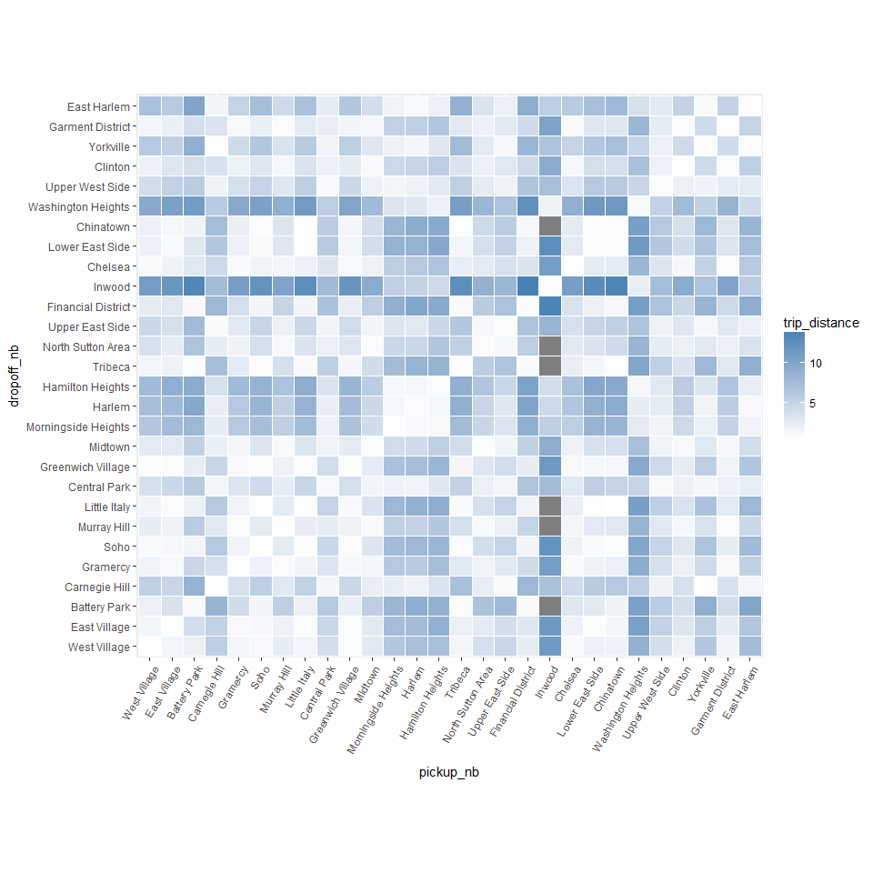
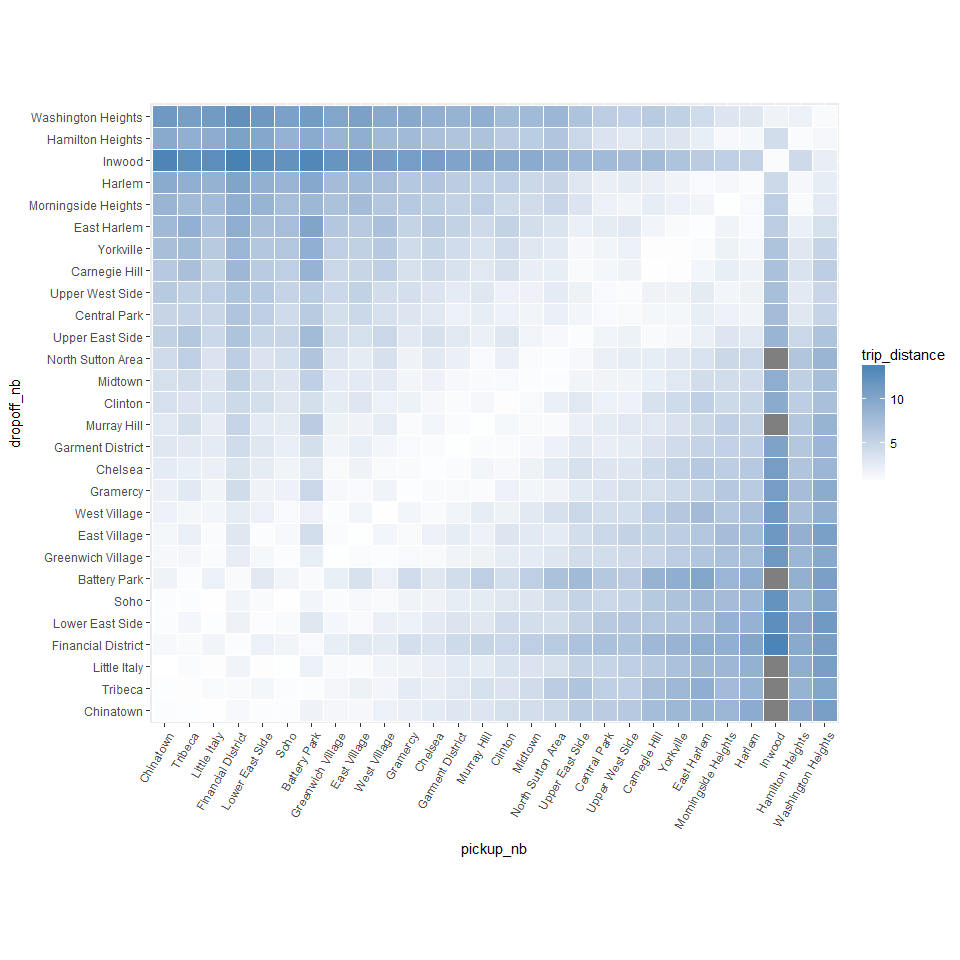
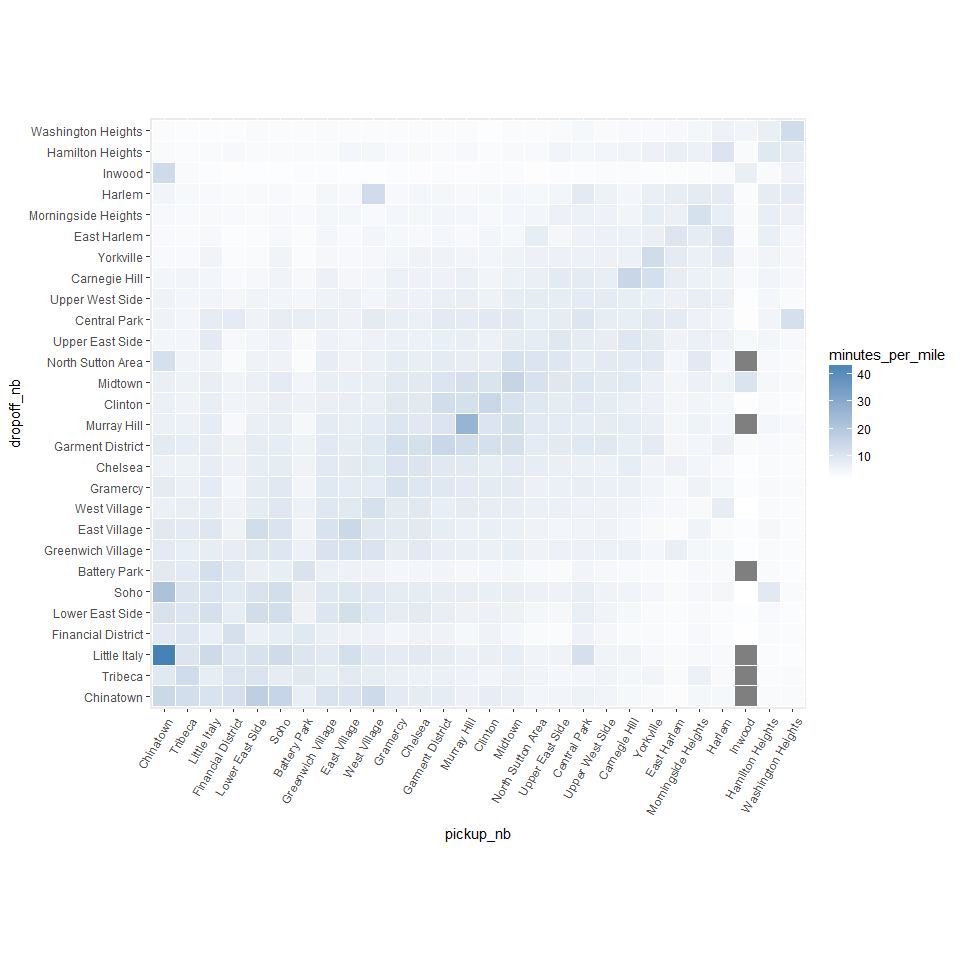
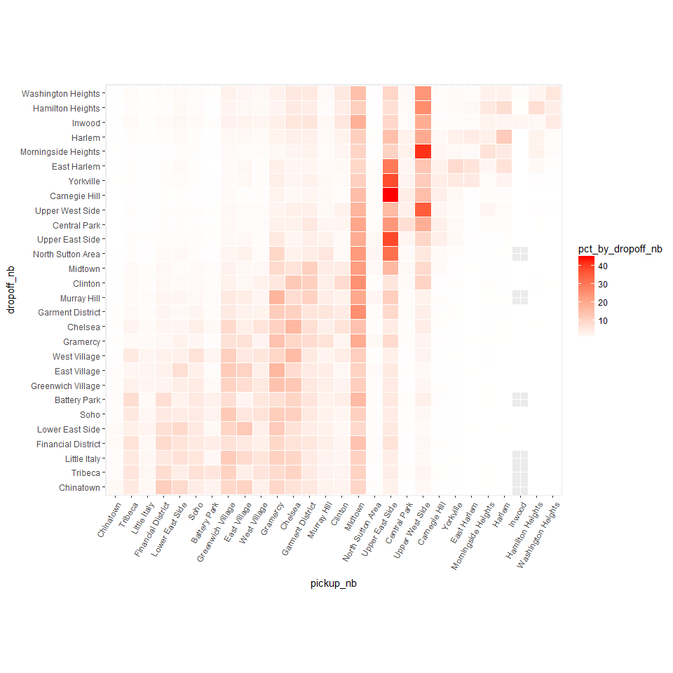
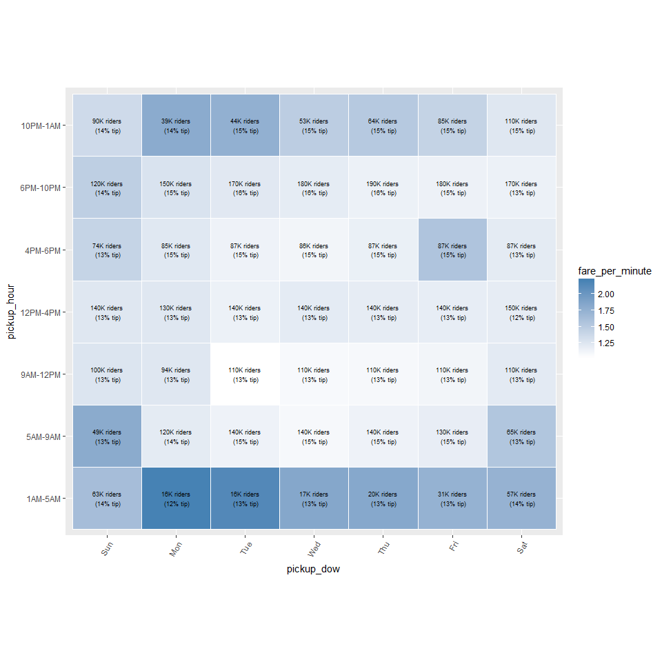

Neighborhood patterns
================
Seth Mottaghinejad
2017-02-08

As our next task, we seek to find patterns between pickup and drop-off neighborhoods and other variables such as fare amount, trip distance, traffic and tipping. Since ultimately `RevoScaleR` is just another R package, it's important to know that to really put it to use, it must integrate and interact with other R packages to make our analysis possible. We've already seen examples of how to use packages such as `lubridate` or `rgeos` for data transformations with `RevoScaleR`, and how to use results returned by `rxSummary` or `rxCrossTabs` and pass them to other R functions. Sometimes, in the process of examining our results, we notice certain attributes about the data that need to be re-examined.

Learning objectives
-------------------

At the end of this chapter, we will know how to - let data summaries guide your decision about how the data should be formatted - know when to use `rxCrossTabs` and when to use `rxCube` - recognize which transformations should best be performed on the fly for the sake a this or that summary, and which one should be built into the data - use the `factor` function or the alternative `rxFactor` function for "releveling" a `factor` column

Using distance to map out neighborhoods
---------------------------------------

As our next task, we seek to find patterns between pickup and drop-off neighborhoods and other variables such as fare amount, trip distance, traffic and tipping. To estimate traffic by looking at the ratio of trip duration and trip distance, assuming that traffic is the most common reason for trips taking longer than they should.

For this analysis, we use the `rxCube` and `rxCrossTabs` are both very similar to `rxSummary` but they return fewer statistical summaries and therefore run faster. With `y ~ u:v` as the formula, `rxCrossTabs` returns counts and sums, and `rxCube` returns counts and averages for column `y` broken up by any combinations of columns `u` and `v`. Another important difference between the two functions is that `rxCrossTabs` returns an array but `rxCube` returns a `data.frame`. Depending on the application in question, we may prefer one to the other (and of course we can always convert one form to the other by "reshaping" it, but doing so would involve extra work).

Let's see what this means in action: We start by using `rxCrossTabs` to get sums and counts for `trip_distance`, broken up by `pickup_nb` and `dropoff_nb`. We can immediately divide the sums by the counts to get averages. The result is called a **distance matrix** and can be fed to the `seriate` function in the `seriation` library to order it so closer neighborhoods appear next to each other (right now neighborhoods are sorted alphabetically, which is what R does by default with factor levels unless otherwise specified).

``` r
rxct <- rxCrossTabs(trip_distance ~ pickup_nb:dropoff_nb, mht_xdf)
```

    ## Rows Read: 412183, Total Rows Processed: 412183, Total Chunk Time: 0.026 seconds
    ## Rows Read: 412015, Total Rows Processed: 824198, Total Chunk Time: 0.026 seconds
    ## Rows Read: 410320, Total Rows Processed: 1234518, Total Chunk Time: 0.028 seconds
    ## Rows Read: 410440, Total Rows Processed: 1644958, Total Chunk Time: 0.025 seconds
    ## Rows Read: 414263, Total Rows Processed: 2059221, Total Chunk Time: 0.029 seconds
    ## Rows Read: 413976, Total Rows Processed: 2473197, Total Chunk Time: 0.029 seconds
    ## Rows Read: 413956, Total Rows Processed: 2887153, Total Chunk Time: 0.032 seconds
    ## Rows Read: 414679, Total Rows Processed: 3301832, Total Chunk Time: 0.026 seconds
    ## Rows Read: 418308, Total Rows Processed: 3720140, Total Chunk Time: 0.027 seconds
    ## Rows Read: 418648, Total Rows Processed: 4138788, Total Chunk Time: 0.029 seconds
    ## Rows Read: 415550, Total Rows Processed: 4554338, Total Chunk Time: 0.026 seconds
    ## Rows Read: 415475, Total Rows Processed: 4969813, Total Chunk Time: 0.027 seconds 
    ## Computation time: 0.342 seconds.

``` r
res <- rxct$sums$trip_distance / rxct$counts$trip_distance

library(seriation)
res[which(is.nan(res))] <- mean(res, na.rm = TRUE)
nb_order <- seriate(res)
```

We will use `nb_order` in a little while, but before we do so, let's use `rxCube` to get counts and averages for `trip_distance`, a new data point representing minutes spent in the taxi per mile of the trip, and `tip_percent`. In the above example, we used `rxCrossTabs` because we wanted a matrix as the return object, so we could feed it to `seriate`. We now use `rxCube` to get a `data.frame` instead, since we intend to use it for plotting with `ggplot2`, which is more easier to code using a long `data.frame` as input compared to a wide `matirx`.

``` r
rxc1 <- rxCube(trip_distance ~ pickup_nb:dropoff_nb, mht_xdf)
```

    ## Rows Read: 412183, Total Rows Processed: 412183, Total Chunk Time: 0.034 seconds
    ## Rows Read: 412015, Total Rows Processed: 824198, Total Chunk Time: 0.036 seconds
    ## Rows Read: 410320, Total Rows Processed: 1234518, Total Chunk Time: 0.036 seconds
    ## Rows Read: 410440, Total Rows Processed: 1644958, Total Chunk Time: 0.038 seconds
    ## Rows Read: 414263, Total Rows Processed: 2059221, Total Chunk Time: 0.035 seconds
    ## Rows Read: 413976, Total Rows Processed: 2473197, Total Chunk Time: 0.032 seconds
    ## Rows Read: 413956, Total Rows Processed: 2887153, Total Chunk Time: 0.032 seconds
    ## Rows Read: 414679, Total Rows Processed: 3301832, Total Chunk Time: 0.031 seconds
    ## Rows Read: 418308, Total Rows Processed: 3720140, Total Chunk Time: 0.029 seconds
    ## Rows Read: 418648, Total Rows Processed: 4138788, Total Chunk Time: 0.030 seconds
    ## Rows Read: 415550, Total Rows Processed: 4554338, Total Chunk Time: 0.028 seconds
    ## Rows Read: 415475, Total Rows Processed: 4969813, Total Chunk Time: 0.026 seconds 
    ## Computation time: 0.397 seconds.

``` r
rxc2 <- rxCube(minutes_per_mile ~ pickup_nb:dropoff_nb, mht_xdf, 
               transforms = list(minutes_per_mile = (trip_duration/60)/trip_distance))
```

    ## Rows Read: 412183, Total Rows Processed: 412183, Total Chunk Time: 0.169 secondsRows Read: 412015, Total Rows Processed: 824198, Total Chunk Time: 0.172 secondsRows Read: 410320, Total Rows Processed: 1234518, Total Chunk Time: 0.064 secondsRows Read: 410440, Total Rows Processed: 1644958, Total Chunk Time: 0.171 secondsRows Read: 414263, Total Rows Processed: 2059221, Total Chunk Time: 0.064 secondsRows Read: 413976, Total Rows Processed: 2473197, Total Chunk Time: 0.171 secondsRows Read: 413956, Total Rows Processed: 2887153, Total Chunk Time: 0.066 secondsRows Read: 414679, Total Rows Processed: 3301832, Total Chunk Time: 0.068 secondsRows Read: 418308, Total Rows Processed: 3720140, Total Chunk Time: 0.063 secondsRows Read: 418648, Total Rows Processed: 4138788, Total Chunk Time: 0.067 secondsRows Read: 415550, Total Rows Processed: 4554338, Total Chunk Time: 0.181 secondsRows Read: 415475, Total Rows Processed: 4969813, Total Chunk Time: 0.068 seconds 
    ## Computation time: 1.367 seconds.

``` r
rxc3 <- rxCube(tip_percent ~ pickup_nb:dropoff_nb, mht_xdf)
```

    ## Rows Read: 412183, Total Rows Processed: 412183, Total Chunk Time: 0.025 seconds
    ## Rows Read: 412015, Total Rows Processed: 824198, Total Chunk Time: 0.025 seconds
    ## Rows Read: 410320, Total Rows Processed: 1234518, Total Chunk Time: 0.023 seconds
    ## Rows Read: 410440, Total Rows Processed: 1644958, Total Chunk Time: 0.025 seconds
    ## Rows Read: 414263, Total Rows Processed: 2059221, Total Chunk Time: 0.025 seconds
    ## Rows Read: 413976, Total Rows Processed: 2473197, Total Chunk Time: 0.028 seconds
    ## Rows Read: 413956, Total Rows Processed: 2887153, Total Chunk Time: 0.025 seconds
    ## Rows Read: 414679, Total Rows Processed: 3301832, Total Chunk Time: 0.029 seconds
    ## Rows Read: 418308, Total Rows Processed: 3720140, Total Chunk Time: 0.024 seconds
    ## Rows Read: 418648, Total Rows Processed: 4138788, Total Chunk Time: 0.025 seconds
    ## Rows Read: 415550, Total Rows Processed: 4554338, Total Chunk Time: 0.028 seconds
    ## Rows Read: 415475, Total Rows Processed: 4969813, Total Chunk Time: 0.026 seconds 
    ## Computation time: 0.320 seconds.

``` r
library(dplyr)
res <- bind_cols(list(rxc1, rxc2, rxc3))
res <- res[ , c('pickup_nb', 'dropoff_nb', 'trip_distance', 'minutes_per_mile', 'tip_percent')]
head(res)
```

    ## # A tibble: 6 × 5
    ##       pickup_nb   dropoff_nb trip_distance minutes_per_mile tip_percent
    ##          <fctr>       <fctr>         <dbl>            <dbl>       <dbl>
    ## 1  West Village West Village     0.6791656        11.389156    15.12896
    ## 2  East Village West Village     1.5436656         8.852361    15.30936
    ## 3  Battery Park West Village     1.9594276         6.371966    16.01990
    ## 4 Carnegie Hill West Village     5.5731081         5.305094    14.83784
    ## 5      Gramercy West Village     1.5818507         8.298627    15.85645
    ## 6          Soho West Village     1.1297525         9.282627    15.89446

We can start plotting the above results to see some interesting trends.

``` r
library(ggplot2)
ggplot(res, aes(pickup_nb, dropoff_nb)) +
  geom_tile(aes(fill = trip_distance), colour = "white") +
  theme(axis.text.x = element_text(angle = 60, hjust = 1)) +
  scale_fill_gradient(low = "white", high = "steelblue") +
  coord_fixed(ratio = .9)
```



The problem with the above plot is the order of the neighborhoods (which is alphabetical), which makes the plot somewhat arbitrary and useless. But as we saw above, using the `seriate` function we found a more natural ordering for the neighborhoods, so we can use it to reorder the above plot in a more suitable way. To reorder the plot, all we need to do is reorder the factor levels in the order given by `nb_order`.

``` r
newlevs <- levels(res$pickup_nb)[unlist(nb_order)]
res$pickup_nb <- factor(res$pickup_nb, levels = unique(newlevs))
res$dropoff_nb <- factor(res$dropoff_nb, levels = unique(newlevs))

ggplot(res, aes(pickup_nb, dropoff_nb)) +
  geom_tile(aes(fill = trip_distance), colour = "white") +
  theme(axis.text.x = element_text(angle = 60, hjust = 1)) +
  scale_fill_gradient(low = "white", high = "steelblue") +
  coord_fixed(ratio = .9)
```



Neighborhood trends
-------------------

Since trip distances remain fix, but trip duration mostly is a function of how much traffic there is, we can plot a look at the same plot as the above, but for the `minutes_per_mile` column, which will give us an idea of which neighborhoods have the most traffic between them.

``` r
ggplot(res, aes(pickup_nb, dropoff_nb)) +
  geom_tile(aes(fill = minutes_per_mile), colour = "white") +
  theme(axis.text.x = element_text(angle = 60, hjust = 1)) +
  scale_fill_gradient(low = "white", high = "steelblue") +
  coord_fixed(ratio = .9)
```



Another interesting question to consider is the relationship between the fare amount and how much passengers tip in relation to which neighborhoods they travel between. We create another plot similar to the ones above, showing fare amount on a gray background color scale, and displaying how much passengers tipped on average for the trip. To make it easier to visually see patterns in tipping behavior, we color-code the average tip based on some predetermined cut-offs.

``` r
res %>%
  mutate(tip_color = cut(tip_percent, c(0, 8, 12, 15, 100))) %>%
  ggplot(aes(pickup_nb, dropoff_nb)) +
  geom_tile(aes(fill = tip_color)) +
  theme(axis.text.x = element_text(angle = 60, hjust = 1)) +
  coord_fixed(ratio = .9)
```


Some interesting results stand out:

-   Trips leaving Battery Park or the Financial District going to midtown or uptown neighborhoods seem to cost a little more than seems warranted, and same trips leaving Greenwich Village going to Chinatown.
-   Trips into and out of Chinatown tip consistently low (below 10%), especially if traveling to or coming from midtown and uptown neighborhoods.
-   The most generous tippers (around 12%) are the ones traveling between downtown neighborhoods (except for Chinatown). The next most generous tippers (around 11%) are the ones traveling between midtown neighborhoods and downtown neighborhoods in either direction. The worst tippers are the one traveling between uptown neighborhoods.

Refactoring neighborhoods
-------------------------

As the plots shows, a lot of traffic happens between neighborhoods that are close to each other. This is not very surprising since trips between neighborhoods that are far apart can be made using periphery routes that bypass most of the traffic through the town center. We can also see generally high traffic in the midtown neighborhoods, and downtown especially between Chinatown and Little Italy.

We changed the order of the factor levels for `pickup_nb` and `dropoff_nb` to draw the above plots. However, this change best belongs in the data itself, otherwise every time we plot something involving `pickup_nb` or `dropoff_nb` we will need to change the order of the factor levels. So let's take the change and apply it to the whole data. We have two options for making the change:

1.  We can use `rxDataStep` with the `transforms` argument, and use the `base` R function `factor` to reorder the factor levels.
2.  We can use the `rxFactor` function and its `factorInfo` to manipulate the factors levels. The advantage of `rxFactors` is that it is faster, because it works at the meta-data level. The disadvantage is that it may not work in other compute contexts such as Hadoop or Spark. Both ways of doing this are shown here.

``` r
# first way of reordering the factor levels
rxDataStep(inData = mht_xdf, outFile = mht_xdf, 
    transforms = list(
        pickup_nb = factor(pickup_nb, levels = newlevels), 
        dropoff_nb = factor(dropoff_nb, levels = newlevels)), 
    transformObjects = list(newlevels = unique(newlevs)), overwrite = TRUE)
```

    ## Rows Read: 412183, Total Rows Processed: 412183, Total Chunk Time: 4.525 secondsRows Read: 412015, Total Rows Processed: 824198, Total Chunk Time: 4.381 secondsRows Read: 410320, Total Rows Processed: 1234518, Total Chunk Time: 3.858 secondsRows Read: 410440, Total Rows Processed: 1644958, Total Chunk Time: 3.471 secondsRows Read: 414263, Total Rows Processed: 2059221, Total Chunk Time: 3.721 secondsRows Read: 413976, Total Rows Processed: 2473197, Total Chunk Time: 3.424 secondsRows Read: 413956, Total Rows Processed: 2887153, Total Chunk Time: 3.754 secondsRows Read: 414679, Total Rows Processed: 3301832, Total Chunk Time: 3.366 secondsRows Read: 418308, Total Rows Processed: 3720140, Total Chunk Time: 3.946 secondsRows Read: 418648, Total Rows Processed: 4138788, Total Chunk Time: 3.853 secondsRows Read: 415550, Total Rows Processed: 4554338, Total Chunk Time: 4.103 secondsRows Read: 415475, Total Rows Processed: 4969813, Total Chunk Time: 3.717 seconds

``` r
# second way of reordering the factor levels
rxFactors(mht_xdf, outFile = mht_xdf, 
    factorInfo = list(
        pickup_nb = list(newLevels = unique(newlevs)), 
        dropoff_nb = list(newLevels = unique(newlevs))), 
    overwrite = TRUE)
```

Total and marginal distribution trips between neighborhoods
-----------------------------------------------------------

Let's focus our attention now the following important questions: - Between which neighborhoods do the most common trips occur? - Assuming that a traveler leaves from a given neighborhood, which neighborhoods are they most likely to go to? - Assuming that someone was just dropped off at a given neighborhood, which neighborhoods are they most likely to have come from?

To answer the above questions, we need to find the distribution (or proportion) of trips between any two neighborhoods, first as a percentage of total trips, then as a percentage of trips *leaving from* a particular neighborhood, and finally as a percentage of trips *going to* a particular neighborhood.

``` r
rxc <- rxCube( ~ pickup_nb:dropoff_nb, mht_xdf)
```

    ## Rows Read: 412183, Total Rows Processed: 412183, Total Chunk Time: 0.014 seconds
    ## Rows Read: 412015, Total Rows Processed: 824198, Total Chunk Time: 0.014 seconds
    ## Rows Read: 410320, Total Rows Processed: 1234518, Total Chunk Time: 0.016 seconds
    ## Rows Read: 410440, Total Rows Processed: 1644958, Total Chunk Time: 0.014 seconds
    ## Rows Read: 414263, Total Rows Processed: 2059221, Total Chunk Time: 0.014 seconds
    ## Rows Read: 413976, Total Rows Processed: 2473197, Total Chunk Time: 0.017 seconds
    ## Rows Read: 413956, Total Rows Processed: 2887153, Total Chunk Time: 0.014 seconds
    ## Rows Read: 414679, Total Rows Processed: 3301832, Total Chunk Time: 0.016 seconds
    ## Rows Read: 418308, Total Rows Processed: 3720140, Total Chunk Time: 0.015 seconds
    ## Rows Read: 418648, Total Rows Processed: 4138788, Total Chunk Time: 0.017 seconds
    ## Rows Read: 415550, Total Rows Processed: 4554338, Total Chunk Time: 0.013 seconds
    ## Rows Read: 415475, Total Rows Processed: 4969813, Total Chunk Time: 0.019 seconds 
    ## Computation time: 0.190 seconds.

``` r
rxc <- as.data.frame(rxc)

rxc %>%
  filter(Counts > 0) %>%
  mutate(pct_all = Counts/sum(Counts) * 100) %>%
  group_by(pickup_nb) %>%
  mutate(pct_by_pickup_nb = Counts/sum(Counts) * 100) %>%
  group_by(dropoff_nb) %>%
  mutate(pct_by_dropoff_nb = Counts/sum(Counts) * 100) %>%
  group_by() %>%
  arrange(desc(Counts)) -> rxcs

head(rxcs)
```

    ## # A tibble: 6 × 6
    ##          pickup_nb      dropoff_nb Counts  pct_all pct_by_pickup_nb
    ##             <fctr>          <fctr>  <dbl>    <dbl>            <dbl>
    ## 1  Upper East Side Upper East Side 286086 5.756474         37.03877
    ## 2          Midtown         Midtown 191555 3.854370         21.82836
    ## 3  Upper West Side Upper West Side 166064 3.341454         35.10696
    ## 4          Midtown Upper East Side 142348 2.864253         16.22105
    ## 5  Upper East Side         Midtown 138639 2.789622         17.94921
    ## 6 Garment District         Midtown  92478 1.860794         28.93337
    ## # ... with 1 more variables: pct_by_dropoff_nb <dbl>

Based on the first row, we can see that trips from the Upper East Side to the Upper East Side make up about 5% of all trips in Manhattan. Of all the trips that pick up in the Upper East Side, about 36% drop off in the Upper East Side. Of all the trips that drop off in the Upper East Side, 37% and tripped that also picked up in the Upper East Side.

We can take the above numbers and display them in plots that make it easier to digest it all at once. We begin with a plot showing how taxi trips between any pair of neighborhoods are distributed.

``` r
ggplot(rxcs, aes(pickup_nb, dropoff_nb)) +
  geom_tile(aes(fill = pct_all), colour = "white") +
  theme(axis.text.x = element_text(angle = 60, hjust = 1)) +
  scale_fill_gradient(low = "white", high = "black") +
  coord_fixed(ratio = .9)
```


The plot shows that trips to and from the Upper East Side make up the majority of trips, a somewhat unexpected result. Furthermore, the lion's share of trips are to and from the Upper East Side and the Upper West Side and the midtown neighborhoods (with most of this category having Midtown either as an origin or a destination). Another surprising fact about the above plot is its near symmetry, which suggests that perhaps most passengers use taxis for a "round trip", meaning that they take a taxi to their destination, and another taxi for the return trip. This point warrants further inquiry (perhaps by involving the time of day into the analysis) but for now we leave it at that.

Next we look at how trips leaving a particular neighborhood (a point on the x-axis in the plot below), "spill out" into other neighborhoods (shown by the vertical color gradient along the y-axis at each point on the x-axis).

``` r
ggplot(rxcs, aes(pickup_nb, dropoff_nb)) +
  geom_tile(aes(fill = pct_by_pickup_nb), colour = "white") +
  theme(axis.text.x = element_text(angle = 60, hjust = 1)) +
  scale_fill_gradient(low = "white", high = "steelblue") +
  coord_fixed(ratio = .9)
```


We can see how most downtown trips are to other downtown neighborhoods or to midtown neighborhoods (especially Midtown). Midtown and the Upper East Side are common destinations from any neighborhood, and the Upper West Side is a common destination for most uptown neighborhoods.

For a trip ending at a particular neighborhood (represented by a point on the y-axis) we now look at the distribution of where the trip originated from (the horizontal color-gradient along the x-axis for each point on the y-axis).

``` r
ggplot(rxcs, aes(pickup_nb, dropoff_nb)) +
  geom_tile(aes(fill = pct_by_dropoff_nb), colour = "white") +
  theme(axis.text.x = element_text(angle = 60, hjust = 1)) +
  scale_fill_gradient(low = "white", high = "red") +
  coord_fixed(ratio = .9)
```



As we can see, a lot of trips claim Midtown regardless of where they ended. The Upper East Side and Upper West Side are also common origins for trips that drop off in one of the uptown neighborhoods.

### Exercises

Let's return to one of the questions we asked in the last section: Assuming that a traveler leaves from a given neighborhood, which neighborhoods are they most likely to go to? To answer this question, in we obtained the proportion of trips that fan out into all the different neighborhoods, given that they all start from the same neighborhood. The results are stored in the `rxcs` data. If we sort the data and keep only the relevant columns, it's easier to make sense of it:

``` r
rxcs %>%
  select(pickup_nb, dropoff_nb, pct = pct_by_pickup_nb) %>%
  arrange(pickup_nb, desc(pct))
```

    ## # A tibble: 778 × 3
    ##    pickup_nb         dropoff_nb       pct
    ##       <fctr>             <fctr>     <dbl>
    ## 1  Chinatown            Midtown 11.223169
    ## 2  Chinatown Financial District  9.696763
    ## 3  Chinatown       East Village  8.974446
    ## 4  Chinatown    Lower East Side  8.735945
    ## 5  Chinatown           Gramercy  8.483816
    ## 6  Chinatown  Greenwich Village  7.134583
    ## 7  Chinatown            Chelsea  6.746167
    ## 8  Chinatown   Garment District  5.948893
    ## 9  Chinatown               Soho  4.204429
    ## 10 Chinatown            Tribeca  3.870528
    ## # ... with 768 more rows

We can see that of all trips out of Chinatown, Midtown is the most common destination (about 11%), followed by the Financial District (about 10%), the Lower East Side (9%), and so on.

1.  Using the pipe operator `%>%` add a few more lines to the above code to do the following:

-   create a new column called `cumpct` representing the cumulative sum of the `pct` column, for each pick-up neighborhood
-   for each pick-up neighborhood, keep only the destinations that are each at least 5% of the share of trips, and that together account for at least half of the trips.
-   dump the results in a `data.frame` called `rxcs_tops`

For example, for Chinatown we should only see the top 6 neighborhoods, because each is a destination at least 5% of the time and together they make up about 54% of the share of destinations leaving from Chinatown.

1.  Let's choose West Village as a pick-up neighborhood. From the `mht_xdf` dataset with all the trips, select the subset of trips from this neighborhood and its most common destinations as shown by `rxcs_tops`.

We use `rxDataStep` along with the `rowSelection` argument to do this, and since we're not specifying the `outFile` argument, our result goes into a `data.frame` which we will call `pickup_df`. We can hard-code this easily, but we want to make the code more dynamic, so that we only choose a neighborhood at the top and let the rest follow. Here's some code to get us started. We can modify it to make it work. As it turns out, if we need to pass any R objects to `rowSelection`, we can do so using the `transformObjects` argument.

``` r
nb_name <- "West Village" # a neighborhood of our choosing
nb_drop <- ## pull the most common destinations for this neighborhood from `rxcs_tops`

pickup_df <- rxDataStep(mht_xdf, # we leave out outFile and store results in pickup_df
  rowSelection = ## select the relevant subset of the data
  varsToKeep = c("dropoff_nb", "pickup_datetime"),
  transformObjects = ## a list, used to pass `nb_name` and `nb_drop` to rowSelection
  )
```

1.  Let's now look at a stacked bar plot showing the number of drop-offs that happened from West Village into each of its top destination neighborhoods hour by hour. Modify this code so that instead of a stacked bar plot showing the counts (frequencies) of trips in the y-axis, it shows the proportions (relative frequencies) of each destination for that hour, and adds up to 100% for each hour.

``` r
library(lubridate)
pickup_df %>%
  mutate(pickup_hour = hour(ymd_hms(pickup_datetime, tz = "UTC"))) %>%
  ggplot(aes(x = pickup_hour, fill = dropoff_nb)) +
  geom_bar(position = "stack", stat = "count") +
  scale_fill_discrete(guide = guide_legend(reverse = TRUE))
```

### Solutions

1.  The easiest way to get the cumulative sum is using the built-in `cumsum` function, but we need to group the data by `pickup_nb` before applying it. Finally, we use `filter` to get on the top destination neighborhoods. The condition `pct > 5` will give us only those neighborhoods that are a destination at least 5% of the time, and the condition `(cumpct <= 50 | (cumpct > 50 & lag(cumpct) <= 50))` will stop us once the destinations together account for more than 50 percent of trips.

``` r
rxcs %>%
  select(pickup_nb, dropoff_nb, pct = pct_by_pickup_nb) %>%
  arrange(pickup_nb, desc(pct)) %>%
  group_by(pickup_nb) %>%
  mutate(cumpct = cumsum(pct)) %>%
  filter(pct > 5 & (cumpct <= 50 | (cumpct > 50 & lag(cumpct) <= 50))) %>%
  as.data.frame -> rxcs_tops
```

1.  We can use `subset` to extract the top drop-off neighborhoods for a given pick-up neighborhood. We use `drop = TRUE` the results into a vector. In the `rxDataStep` call, we can pass the two objects `nb_name` and `nb_drop` to the `rowSelection` argument by using `transformObjects` which is simply a *named list*. One quirk that we must be aware of here is that the objects (`nb_name` and `nb_drop`) must be renamed and the new names (`nb` and `top_drop_for_nb` respectively) go into `rowSelection`.

``` r
nb_name <- "West Village"
nb_drop <- subset(rxcs_tops, pickup_nb == nb_name, select = "dropoff_nb", drop = TRUE)

pickup_df <- rxDataStep(mht_xdf,
  rowSelection = pickup_nb == nb & dropoff_nb %in% top_drop_for_nb,
  varsToKeep = c("dropoff_nb", "pickup_datetime"),
  transformObjects = list(nb = nb_name, top_drop_for_nb = nb_drop))
```

    ## Rows Read: 412183, Total Rows Processed: 412183, Total Chunk Time: 0.912 secondsRows Read: 412015, Total Rows Processed: 824198, Total Chunk Time: 0.738 secondsRows Read: 410320, Total Rows Processed: 1234518, Total Chunk Time: 0.702 secondsRows Read: 410440, Total Rows Processed: 1644958, Total Chunk Time: 0.937 secondsRows Read: 414263, Total Rows Processed: 2059221, Total Chunk Time: 0.715 secondsRows Read: 413976, Total Rows Processed: 2473197, Total Chunk Time: 1.200 secondsRows Read: 413956, Total Rows Processed: 2887153, Total Chunk Time: 1.124 secondsRows Read: 414679, Total Rows Processed: 3301832, Total Chunk Time: 0.802 secondsRows Read: 418308, Total Rows Processed: 3720140, Total Chunk Time: 1.609 secondsRows Read: 418648, Total Rows Processed: 4138788, Total Chunk Time: 0.819 secondsRows Read: 415550, Total Rows Processed: 4554338, Total Chunk Time: 0.653 secondsRows Read: 415475, Total Rows Processed: 4969813, Total Chunk Time: 0.664 seconds

1.  We simply need to change `position = "stack"` to `position = "fill"`. However, since the y-axis is mislabeled, we use `scale_y_continuous(labels = percent_format())` and `ylab("percent")` to properly format and label the y-axis.

``` r
library(scales)
library(lubridate)
pickup_df %>%
  mutate(pickup_hour = hour(ymd_hms(pickup_datetime, tz = "UTC"))) %>%
  ggplot(aes(x = pickup_hour, fill = dropoff_nb)) +
  geom_bar(position = "fill", stat = "count") +
  scale_fill_discrete(guide = guide_legend(reverse = TRUE)) +
  scale_y_continuous(labels = percent_format()) +
  ylab("percent")
```


Day of week and time of day
---------------------------

We've so far only focus on spatial patterns, i.e. between the various neighborhoods. Let's now see what sorts of insights can be derived from temporal columns we extracted from the data, namely the day of the week and the hour the traveler was picked up.

``` r
res1 <- rxCube(tip_percent ~ pickup_dow:pickup_hour, mht_xdf)
```

    ## Rows Read: 412183, Total Rows Processed: 412183, Total Chunk Time: 0.023 seconds
    ## Rows Read: 412015, Total Rows Processed: 824198, Total Chunk Time: 0.025 seconds
    ## Rows Read: 410320, Total Rows Processed: 1234518, Total Chunk Time: 0.025 seconds
    ## Rows Read: 410440, Total Rows Processed: 1644958, Total Chunk Time: 0.024 seconds
    ## Rows Read: 414263, Total Rows Processed: 2059221, Total Chunk Time: 0.024 seconds
    ## Rows Read: 413976, Total Rows Processed: 2473197, Total Chunk Time: 0.024 seconds
    ## Rows Read: 413956, Total Rows Processed: 2887153, Total Chunk Time: 0.023 seconds
    ## Rows Read: 414679, Total Rows Processed: 3301832, Total Chunk Time: 0.026 seconds
    ## Rows Read: 418308, Total Rows Processed: 3720140, Total Chunk Time: 0.023 seconds
    ## Rows Read: 418648, Total Rows Processed: 4138788, Total Chunk Time: 0.024 seconds
    ## Rows Read: 415550, Total Rows Processed: 4554338, Total Chunk Time: 0.027 seconds
    ## Rows Read: 415475, Total Rows Processed: 4969813, Total Chunk Time: 0.022 seconds 
    ## Computation time: 0.301 seconds.

``` r
res2 <- rxCube(fare_amount/(trip_duration/60) ~ pickup_dow:pickup_hour, mht_xdf)
```

    ## Rows Read: 412183, Total Rows Processed: 412183, Total Chunk Time: 0.053 secondsRows Read: 412015, Total Rows Processed: 824198, Total Chunk Time: 0.061 secondsRows Read: 410320, Total Rows Processed: 1234518, Total Chunk Time: 0.100 secondsRows Read: 410440, Total Rows Processed: 1644958, Total Chunk Time: 0.079 secondsRows Read: 414263, Total Rows Processed: 2059221, Total Chunk Time: 0.070 secondsRows Read: 413976, Total Rows Processed: 2473197, Total Chunk Time: 0.070 secondsRows Read: 413956, Total Rows Processed: 2887153, Total Chunk Time: 0.078 secondsRows Read: 414679, Total Rows Processed: 3301832, Total Chunk Time: 0.085 secondsRows Read: 418308, Total Rows Processed: 3720140, Total Chunk Time: 0.091 secondsRows Read: 418648, Total Rows Processed: 4138788, Total Chunk Time: 0.170 secondsRows Read: 415550, Total Rows Processed: 4554338, Total Chunk Time: 0.077 secondsRows Read: 415475, Total Rows Processed: 4969813, Total Chunk Time: 0.077 seconds 
    ## Computation time: 1.055 seconds.

``` r
names(res2)[3] <- 'fare_per_minute'
res <- bind_cols(list(res1, res2))
res <- res[ , c('pickup_dow', 'pickup_hour', 'fare_per_minute', 'tip_percent', 'Counts')]

ggplot(res, aes(pickup_dow, pickup_hour)) +
  geom_tile(aes(fill = fare_per_minute), colour = "white") +
  theme(axis.text.x = element_text(angle = 60, hjust = 1)) +
  scale_fill_gradient(low = "white", high = "steelblue") +
  geom_text(aes(label = sprintf('%dK riders\n (%d%% tip)', 
                                signif(Counts/1000, 2), round(tip_percent, 0))), 
            size = 2.5) +
  coord_fixed(ratio = .9)
```



We can see from the above plot that a cab ride costs the more on a weekend than a weekday if it's taken between 5 AM and 10 PM, and vice versa from 10 PM to 5 AM. The plot also suggests that passengers tip slightly more on weekdays and especially right after office hours. The question of tipping should be more closely looked at, especially since the percentage people tip is affected by whether people use cash or card, which so far we've ignored.
