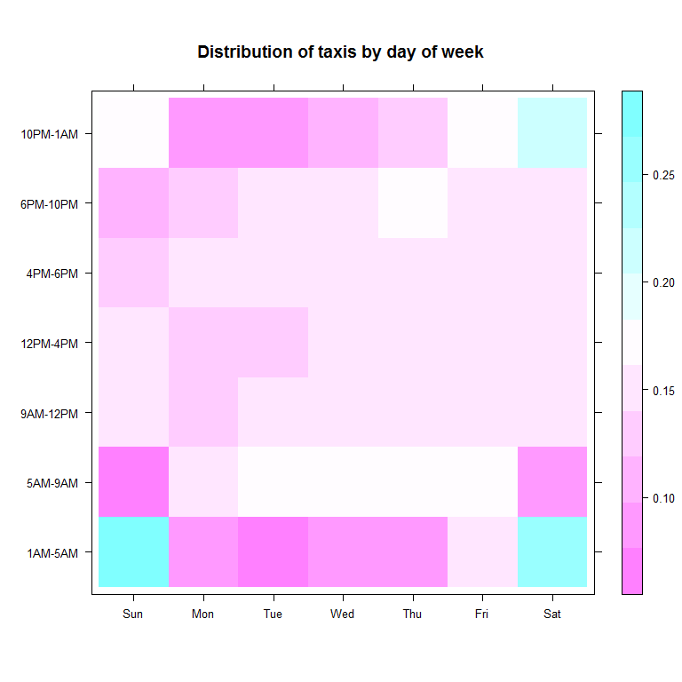
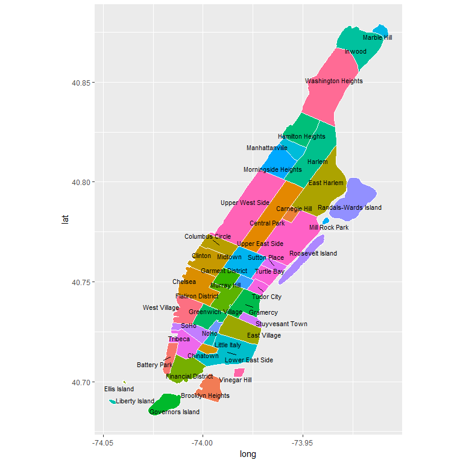

Preparing the data
================
Seth Mottaghinejad
2017-03-08

Raw data is often too primitive to be used directly for analysis. After reading in the raw data, a data scientist spends a great deal of time and effort on cleaning the data and adding the features to the data that pertain to the analysis at hand. How the data needs to be cleaned is something that is partly guided by how the analysis makes business common sense and meets certain requirements, and partly by the specific analytics algorithm that it is being fed to. In other words, it is can be somewhat subjective as long as it does not makes the analysis hard to understand.

Common data prep tasks can be - dealing with missing values - dealing with outliers - deciding the level of granularity for the data, for example should time variables be in seconds, minutes, or hours, etc. - deciding which features to add or extract based on existing features to make the analysis more interesting or easier to interpret

Learning objectives
-------------------

After reading this chapter, we will understand how to - run some preliminary checks on the data - use `rxDataStep` modify existing columns or create new ones - wrap more complicated transformations into function that we pass directly to `rxDataStep` - examine and summarize new features to double-check our work

Checking column types
---------------------

It's a good idea to check our column types and make sure nothing strange stands out. In addition to column types, the `rxGetInfo` function also shows lows and highs for numeric columns, which can be useful for identifying outliers or running sanity checks. With the `numRows = 5` argument, we can look at the first 5 rows of the data as well.

``` r
rxGetInfo(nyc_xdf, getVarInfo = TRUE, numRows = 5)
```

    ## File name: C:\Data\NYC_taxi\yellow_tripsample_2016.xdf 
    ## Number of observations: 6000000 
    ## Number of variables: 27 
    ## Number of blocks: 12 
    ## Compression type: zlib 
    ## Variable information: 
    ## Var 1: pickup_datetime, Type: character
    ## Var 2: dropoff_datetime, Type: character
    ## Var 3: passenger_count, Type: integer, Low/High: (0, 9)
    ## Var 4: trip_distance, Type: numeric, Low/High: (0.0000, 1674367.7000)
    ## Var 5: pickup_longitude, Type: numeric, Low/High: (-121.9337, 0.0000)
    ## Var 6: pickup_latitude, Type: numeric, Low/High: (0.0000, 57.2693)
    ## Var 7: rate_code_id
    ##        6 factor levels: standard JFK Newark Nassau or Westchester negotiated group ride
    ## Var 8: dropoff_longitude, Type: numeric, Low/High: (-121.9334, 0.0000)
    ## Var 9: dropoff_latitude, Type: numeric, Low/High: (0.0000, 405.3167)
    ## Var 10: payment_type
    ##        2 factor levels: card cash
    ## Var 11: fare_amount, Type: numeric, Low/High: (-450.0000, 628544.7400)
    ## Var 12: extra, Type: numeric, Low/High: (-35.5000, 636.1200)
    ## Var 13: mta_tax, Type: numeric, Low/High: (-2.7000, 80.5000)
    ## Var 14: tip_amount, Type: numeric, Low/High: (-64.2500, 843.8200)
    ## Var 15: tolls_amount, Type: numeric, Low/High: (-12.5000, 905.5400)
    ## Var 16: improvement_surcharge, Type: numeric, Low/High: (-0.3000, 0.7600)
    ## Var 17: total_amount, Type: numeric, Low/High: (-450.8000, 629033.7800)
    ## Var 18: tip_percent, Type: numeric, Low/High: (-1.0000, 100.0000)
    ## Var 19: pickup_hour
    ##        7 factor levels: 1AM-5AM 5AM-9AM 9AM-12PM 12PM-4PM 4PM-6PM 6PM-10PM 10PM-1AM
    ## Var 20: pickup_dow
    ##        7 factor levels: Sun Mon Tue Wed Thu Fri Sat
    ## Var 21: dropoff_hour
    ##        7 factor levels: 1AM-5AM 5AM-9AM 9AM-12PM 12PM-4PM 4PM-6PM 6PM-10PM 10PM-1AM
    ## Var 22: dropoff_dow
    ##        7 factor levels: Sun Mon Tue Wed Thu Fri Sat
    ## Var 23: trip_duration, Type: integer, Low/High: (-631147949, 11122910)
    ## Var 24: pickup_nhood
    ##        558 factor levels: 19th Ward Abbott McKinley Airmont Albright Alcove ... Woodhaven Woodlawn Woodrow Woodside Yorktown Heights
    ## Var 25: pickup_borough
    ##        24 factor levels: Albany Allegany Bronx Cattaraugus Dutchess ... Sullivan Tompkins Warren Westchester Wyoming
    ## Var 26: dropoff_nhood
    ##        558 factor levels: 19th Ward Abbott McKinley Airmont Albright Alcove ... Woodhaven Woodlawn Woodrow Woodside Yorktown Heights
    ## Var 27: dropoff_borough
    ##        24 factor levels: Albany Allegany Bronx Cattaraugus Dutchess ... Sullivan Tompkins Warren Westchester Wyoming
    ## Data (5 rows starting with row 1):
    ##       pickup_datetime    dropoff_datetime passenger_count trip_distance pickup_longitude
    ## 1 2016-06-21 21:33:52 2016-06-21 21:34:40               5          0.40        -73.97750
    ## 2 2016-06-08 09:52:19 2016-06-08 10:19:55               1          5.20        -73.96890
    ## 3 2016-06-14 23:27:22 2016-06-14 23:35:05               1          2.10        -73.98932
    ## 4 2016-06-12 20:13:12 2016-06-12 20:18:53               5          2.23        -73.98183
    ## 5 2016-06-10 23:40:21 2016-06-11 00:05:14               3          2.72        -74.00858
    ##   pickup_latitude rate_code_id dropoff_longitude dropoff_latitude payment_type fare_amount extra
    ## 1        40.74949     standard         -73.98100         40.74445         card         3.0   0.5
    ## 2        40.80114     standard         -73.98331         40.75087         cash        21.5   0.0
    ## 3        40.71869     standard         -73.96317         40.71445         card         9.0   0.5
    ## 4        40.77286     standard         -73.95563         40.78540         card         8.0   0.5
    ## 5        40.74144     standard         -73.98224         40.72152         card        17.0   0.5
    ##   mta_tax tip_amount tolls_amount improvement_surcharge total_amount tip_percent pickup_hour
    ## 1     0.5       0.86            0                   0.3         5.16          29    6PM-10PM
    ## 2     0.5       0.00            0                   0.3        22.30           0     5AM-9AM
    ## 3     0.5       1.50            0                   0.3        11.80          17    10PM-1AM
    ## 4     0.5       2.79            0                   0.3        12.09          35    6PM-10PM
    ## 5     0.5       3.66            0                   0.3        21.96          22    10PM-1AM
    ##   pickup_dow dropoff_hour dropoff_dow trip_duration    pickup_nhood pickup_borough    dropoff_nhood
    ## 1        Tue     6PM-10PM         Tue            48     Murray Hill       New York         Gramercy
    ## 2        Wed     9AM-12PM         Wed          1656 Upper West Side       New York Garment District
    ## 3        Tue     10PM-1AM         Tue           463 Lower East Side       New York     Williamsburg
    ## 4        Sun     6PM-10PM         Sun           341 Upper West Side       New York    Carnegie Hill
    ## 5        Fri     10PM-1AM         Sat          1493    West Village       New York     East Village
    ##   dropoff_borough
    ## 1        New York
    ## 2        New York
    ## 3           Kings
    ## 4        New York
    ## 5        New York

Using `rxDataStep`
------------------

Once data in brought in for analysis, we can begin thinking about the interesting/relevant features that go into the analysis. Our goal is primarily exploratory: we want to tell a story based on the data. In that sense, any piece of information contained in the data can be useful. Additionally, new information *o**r**f**e**a**t**u**r**e**s* can be extracted from existing data points. It is not only important to think of which features to extract, but also what their column type must be, so that later analyses run appropriately. As a first example, consider a simple transformation for extracting the percentage that passengers tipped for the trip.

This is where we encounter the `rxDataStep` function, a function that we will revisit many times. `rxDataStep` is an essential function in that it is the most important data transformation function in `RevoScaleR` $the others being \`rxMerge\` and \`rxSort\`$; most other analytics functions are data summary and modeling functions. `rxDataStep` can be used to

-   modify existing columns or add new columns to the data
-   keep or drop certain columns from the data before writing to a new file
-   keep or drop certain rows of the data before writing to a new file

In a local compute context, when we run `rxDataStep`, we specify an `inData` argument which can point to a `data.frame` or a CSV or XDF file. *W**e**c**a**n**l**a**t**e**r**c**h**a**n**g**e**t**h**e**c**o**m**p**u**t**e**c**o**n**t**e**x**t**t**o**S**Q**L**S**e**r**v**e**r**o**r**H**D**F**S**t**o**r**u**n**t**h**e**t**r**a**n**s**f**o**r**m**a**t**i**o**n**i**n**a**r**e**m**o**t**e*, *d**i**s**t**r**i**b**u**t**e**d**c**o**m**p**u**t**e**c**o**n**t**e**x**t*. We also have an `outFile` argument that points to the file we are outputting to, and if both `inData` and `outFile` point to the same file, we must set `overwrite = TRUE`. **Note that **`outFile`\*\* is an optional argument: leaving it out will output the result into a **`data.frame`**. However, in most cases that is not what we want, so we need to specify **`outFile`**.\*\*

Let's start with a simple transformation for calculating tip percentage.

``` r
rxDataStep(nyc_xdf, nyc_xdf,
  transforms = list(
    tip_percent = ifelse(fare_amount > 0 & tip_amount < fare_amount, 
                         round(tip_amount * 100 / fare_amount, 0), 
                         NA)),
  overwrite = TRUE)
rxSummary( ~ tip_percent, nyc_xdf)
```

    ## Call:
    ## rxSummary(formula = ~tip_percent, data = nyc_xdf)
    ## 
    ## Summary Statistics Results for: ~tip_percent
    ## Data: nyc_xdf (RxXdfData Data Source)
    ## File name: C:/Data/NYC_taxi/yellow_tripsample_2016.xdf
    ## Number of valid observations: 6000000 
    ##  
    ##  Name        Mean    StdDev   Min Max ValidObs MissingObs
    ##  tip_percent 13.9733 11.88687 -1  100 5990374  9626

The above transformation was persisted in the data. In other words, there's is now a new column in the data called `tip_percent`. Such a transformation has IO overhead when the data is stored on disk. An alternative approach is to perform the transformation *on the fly* by putting the `transforms` argument directly inside of the `rxSummary` call instead of in a prior `rxDataStep` call. In this case, we don't pay the IO overhead of writing to data on disk.

``` r
rxSummary( ~ tip_percent2, nyc_xdf,
           transforms = list(
            tip_percent2 = ifelse(fare_amount > 0 & tip_amount < fare_amount, 
                                  round(tip_amount * 100 / fare_amount, 0), 
                                  NA)))
```

    ## Call:
    ## rxSummary(formula = ~tip_percent2, data = nyc_xdf, transforms = list(tip_percent2 = ifelse(fare_amount > 
    ##     0 & tip_amount < fare_amount, round(tip_amount * 100/fare_amount, 
    ##     0), NA)))
    ## 
    ## Summary Statistics Results for: ~tip_percent2
    ## Data: nyc_xdf (RxXdfData Data Source)
    ## File name: C:/Data/NYC_taxi/yellow_tripsample_2016.xdf
    ## Number of valid observations: 6000000 
    ##  
    ##  Name         Mean    StdDev   Min Max ValidObs MissingObs
    ##  tip_percent2 13.9733 11.88687 -1  100 5990374  9626

In the above case, `tip_percent2` is calculated so `rxSummary` can then provide us with summary statistics, but the transformation does not persist in the data. We can run on the fly transformations on all of the summary and analytics functions in `RevoScaleR` in a similar fashion. For more straight-forward types of transformations, performing the transformation on the fly usually makes sense because it runs faster (no IO overhead) and prevents us from persisting too many columns in the data. It can still be beneficial to presist some transformations if the transformed columns are used repeatedly in various parts of the analysis. In the latter case, the IO overhead may be outweighed by the overhead of repeatedly performing the transformation and the inconvenience of having to copy and paste the same transformation in multiple places.

### Exercises

We can use the `rxCrossTabs` function to get counts for the number of trips per month and year of the data. We do so by passing the formula `~ month:year` to `rxCrossTabs`. Right now we don't have a column called `month` and one called `year` in the data, but we can extract them from `pickup_datetime`. Since this is a straight-forward transform, it's probably easier to run it on the fly with a `transforms` argument inside the `rxCrossTabs` function. Note that `rxCrossTabs` expects those columns to be `factor` columns, as they represent categorical data.

1.  Write a transformation that extracts `year` and one that extracts `month` from `pickup_datetime` and using the `substr` function.

2.  Write a similar transformation that extracts `year` and one that extracts `month` from `pickup_datetime` this time by first converting `pickup_datetime` to a `datetime` column using the `ymd_hms` function in the `lubridate` package, and then using the `year` and `month` *functions* (also in `lubridate`) to extract `year` and `month` respectively. You will also have to specify `transformPackages = 'lubridate'`.

3.  Which transformation is faster? Which transformation do you prefer?

### Solutions

1.  We use `substr` to extract the year and month form `pickup_datetime` and convert them to factors. We can specify any range of values as `levels`, not just what we expect in the data.

``` r
rxCrossTabs( ~ month:year, nyc_xdf,
             transforms = list(
               year = as.integer(substr(pickup_datetime, 1, 4)),
               month = as.integer(substr(pickup_datetime, 6, 7)),
               year = factor(year, levels = 2014:2016),
               month = factor(month, levels = 1:12)))
```

    ## Call:
    ## rxCrossTabs(formula = ~month:year, data = nyc_xdf, transforms = list(year = as.integer(substr(pickup_datetime, 
    ##     1, 4)), month = as.integer(substr(pickup_datetime, 6, 7)), 
    ##     year = factor(year, levels = 2014:2016), month = factor(month, 
    ##         levels = 1:12)))
    ## 
    ## Cross Tabulation Results for: ~month:year
    ## Data: nyc_xdf (RxXdfData Data Source)
    ## File name: C:/Data/NYC_taxi/yellow_tripsample_2016.xdf
    ## Number of valid observations: 6000000
    ## Number of missing observations: 0 
    ## Statistic: counts 
    ##  
    ## month:year (counts):
    ##      year
    ## month 2014 2015    2016
    ##    1     0    0 1000000
    ##    2     0    0 1000000
    ##    3     0    0 1000000
    ##    4     0    0 1000000
    ##    5     0    0 1000000
    ##    6     0    0 1000000
    ##    7     0    0       0
    ##    8     0    0       0
    ##    9     0    0       0
    ##    10    0    0       0
    ##    11    0    0       0
    ##    12    0    0       0

1.  In this case we first convert `pickup_datetime` form `character` to `datetime` and then extract year and month. Because we're using the `lubridate` package we specify this using the `transformPackages` argument. Note that we can't just put `library(lubridate)` at the top, becuase `rxCrossTabs` is a `RevoScaleR` function and as such it can run not just locally, but also in remote compute contexts where the `lubridate` package will have to be loaded before it can execute.

``` r
rxCrossTabs( ~ month:year, nyc_xdf,
             transforms = list(
               date = ymd_hms(pickup_datetime),
               year = factor(year(date), levels = 2014:2016),
               month = factor(month(date), levels = 1:12)),
             transformPackages = "lubridate")
```

    ## Call:
    ## rxCrossTabs(formula = ~month:year, data = nyc_xdf, transforms = list(date = ymd_hms(pickup_datetime), 
    ##     year = factor(year(date), levels = 2014:2016), month = factor(month(date), 
    ##         levels = 1:12)), transformPackages = "lubridate")
    ## 
    ## Cross Tabulation Results for: ~month:year
    ## Data: nyc_xdf (RxXdfData Data Source)
    ## File name: C:/Data/NYC_taxi/yellow_tripsample_2016.xdf
    ## Number of valid observations: 6000000
    ## Number of missing observations: 0 
    ## Statistic: counts 
    ##  
    ## month:year (counts):
    ##      year
    ## month 2014 2015    2016
    ##    1     0    0 1000000
    ##    2     0    0 1000000
    ##    3     0    0 1000000
    ##    4     0    0 1000000
    ##    5     0    0 1000000
    ##    6     0    0 1000000
    ##    7     0    0       0
    ##    8     0    0       0
    ##    9     0    0       0
    ##    10    0    0       0
    ##    11    0    0       0
    ##    12    0    0       0

1.  The first transformation is faster, becuase it deals directly with the strings. The second transformation is more powerful, because we can use it to extract things such as day of week, which can't be directly extracted from the string.

Complex transformations
-----------------------

In the last part `rxDataStep` was introduced to perform a simple one-liner transformation. We now use `rxDataStep` again to perform some other, this time more complicated transformations. We can sometimes perform these more complex transformations as longer one-liners using the `transforms` argument, following the above example. But a cleaner way to do it is to create a function that contains the logic of our transformations and pass it to the `transformFunc` argument. This function takes the data as input and usually returns the same data as output with one or more columns added or modified. More specifically, the input to the transformation function is a `list` whose elements are the columns. Otherwise, it is just like any R function. Using the `transformFunc` argument allows us to focus on writing a transformation function and quickly testing them on the sample `data.frame` before we run them on the whole data.

For the NYC Taxi data, we are interested in comparing trips based on day of week and the time of day. Those two columns do not exist yet, but we can extract them from pick-up date and time and drop-off date and time. To extract the above features, we use the `lubridate` package, which has useful functions for dealing with date and time columns. To perform these transformations, we use a transformation function called `xforms`.

``` r
# transformation function for extracting some date and time features
xforms <- function(data) {
  
  wlabels <- c('Sun', 'Mon', 'Tue', 'Wed', 'Thu', 'Fri', 'Sat')
  cut_levels <- c(1, 5, 9, 12, 16, 18, 22)
  hour_labels <- c('1AM-5AM', '5AM-9AM', '9AM-12PM', '12PM-4PM', 
                   '4PM-6PM', '6PM-10PM', '10PM-1AM')
  
  pickup_datetime <- ymd_hms(data$pickup_datetime, tz = "UTC")
  pickup_hour <- addNA(cut(hour(pickup_datetime), cut_levels))
  pickup_dow <- factor(wday(pickup_datetime), levels = 1:7, labels = wlabels)
  levels(pickup_hour) <- hour_labels
  
  dropoff_datetime <- ymd_hms(data$dropoff_datetime, tz = "UTC")
  dropoff_hour <- addNA(cut(hour(dropoff_datetime), cut_levels))
  dropoff_dow <- factor(wday(dropoff_datetime), levels = 1:7, labels = wlabels)
  levels(dropoff_hour) <- hour_labels
  
  data$pickup_hour <- pickup_hour
  data$pickup_dow <- pickup_dow
  data$dropoff_hour <- dropoff_hour
  data$dropoff_dow <- dropoff_dow
  data$trip_duration <- as.integer(as.duration(dropoff_datetime - pickup_datetime))
  
  data
}
```

Before we apply the transformation to the data, it's usually a good idea to test it and make sure it's working. We set aside a sample of the data as a `data.frame` for this purpose. Running the transformation function on `nyc_sample` should return the original data with the new columns.

``` r
library(lubridate)
Sys.setenv(TZ = "US/Eastern") # not important for this dataset
head(xforms(nyc_sample)) # test the function on a data.frame
```

    ##       pickup_datetime    dropoff_datetime passenger_count trip_distance pickup_longitude
    ## 1 2016-01-16 19:30:38 2016-01-16 19:44:42               1          2.20        -73.95630
    ## 2 2016-01-16 22:21:42 2016-01-16 22:35:30               2          6.36        -73.97758
    ## 3 2016-01-31 01:25:13 2016-01-31 01:33:31               2          2.97        -73.98280
    ## 4 2016-01-09 10:27:41 2016-01-09 10:30:55               4          0.60        -73.96043
    ## 5 2016-01-01 03:48:48 2016-01-01 03:58:20               3          2.60        -73.99337
    ## 6 2016-01-22 21:11:53 2016-01-22 21:37:07               1          3.11        -73.97186
    ##   pickup_latitude rate_code_id dropoff_longitude dropoff_latitude payment_type fare_amount extra
    ## 1        40.78182            1         -73.98237         40.77283            1        11.5   0.0
    ## 2        40.74229            1         -73.98560         40.68565            1        19.5   0.5
    ## 3        40.73094            1         -73.95458         40.76549            1        10.0   0.5
    ## 4        40.76635            1         -73.95851         40.76003            1         4.5   0.0
    ## 5        40.74152            1         -73.99491         40.76984            2        10.0   0.5
    ## 6        40.75442            1         -74.00585         40.73620            2        16.5   0.5
    ##   mta_tax tip_amount tolls_amount improvement_surcharge total_amount pickup_hour pickup_dow
    ## 1     0.5       3.00            0                   0.3        15.30    6PM-10PM        Sat
    ## 2     0.5       5.20            0                   0.3        26.00    6PM-10PM        Sat
    ## 3     0.5       1.00            0                   0.3        12.30    10PM-1AM        Sun
    ## 4     0.5       1.05            0                   0.3         6.35    9AM-12PM        Sat
    ## 5     0.5       0.00            0                   0.3        11.30     1AM-5AM        Fri
    ## 6     0.5       0.00            0                   0.3        17.80    6PM-10PM        Fri
    ##   dropoff_hour dropoff_dow trip_duration
    ## 1     6PM-10PM         Sat           844
    ## 2     6PM-10PM         Sat           828
    ## 3     10PM-1AM         Sun           498
    ## 4     9AM-12PM         Sat           194
    ## 5      1AM-5AM         Fri           572
    ## 6     6PM-10PM         Fri          1514

We run one last test before applying the transformation. Recall that `rxDataStep` works with a `data.frame` input too, and that leaving the `outFile` argument means we return a `data.frame`. So we can perform the above test with `rxDataStep` by passing transformation function to `transformFunc` and specifying the required packages in `transformPackages`.

``` r
head(rxDataStep(nyc_sample, transformFunc = xforms, transformPackages = "lubridate"))
```

    ##       pickup_datetime    dropoff_datetime passenger_count trip_distance pickup_longitude
    ## 1 2016-01-16 19:30:38 2016-01-16 19:44:42               1          2.20        -73.95630
    ## 2 2016-01-16 22:21:42 2016-01-16 22:35:30               2          6.36        -73.97758
    ## 3 2016-01-31 01:25:13 2016-01-31 01:33:31               2          2.97        -73.98280
    ## 4 2016-01-09 10:27:41 2016-01-09 10:30:55               4          0.60        -73.96043
    ## 5 2016-01-01 03:48:48 2016-01-01 03:58:20               3          2.60        -73.99337
    ## 6 2016-01-22 21:11:53 2016-01-22 21:37:07               1          3.11        -73.97186
    ##   pickup_latitude rate_code_id dropoff_longitude dropoff_latitude payment_type fare_amount extra
    ## 1        40.78182            1         -73.98237         40.77283            1        11.5   0.0
    ## 2        40.74229            1         -73.98560         40.68565            1        19.5   0.5
    ## 3        40.73094            1         -73.95458         40.76549            1        10.0   0.5
    ## 4        40.76635            1         -73.95851         40.76003            1         4.5   0.0
    ## 5        40.74152            1         -73.99491         40.76984            2        10.0   0.5
    ## 6        40.75442            1         -74.00585         40.73620            2        16.5   0.5
    ##   mta_tax tip_amount tolls_amount improvement_surcharge total_amount pickup_hour pickup_dow
    ## 1     0.5       3.00            0                   0.3        15.30    6PM-10PM        Sat
    ## 2     0.5       5.20            0                   0.3        26.00    6PM-10PM        Sat
    ## 3     0.5       1.00            0                   0.3        12.30    10PM-1AM        Sun
    ## 4     0.5       1.05            0                   0.3         6.35    9AM-12PM        Sat
    ## 5     0.5       0.00            0                   0.3        11.30     1AM-5AM        Fri
    ## 6     0.5       0.00            0                   0.3        17.80    6PM-10PM        Fri
    ##   dropoff_hour dropoff_dow trip_duration
    ## 1     6PM-10PM         Sat           844
    ## 2     6PM-10PM         Sat           828
    ## 3     10PM-1AM         Sun           498
    ## 4     9AM-12PM         Sat           194
    ## 5      1AM-5AM         Fri           572
    ## 6     6PM-10PM         Fri          1514

Everything seems to be working well. This does not guarantee that running the transformation function on the whole dataset will succeed, but it makes it less likely to fail for the wrong reasons. If the transformation works on the sample `data.frame`, as it does above, but fails when we run it on the whole dataset, then it is usually because of something in the dataset that causes it to fail (such as missing values) that was not present in the sample data. We now run the transformation on the whole data set.

``` r
st <- Sys.time()
rxDataStep(nyc_xdf, nyc_xdf, overwrite = TRUE, transformFunc = xforms, 
           transformPackages = "lubridate")
Sys.time() - st
```

    ## Time difference of 1.909374 mins

Examining the new columns
-------------------------

Let's examine the new columns we created to make sure the transformation more or less worked. We use the `rxSummary` function to get some statistical summaries of the data. The `rxSummary` function is akin to the `summary` function in base R $aside from the fact that \`summary\` only works on a \`data.frame\`$ in two ways:

-   It provides numerical summaries for numeric columns $except for percentiles, for which we use the \`rxQuantile\` function$.
-   It provides counts for each level of the factor columns.

We use the same *formula notation* used by many other R modeling or plotting functions to specify which columns we want summaries for. For example, here we want to see summaries for `pickup_hour` and `pickup_dow` *b**o**t**h**f**a**c**t**o**r**s* and `trip_duration` *n**u**m**e**r**i**c*, *i**n**s**e**c**o**n**d**s*.

``` r
rxs1 <- rxSummary( ~ pickup_hour + pickup_dow + trip_duration, nyc_xdf)
# we can add a column for proportions next to the counts
rxs1$categorical <- lapply(rxs1$categorical, 
  function(x) cbind(x, prop = round(prop.table(x$Counts), 2)))
rxs1
```

    ## Call:
    ## rxSummary(formula = ~pickup_hour + pickup_dow + trip_duration, 
    ##     data = nyc_xdf)
    ## 
    ## Summary Statistics Results for: ~pickup_hour + pickup_dow + trip_duration
    ## Data: nyc_xdf (RxXdfData Data Source)
    ## File name: C:/Data/NYC_taxi/yellow_tripsample_2016.xdf
    ## Number of valid observations: 6000000 
    ##  
    ##  Name          Mean     StdDev   Min        Max      ValidObs MissingObs
    ##  trip_duration 852.8945 257844.9 -631147949 11122910 6000000  0         
    ## 
    ## Category Counts for pickup_hour
    ## Number of categories: 7
    ## Number of valid observations: 6000000
    ## Number of missing observations: 0
    ## 
    ##  pickup_hour Counts  prop
    ##  1AM-5AM      329006 0.05
    ##  5AM-9AM      918307 0.15
    ##  9AM-12PM     844536 0.14
    ##  12PM-4PM    1163923 0.19
    ##  4PM-6PM      688718 0.11
    ##  6PM-10PM    1395406 0.23
    ##  10PM-1AM     660104 0.11
    ## 
    ## Category Counts for pickup_dow
    ## Number of categories: 7
    ## Number of valid observations: 6000000
    ## Number of missing observations: 0
    ## 
    ##  pickup_dow Counts prop
    ##  Sun        800938 0.13
    ##  Mon        772497 0.13
    ##  Tue        834303 0.14
    ##  Wed        863102 0.14
    ##  Thu        900046 0.15
    ##  Fri        922501 0.15
    ##  Sat        906613 0.15

Separating two variables by a colon $\`pickup\_dow:pickup\_hour\`$ instead of a plus sign $\`pickup\_dow + pickup\_hour\`$ allows us to get summaries for each combination of the levels of the two factor columns, instead of individual ones.

``` r
rxs2 <- rxSummary( ~ pickup_dow:pickup_hour, nyc_xdf)
rxs2 <- tidyr::spread(rxs2$categorical[[1]], key = 'pickup_hour', value = 'Counts')
row.names(rxs2) <- rxs2[ , 1]
rxs2 <- as.matrix(rxs2[ , -1])
rxs2
```

    ##     1AM-5AM 5AM-9AM 9AM-12PM 12PM-4PM 4PM-6PM 6PM-10PM 10PM-1AM
    ## Sun   90152   63765   120845   170707   89473   146544   119452
    ## Mon   26591  141221   109407   158314   98046   181295    57623
    ## Tue   24088  158331   119558   162326   99995   206040    63965
    ## Wed   26989  159947   122653   163004   98939   217245    74325
    ## Thu   30692  162472   123351   166281  101116   227925    88209
    ## Fri   48405  152911   121952   166255  101582   217533   113863
    ## Sat   82089   79660   126770   177036   99567   198824   142667

In the above case, the individual counts are not as helpful to us as proportions from those counts, and for comparing across different days of the week, we want the proportions to be based on totals for each column, not the entire table. We ask for proportions based on column totals by passing the 2 to as second argument to the `prop.table` function. We can also visually display the proportions using the `levelplot` function.

``` r
levelplot(prop.table(rxs2, 2), cuts = 10, xlab = "", ylab = "", 
          main = "Distribution of taxis by day of week")
```



Interesting results manifest themselves in the above plot:

1.  Early morning *b**e**t**w**e**e**n*5*A**M**a**n**d*9*A**M* taxi rides are predictably at their lowest on weekends, and somewhat on Mondays *t**h**e**M**o**n**d**a**y**b**l**u**e**s**e**f**f**e**c**t*?.
2.  During the business hours *b**e**t**w**e**e**n*9*A**M**a**n**d*6*P**M*, about the same proportion of taxi trips take place *a**b**o**u**t*42*t**o*45*p**e**r**c**e**n**t* for each day of the week, including weekends. In other words, regardless of what day of the week it is, a little less than half of all trips take place between 9AM and 6PM.
3.  We can see a spike in taxi rides between 6PM and 10PM on Thursday and Friday evenings, and a spike between 10PM and 1AM on Friday and especially Saturday evenings. Taxi trips between 1AM and 5AM spike up on Saturdays *t**h**e**F**r**i**d**a**y**l**a**t**e* − *n**i**g**h**t**o**u**t**i**n**g**s* and even more so on Sundays *t**h**e**S**a**t**u**r**d**a**y**l**a**t**e* − *n**i**g**h**t**o**u**t**i**n**g**s*. They fall sharply on other days, but right slightly on Fridays *i**n**a**n**t**i**c**i**p**a**t**i**o**n*!. In other words, more people go out on Thursdays but don't stay out late, even more people go out on Fridays and stay even later, but Saturday is the day most people choose for a really late outing.

Plotting neighborhoods
----------------------

We now add another set of features to the data: pickup and drop-off neighborhoods. Getting neighborhood information from longitude and latitude is not something we can hardcode easily, so instead we rely a few GIS packages and a **shapefile** [(courtesy of Zillow)](http://www.zillow.com/howto/api/neighborhood-boundaries.htm). A shapefile is a file that contains geographical information inside of it, including information about boundaries separating geographical areas. The `ZillowNeighborhoods-NY.shp` file has information about NYC neighborhoods.

We begin by plotting a map of Manhattan neighborhoods, so we can see the neighborhood boundaries and familiarize ourselves with their names. The details of how the plot below was generated is beyond the discussion of this course, and we recommend checking the documentation for the `maptools` library for more details.

``` r
library(rgeos)
library(maptools)

nyc_shapefile <- readShapePoly('../ZillowNeighborhoods-NY/ZillowNeighborhoods-NY.shp')
mht_shapefile <- subset(nyc_shapefile, City == 'New York' & County == 'New York')

mht_shapefile@data$id <- as.character(mht_shapefile@data$Name)
library(ggplot2)
mht_points <- fortify(gBuffer(mht_shapefile, byid = TRUE, width = 0), region = "Name")
library(dplyr)
mht_df <- inner_join(mht_points, mht_shapefile@data, by = "id")
mht_cent <- cbind(mht_shapefile@data, as.data.frame(gCentroid(mht_shapefile, byid = TRUE)))

library(ggrepel)
ggplot(mht_df, aes(long, lat, fill = id)) +
  geom_polygon() +
  geom_path(color = "white") +
  coord_equal() +
  theme(legend.position = "none") +
  geom_text_repel(aes(label = id, x = x, y = y), data = mht_cent, size = 3)
```



### Exercises

The NYC Taxi dataset has a [data dictionary](http://www.nyc.gov/html/tlc/downloads/pdf/data_dictionary_trip_records_yellow.pdf), which we can use to properly label the columns `rate_code_id` and `payment_type`.

1.  Based on the information in the data dictionary, run a transformation that coverts `rate_code_id` and `payment_type` into `factor` columns (if it's not one already) with the proper labels. In the case of `payment_type`, lump anything that isn't card or cash into a generic third category.

In the last section, we stored the shapefile for NYC in an object called `nyc_shapefile`, which we then used to plot a map of Manhattan neighborhoods. Let's now see how we can use the same shapefile along with the function `over` (part of the `sp` package) to find out pick-up and drop-off neighborhoods for each trip. We will demonstrate how we can do that with a `data.frame` (using the sample of the NYC taxi data we took earlier) and leave it as an exercise to find out how we can wrap the code in a transformation function and apply it to the XDF data.

To add pick-up neighborhood columns to `nyc_sample`, we need to do as follows: - replace NAs in `pickup_latitude` and `pickup_longitude` with 0, otherwise we will get an error - use the `coordinates` function to specify that the above two columns represent the geographical coordinates in the data - use the `over` function to get neighborhoods based on the coordinates specified above, which returns a `data.frame` with neighborhood information - attach the results to the original data using `cbind` after giving them relevant column names

``` r
# take only the coordinate columns, and replace NAs with 0
data_coords <- data.frame(
  long = ifelse(is.na(nyc_sample$pickup_longitude), 0, nyc_sample$pickup_longitude),
  lat = ifelse(is.na(nyc_sample$pickup_latitude), 0, nyc_sample$pickup_latitude)
  )
# we specify the columns that correspond to the coordinates
coordinates(data_coords) <- c('long', 'lat')
# returns the neighborhoods based on coordinates
nhoods <- over(data_coords, nyc_shapefile)
# rename the column names in nhoods
names(nhoods) <- paste('pickup', tolower(names(nhoods)), sep = '_')
# combine the neighborhood information with the original data
nyc_sample <- cbind(nyc_sample, nhoods)
head(nyc_sample)
```

    ##       pickup_datetime    dropoff_datetime passenger_count trip_distance pickup_longitude
    ## 1 2016-01-16 19:30:38 2016-01-16 19:44:42               1          2.20        -73.95630
    ## 2 2016-01-16 22:21:42 2016-01-16 22:35:30               2          6.36        -73.97758
    ## 3 2016-01-31 01:25:13 2016-01-31 01:33:31               2          2.97        -73.98280
    ## 4 2016-01-09 10:27:41 2016-01-09 10:30:55               4          0.60        -73.96043
    ## 5 2016-01-01 03:48:48 2016-01-01 03:58:20               3          2.60        -73.99337
    ## 6 2016-01-22 21:11:53 2016-01-22 21:37:07               1          3.11        -73.97186
    ##   pickup_latitude rate_code_id dropoff_longitude dropoff_latitude payment_type fare_amount extra
    ## 1        40.78182            1         -73.98237         40.77283            1        11.5   0.0
    ## 2        40.74229            1         -73.98560         40.68565            1        19.5   0.5
    ## 3        40.73094            1         -73.95458         40.76549            1        10.0   0.5
    ## 4        40.76635            1         -73.95851         40.76003            1         4.5   0.0
    ## 5        40.74152            1         -73.99491         40.76984            2        10.0   0.5
    ## 6        40.75442            1         -74.00585         40.73620            2        16.5   0.5
    ##   mta_tax tip_amount tolls_amount improvement_surcharge total_amount pickup_state pickup_county
    ## 1     0.5       3.00            0                   0.3        15.30           NY      New York
    ## 2     0.5       5.20            0                   0.3        26.00           NY      New York
    ## 3     0.5       1.00            0                   0.3        12.30           NY      New York
    ## 4     0.5       1.05            0                   0.3         6.35           NY      New York
    ## 5     0.5       0.00            0                   0.3        11.30           NY      New York
    ## 6     0.5       0.00            0                   0.3        17.80           NY      New York
    ##   pickup_city       pickup_name pickup_regionid
    ## 1    New York     Carnegie Hill          270810
    ## 2    New York          Gramercy          273860
    ## 3    New York      East Village          270829
    ## 4    New York   Upper East Side          270957
    ## 5    New York Flatiron District          403206
    ## 6    New York        Turtle Bay          270953

The neighborhood columns were successfully added to the data. We can repeat the same process to get drop-off neighborhood information.

1.  What is the appropriate column types for `pickup_name` and `pickup-city`? Check that the column types match your expectations.

In order to run the above transformation on the whole data, we need to take the above code and wrap it into a transformation function that we can pass to `rxDataStep` through the `transfromFunc` argument.

1.  We call the transformation function `find_nhoods`. There are hints in the code below to help you figure out the various steps needed for the function to return the expected results. Based on the above examples, fill in the code to add the pick-up and drop-off neighborhood columns to the data.

``` r
find_nhoods <- function(data) {
  # extract pick-up lat and long and find their neighborhoods
  # add only the pick-up neighborhood and city columns to the data
  # extract drop-off lat and long and find their neighborhoods
  # add only the drop-off neighborhood and city columns to the data
  # return the data with the new columns added in
}
```

Now that we've got our function, it's time to test it. We can do so by running `rxDataStep` on the sample data `nyc_sample`. This is a good way to make sure the transformation works before we run it on the large XDF file `nyc_xdf`. Sometimes errors messages we get are more informative when we apply the transformation to a `data.frame`, and it's easier to trace it back and debug it. So here we use `rxDataStep` and feed it `nyc_sample` (with no `outFile` argument) to see what the data looks like after applying the transformation function `find_nhoods` to it.

``` r
# test the function on a data.frame using rxDataStep
head(rxDataStep(nyc_sample, 
                transformFunc = find_nhoods, 
                transformPackages = c("sp", "maptools"), 
                transformObjects = list(shapefile = nyc_shapefile)))
```

1.  Did the transformation work? If not, we can go back to `find_nhoods` and keep making changes until we have the right transformation.

### Solutions

1.  `rate_code_id` is an `integer` column, so we need to use `as.factor` to covert it into a factor. When converting a column from one type to another, we often cannot overwrite the existing column and must create a new column instead. This is because of how the data is broken up into chunks and by converting a column from one type to another, we get a mismatch between chunks. `payment_type` is already a factor and so it doesn't need to be converted to one. When specifying the levels for `payment_type`, we can limit them to 1 and 2 (corresponding to card and cash) and all other levels wills automatically become NAs.

``` r
rxDataStep(nyc_xdf, nyc_xdf,
  transforms = list(
    rate_code_id = as.factor(rate_code_id),
    rate_code_id = factor(rate_code_id, 
                          levels = 1:6, 
                          labels = c('standard', 'JFK', 'Newark', 'Nassau or Westchester', 
                                     'negotiated', 'group ride')),
    payment_type = factor(payment_type, levels = 1:2, labels = c('card', 'cash'))
  ),
  overwrite = TRUE)
```

1.  Because we want to apply the transformation to the large data `nyc_xdf`, we need to make sure that we don't add unnecessary columns and that the columns have the appropriate types.

``` r
nhoods <- over(data_coords, mht_shapefile)
str(nhoods)
```

    ## 'data.frame':    1000 obs. of  6 variables:
    ##  $ State   : Factor w/ 1 level "NY": 1 1 1 1 1 1 1 1 1 1 ...
    ##  $ County  : Factor w/ 24 levels "Albany","Allegany",..: 10 10 10 10 10 10 10 10 10 10 ...
    ##  $ City    : Factor w/ 50 levels "Albany","Alma",..: 25 25 25 25 25 25 25 25 25 25 ...
    ##  $ Name    : Factor w/ 558 levels "19th Ward","Abbott McKinley",..: 76 203 146 509 171 501 499 98 220 332 ...
    ##  $ RegionID: Factor w/ 575 levels "10007","10329",..: 152 269 162 233 470 231 229 257 72 281 ...
    ##  $ id      : chr  "Carnegie Hill" "Gramercy" "East Village" "Upper East Side" ...

The shapefile contains a few columns we don't need. The neighborhood column is called `NAME` and the city column is called `CITY` (which for NYC also contains the name of the borough). The appropriate column type for both is `factor`, which is already the case.

1.  There is more than a single correct solution in this case, but here's one that works.

``` r
find_nhoods <- function(data) {
  # extract pick-up lat and long and find their neighborhoods
  pickup_longitude <- ifelse(is.na(data$pickup_longitude), 0, data$pickup_longitude)
  pickup_latitude <- ifelse(is.na(data$pickup_latitude), 0, data$pickup_latitude)
  data_coords <- data.frame(long = pickup_longitude, lat = pickup_latitude)
  coordinates(data_coords) <- c('long', 'lat')
  nhoods <- over(data_coords, shapefile)
  # add only the pick-up neighborhood and city columns to the data
  data$pickup_nhood <- nhoods$Name
  data$pickup_borough <- nhoods$County
  # extract drop-off lat and long and find their neighborhoods
  dropoff_longitude <- ifelse(is.na(data$dropoff_longitude), 0, data$dropoff_longitude)
  dropoff_latitude <- ifelse(is.na(data$dropoff_latitude), 0, data$dropoff_latitude)
  data_coords <- data.frame(long = dropoff_longitude, lat = dropoff_latitude)
  coordinates(data_coords) <- c('long', 'lat')
  nhoods <- over(data_coords, shapefile)
  # add only the drop-off neighborhood and city columns to the data
  data$dropoff_nhood <- nhoods$Name
  data$dropoff_borough <- nhoods$County
  # return the data with the new columns added in
  data
}
```

1.  We can test the above function on the sample data to make sure it works.

``` r
# test the function on a data.frame using rxDataStep
head(rxDataStep(nyc_sample, transformFunc = find_nhoods, 
                transformPackages = c("sp", "maptools"), 
                transformObjects = list(shapefile = nyc_shapefile)))
```

    ##       pickup_datetime    dropoff_datetime passenger_count trip_distance pickup_longitude
    ## 1 2016-01-16 19:30:38 2016-01-16 19:44:42               1          2.20        -73.95630
    ## 2 2016-01-16 22:21:42 2016-01-16 22:35:30               2          6.36        -73.97758
    ## 3 2016-01-31 01:25:13 2016-01-31 01:33:31               2          2.97        -73.98280
    ## 4 2016-01-09 10:27:41 2016-01-09 10:30:55               4          0.60        -73.96043
    ## 5 2016-01-01 03:48:48 2016-01-01 03:58:20               3          2.60        -73.99337
    ## 6 2016-01-22 21:11:53 2016-01-22 21:37:07               1          3.11        -73.97186
    ##   pickup_latitude rate_code_id dropoff_longitude dropoff_latitude payment_type fare_amount extra
    ## 1        40.78182            1         -73.98237         40.77283            1        11.5   0.0
    ## 2        40.74229            1         -73.98560         40.68565            1        19.5   0.5
    ## 3        40.73094            1         -73.95458         40.76549            1        10.0   0.5
    ## 4        40.76635            1         -73.95851         40.76003            1         4.5   0.0
    ## 5        40.74152            1         -73.99491         40.76984            2        10.0   0.5
    ## 6        40.75442            1         -74.00585         40.73620            2        16.5   0.5
    ##   mta_tax tip_amount tolls_amount improvement_surcharge total_amount pickup_state pickup_county
    ## 1     0.5       3.00            0                   0.3        15.30           NY      New York
    ## 2     0.5       5.20            0                   0.3        26.00           NY      New York
    ## 3     0.5       1.00            0                   0.3        12.30           NY      New York
    ## 4     0.5       1.05            0                   0.3         6.35           NY      New York
    ## 5     0.5       0.00            0                   0.3        11.30           NY      New York
    ## 6     0.5       0.00            0                   0.3        17.80           NY      New York
    ##   pickup_city       pickup_name pickup_regionid      pickup_nhood pickup_borough   dropoff_nhood
    ## 1    New York     Carnegie Hill          270810     Carnegie Hill       New York Upper West Side
    ## 2    New York          Gramercy          273860          Gramercy       New York     Boerum Hill
    ## 3    New York      East Village          270829      East Village       New York Upper East Side
    ## 4    New York   Upper East Side          270957   Upper East Side       New York Upper East Side
    ## 5    New York Flatiron District          403206 Flatiron District       New York Columbus Circle
    ## 6    New York        Turtle Bay          270953        Turtle Bay       New York    West Village
    ##   dropoff_borough
    ## 1        New York
    ## 2           Kings
    ## 3        New York
    ## 4        New York
    ## 5        New York
    ## 6        New York

The last four columns in the data correspond to the neighborhood columns we wanted.

Finding neighborhoods
---------------------

We now write a transformation function, `find_nhoods`, that will find the corresponding neighborhood for pick-up and drop-off locations based on their coordinates.

Since we tested the function in the prior exercise and everything went well, we can now apply the transformation to the whole data and reasonably expect that it should work.

``` r
st <- Sys.time()
rxDataStep(nyc_xdf, nyc_xdf, overwrite = TRUE, 
           transformFunc = find_nhoods, 
           transformPackages = c("sp", "maptools", "rgeos"), 
           transformObjects = list(shapefile = nyc_shapefile))

Sys.time() - st
```

    ## Time difference of 4.426033 mins

``` r
rxGetInfo(nyc_xdf, numRows = 5)
```

    ## File name: C:\Data\NYC_taxi\yellow_tripsample_2016.xdf 
    ## Number of observations: 6000000 
    ## Number of variables: 27 
    ## Number of blocks: 12 
    ## Compression type: zlib 
    ## Data (5 rows starting with row 1):
    ##       pickup_datetime    dropoff_datetime passenger_count trip_distance pickup_longitude
    ## 1 2016-06-21 21:33:52 2016-06-21 21:34:40               5          0.40        -73.97750
    ## 2 2016-06-08 09:52:19 2016-06-08 10:19:55               1          5.20        -73.96890
    ## 3 2016-06-14 23:27:22 2016-06-14 23:35:05               1          2.10        -73.98932
    ## 4 2016-06-12 20:13:12 2016-06-12 20:18:53               5          2.23        -73.98183
    ## 5 2016-06-10 23:40:21 2016-06-11 00:05:14               3          2.72        -74.00858
    ##   pickup_latitude rate_code_id dropoff_longitude dropoff_latitude payment_type fare_amount extra
    ## 1        40.74949         <NA>         -73.98100         40.74445         <NA>         3.0   0.5
    ## 2        40.80114         <NA>         -73.98331         40.75087         <NA>        21.5   0.0
    ## 3        40.71869         <NA>         -73.96317         40.71445         <NA>         9.0   0.5
    ## 4        40.77286         <NA>         -73.95563         40.78540         <NA>         8.0   0.5
    ## 5        40.74144         <NA>         -73.98224         40.72152         <NA>        17.0   0.5
    ##   mta_tax tip_amount tolls_amount improvement_surcharge total_amount tip_percent pickup_hour
    ## 1     0.5       0.86            0                   0.3         5.16          29    6PM-10PM
    ## 2     0.5       0.00            0                   0.3        22.30           0     5AM-9AM
    ## 3     0.5       1.50            0                   0.3        11.80          17    10PM-1AM
    ## 4     0.5       2.79            0                   0.3        12.09          35    6PM-10PM
    ## 5     0.5       3.66            0                   0.3        21.96          22    10PM-1AM
    ##   pickup_dow dropoff_hour dropoff_dow trip_duration    pickup_nhood pickup_borough    dropoff_nhood
    ## 1        Tue     6PM-10PM         Tue            48     Murray Hill       New York         Gramercy
    ## 2        Wed     9AM-12PM         Wed          1656 Upper West Side       New York Garment District
    ## 3        Tue     10PM-1AM         Tue           463 Lower East Side       New York     Williamsburg
    ## 4        Sun     6PM-10PM         Sun           341 Upper West Side       New York    Carnegie Hill
    ## 5        Fri     10PM-1AM         Sat          1493    West Village       New York     East Village
    ##   dropoff_borough
    ## 1        New York
    ## 2        New York
    ## 3           Kings
    ## 4        New York
    ## 5        New York
