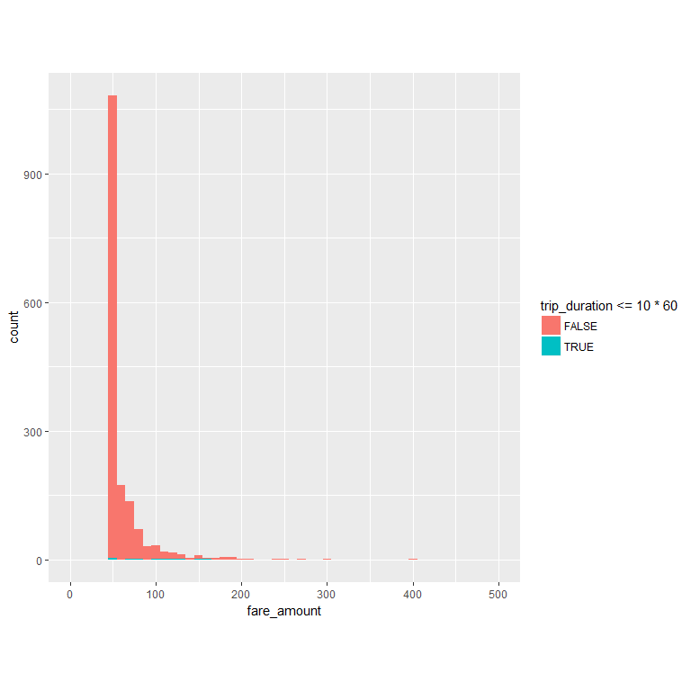
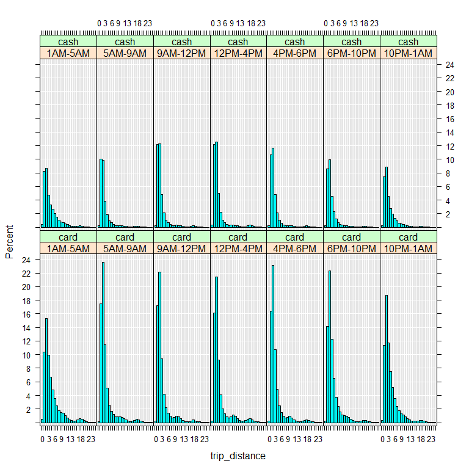

Running sanity checks
================
Seth Mottaghinejad
2017-03-01

In addition to asking whether the data makes logical sense, it's often a good idea to also check whether the data makes business sense or practical sense. Doing so can help us catch certain errors in the data such as data being mislabeled or attributed to the wrong set of features. If unaccounted, such soft errors can have a profound impact on the analysis.

Learning objectives
-------------------

After reading this chapter, we will understand how to - run basic tabulations and summaries on the data - take the return objects from `RevoScaleR` summary functions for further processing by R functions for plotting and more - visualize the distribution of a column with `rxHistogram` - take a random sample of the large data and use it as a way to examine outliers

Examining neighborhoods
-----------------------

By passing `~ .` as the formula to `rxSummary`, we can summarize all the columns in the data.

``` r
system.time(rxs_all <- rxSummary( ~ ., nyc_xdf) )
```

    ##    user  system elapsed 
    ##    0.01    0.00   12.19

For example, the numeric summaries for the relevant columns in the data are stored in `rxs_all` under the element called `sDataFrame`.

``` r
head(rxs_all$sDataFrame)
```

    ##               Name       Mean      StdDev       Min           Max ValidObs MissingObs
    ## 1  pickup_datetime         NA          NA        NA            NA        0          0
    ## 2 dropoff_datetime         NA          NA        NA            NA        0          0
    ## 3  passenger_count   1.660809    1.310673    0.0000       9.00000  6000000          0
    ## 4    trip_distance   3.805193 1131.696858    0.0000 1674367.70000  6000000          0
    ## 5 pickup_longitude -72.917826    8.773957 -121.9337       0.00000  6000000          0
    ## 6  pickup_latitude  40.169355    4.833384    0.0000      57.26928  6000000          0

If we wanted one-way tables showing counts of levels for each `factor` column in the data, we can refer to `rxs_all` to obtain that, but if we need to get two-way tables showing counts of combinations of certain `factor` columns with others we need to pass the correct formula to the summary function. Here we use `rxCube` to get the number of trips broken up by county and neighborhoods.

``` r
nhoods_by_borough <- rxCube( ~ pickup_nhood:pickup_borough, nyc_xdf, returnDataFrame = TRUE)
library(dplyr)
nhoods_by_borough %>%
  select(pickup_borough, pickup_nhood, Counts) %>%
  filter(Counts > 0) %>%
  arrange(pickup_borough, desc(Counts)) %>%
  group_by(pickup_borough) %>%
  top_n(5)
```

    ## Source: local data frame [52 x 3]
    ## Groups: pickup_borough [9]
    ## 
    ##    pickup_borough                          pickup_nhood Counts
    ##            <fctr>                                <fctr>  <dbl>
    ## 1           Bronx                             Concourse   1141
    ## 2           Bronx                            Mott Haven   1099
    ## 3           Bronx                           Port Morris    378
    ## 4           Bronx                               Melrose    280
    ## 5           Bronx                           South Bronx    234
    ## 6           Kings                          Williamsburg  28575
    ## 7           Kings                              Downtown  11599
    ## 8           Kings                            Park Slope   8535
    ## 9           Kings                      Brooklyn Heights   7105
    ## 10          Kings                           Fort Greene   6310
    ## 11         Nassau                      Great Neck Plaza     10
    ## 12         Nassau                          Lake Success      9
    ## 13         Nassau                    Great Neck Village      3
    ## 14         Nassau                           Kings Point      2
    ## 15         Nassau                             Thomaston      2
    ## 16         Nassau                    University Gardens      2
    ## 17       New York                       Upper East Side 815386
    ## 18       New York                               Midtown 684662
    ## 19       New York                       Upper West Side 494724
    ## 20       New York                     Flatiron District 378959
    ## 21       New York                      Garment District 349122
    ## 22         Queens                    La Guardia Airport 149321
    ## 23         Queens John F. Kennedy International Airport 130288
    ## 24         Queens                               Astoria  27951
    ## 25         Queens                             Sunnyside  10355
    ## 26         Queens                         Hunters Point   8422
    ## 27       Richmond                          New Brighton     88
    ## 28       Richmond                              Rosebank     38
    ## 29       Richmond                             Stapleton     33
    ## 30       Richmond                         Tompkinsville     14
    ## 31       Richmond                               Clifton     12
    ## 32       Rockland                                Nanuet      4
    ## 33       Rockland                                 Nyack      2
    ## 34       Rockland                           Pearl River      2
    ## 35       Rockland                              New City      1
    ## 36       Rockland                            Orangeburg      1
    ## 37       Rockland                            West Nyack      1
    ## 38        Suffolk                             Brentwood      3
    ## 39        Suffolk                              Islandia      3
    ## 40        Suffolk                             Bay Shore      2
    ## 41        Suffolk                         Central Islip      2
    ## 42        Suffolk                             Hauppauge      2
    ## 43        Suffolk                          Lloyd Harbor      2
    ## 44    Westchester                          Lincoln Park     11
    ## 45    Westchester                          Pelham Manor      7
    ## 46    Westchester                      Colonial Heights      5
    ## 47    Westchester                          Getty Square      4
    ## 48    Westchester                                Armonk      3
    ## 49    Westchester                            Beech Hill      3
    ## 50    Westchester                              Downtown      3
    ## 51    Westchester                            Greenville      3
    ## 52    Westchester                                Ludlow      3

The `rxCube` and `rxCrossTabs` functions return the same results, but presented differently: `rxCube` results have a tabular representation and `rxCrossTabs` results have a matrix representation. Which we prefer depends on what we are comfortable with and how we indend to use the results. For example, we might be wondering whether every neighborhood falls into one and only one county. We can answer that with the above table, but if we're comfortable with R `matrix` objects we can also use `apply` to answer this question.

``` r
nhoods_by_borough <- rxCrossTabs( ~ pickup_nhood:pickup_borough, nyc_xdf)
nhoods_by_borough <- nhoods_by_borough$counts[[1]]
nb_cnt <- apply(nhoods_by_borough, 1, function(x) sum(x > 0))
nb_cnt[nb_cnt > 1]
```

    ##    Downtown  Kensington Murray Hill   Park Hill 
    ##           2           2           2           2

Looking at Manhattan only
-------------------------

Since the lion's share of taxi trips take place in Manhattan, we focus our attention to Manhattan only and ignore the other four boroughs. For that purpose, we create two new columns called `pickup_nb` and `dropoff_nb` based on the original columns `pickup_nhood` and `dropoff_nhood` except that their factor levels are limited to Manhattan neighborhoods (any other factor level will be replaced with an NA). It is important to do so, because otherwise neighborhoods outside of Manhattan will show up in any modeling or summary function involving those columns.

``` r
manhattan_nhoods <- subset(nyc_shapefile@data, County == 'New York', select = "Name", drop = TRUE)
# manhattan_nhoods <- manhattan_nhoods[-grep('Island', manhattan_nhoods)]
manhattan_nhoods <- as.character(manhattan_nhoods)
bad_nhoods <- c('Brooklyn Heights', 'Marble Hill', 'Ellis Island', 'Liberty Island',
                'Mill Rock Park', 'Governors Island', 'Vinegar Hill')
manhattan_nhoods <- setdiff(manhattan_nhoods, bad_nhoods)

refactor_columns <- function(data) {
  data$pickup_nb = factor(data$pickup_nhood, levels = nhoods_levels)
  data$dropoff_nb = factor(data$dropoff_nhood, levels = nhoods_levels)
  data
}

rxDataStep(nyc_xdf, nyc_xdf, overwrite = TRUE, 
           transformFunc = refactor_columns, 
           transformObjects = list(nhoods_levels = manhattan_nhoods))

rxs_pickdrop <- rxSummary( ~ pickup_nb:dropoff_nb, nyc_xdf)
head(rxs_pickdrop$categorical[[1]])
```

    ##            pickup_nb       dropoff_nb Counts
    ## 1   Roosevelt Island Roosevelt Island     50
    ## 2 Washington Heights Roosevelt Island      2
    ## 3          Chinatown Roosevelt Island     12
    ## 4  Greenwich Village Roosevelt Island     53
    ## 5             Inwood Roosevelt Island      2
    ## 6             Harlem Roosevelt Island      6

Examining trip distance
-----------------------

Data is messy and often needs to be cleaned before we can do much with it. Looking at the above summaries and snapshots of the data, we can often tell how the data needs to be cleaned. Here are some suggestions:

-   *Have missing values been properly accounted for?* In flat files missing values have often a different representation as NAs. For example, missing values for character columns can have an empty entry or one with a catchall term such as 'other' or 'n/a', while missing numeric columns can have empty cells, or use NULL or 999. Sometimes, different codes are used to delineate different kinds of missing values (such as data missing because the information is not relevant, or missing because the information was not provided). When recoding missing values to NAs in R, it's important to account for such differences.
-   *Do column types match our expectation?* This is an important consideration, and we dealt with it by explicitly providing column types prior to reading the data. This is the preferred approach since it avoids unnecessary processing, especially the processing that takes place when R reads in a column as a `factor` when it's not needed. Columns with high cardinality that are formatted as `factor` add a lot of overhead to R session. Such columns often don't need to be `factor` and should remain as `integer` or `character` columns. If we don't know ahead of time which columns should be factors and which not, or if we need to clean a column before turning it into a `factor`, then we can suppress the automatic conversion of `character` columns to `factor` columns by setting `stringsAsFactors = FALSE` when we run `rxImport` or specifying all non-numeric columns to be `character` columns.
-   *Are there outliers in the data and do they seem legitimate?* Often, the question of what an outlier is depends on our understanding of the data and tolerance for deviations from the average patterns in the data. In the NYC Taxi dataset, consider the following cases: (1) A passenger might take a cab and use it all day for running multiple errands, asking the driver to wait for him. (2) A passenger might intend to tip 5 dollars and accidentally press 5 twice and tip 55 dollars for a trip that cost 40 dollars. (3) A passenger could get into a argument with a driver and leave without paying. (4) Multi-passenger trips could have one person pay for everyone or each person pay for himself, with some paying with a card and others using cash. (5) A driver can accidentally keep the meter running after dropping someone off. (6) Machine logging errors can result in either no data or wrong data points. In all of these cases, even assuming that we can easily capture the behavior (because some combination of data points falls within unusual ranges) whether or not we consider them *legitimate* still depends on what the purpose of our analysis is. An outlier could be noise to one analysis and a point of interest to another.

Now that we have the data with candidate outliers, we can examine it for certain patterns. For example, we can plot a histogram of `trip_distance` and notice that almost all trips traveled a distance of less than 20 miles, with the great majority going less than 5 miles.

``` r
rxHistogram( ~ trip_distance, nyc_xdf, startVal = 0, endVal = 25, 
            histType = "Percent", numBreaks = 20)
```


There is a second peak around around trips that traveled between 16 and 20, which is worth examining further. We can verify this by looking at which neighborhoods passengers are traveling from and to.

``` r
rxs <- rxSummary( ~ pickup_nhood:dropoff_nhood, nyc_xdf, 
                 rowSelection = (trip_distance > 15 & trip_distance < 22))
library(dplyr)
head(arrange(rxs$categorical[[1]], desc(Counts)), 10)
```

    ##                             pickup_nhood                         dropoff_nhood Counts
    ## 1  John F. Kennedy International Airport                               Midtown  13256
    ## 2                                Midtown John F. Kennedy International Airport   9046
    ## 3  John F. Kennedy International Airport                       Upper East Side   6826
    ## 4  John F. Kennedy International Airport                       Upper West Side   5479
    ## 5                        Upper East Side John F. Kennedy International Airport   4184
    ## 6  John F. Kennedy International Airport                     Flatiron District   4045
    ## 7  John F. Kennedy International Airport                      Garment District   3850
    ## 8  John F. Kennedy International Airport                          Williamsburg   3230
    ## 9  John F. Kennedy International Airport                               Clinton   3225
    ## 10                       Upper West Side John F. Kennedy International Airport   3063

Looking at the above results can help answer whether long trips correspond to airport rides or people running errands around the city and so on.

Examining outliers
------------------

Let's see how we could use `RevoScaleR` to examine the data for outliers. Our approach here is rather primitive, but the intent is to show how the use the tools: We use `rxDataStep` and its `rowSelection` argument to extract all the data points that are candidate outliers. By leaving the `outFile` argument we output the resulting dataset into a `data.frame` which we call `odd_trips`. Lastly, if we are too expansive in our outlier selection criteria, then resulting `data.frame` could still have too many rows (which could clog the memory and make it slow to produce plots and other summaries). So we create a new column `u` and populate it with random uniform numbers between 0 and 1, and we add `u < .05` to our `rowSelection` criteria. We can adjust this number to end up with a smaller `data.frame` (threshold closer to 0) or a larger `data.frame` (threshold closer to 1).

``` r
# outFile argument missing means we output to data.frame
odd_trips <- rxDataStep(nyc_xdf, 
  rowSelection = (u < .05 & ( # we can adjust this if the data gets too big
                  (trip_distance > 20 | trip_distance <= 0) |
                  (passenger_count > 5 | passenger_count == 0) |
                  (fare_amount > 1000 | fare_amount <= 0))), 
  transforms = list(u = runif(.rxNumRows)))

print(dim(odd_trips))
```

    ## [1] 13423    30

Since the dataset with the candidate outliers is a `data.frame`, we can use any R function to examine it. For example, we limit `odd_trips` to cases where a distance of more than 20 miles was traveled, plot a histogram of the fare amount the passenger paid, and color it based on whether the trip took more or less than 10 minutes.

``` r
library(ggplot2)
odd_trips %>%
filter(trip_distance > 20) %>%
ggplot() -> p

p + geom_histogram(aes(x = fare_amount, fill = trip_duration <= 10*60), binwidth = 10) +
  xlim(0, 500) + 
  coord_fixed(ratio = .5)
```



As we can see, the majority of trips that traveled over 50 miles cost nothing or next to nothing, even though most of these trips took 10 minutes or longer. It is unclear whether such trips were the result of machine error human error, but if for example this analysis was targeted at the company that owns the taxis, this finding would warrant more investigation.

### Exercises

Let's re-create the histogram for `trip_distance` using `rxHistogram`:

``` r
rxHistogram( ~ trip_distance, nyc_xdf, startVal = 0, endVal = 25, 
            histType = "Percent", numBreaks = 20)
```


1.  Modify the formula in the line above so that we get a separate histogram for each combination of `pickup_hour` and `payment_type`.

We used `rxHistogram` to get a histogram of `trip_distance`, which is a `numeric` column. We can also feed a `factor` column to `rxHistogram` and the result is a bar plot. If a `numeric` column is heavily skewed, its histogram is often hard to look at because most of the information is squeezed to one side of the plot. In such cases, we can convert the `numeric` column into a `factor` column, a process that's also called **binning**. We do that in R using the `cut` function, and provide it with a set of breakpoints that are used as boundaries for moving from one bin to the next.

For example, let's say we wanted to know if taxi trips travel zero miles (for whatever business reason), 5 miles or less, between 5 and 10 miles, or 10 or more miles. If a taxi trip travels 8.9 miles, then the following code example will answer it for us.

``` r
cut(8.9, breaks = c(-Inf, 0, 5, 10, Inf), labels = c("0", "<5", "5-10", "10+"))
```

    ## [1] 5-10
    ## Levels: 0 <5 5-10 10+

1.  Modify the `rxHistogram` call in part (1) so that instead of plotting a histogram of `trip_distance`, you plot a bar plot of the trip distance binned based on the breakpoints provided in the above code example.

### Solutions

1.  We simply add `| pickup_hour + payment_type` to the formula in `rxHistogram`

``` r
rxHistogram( ~ trip_distance | pickup_hour + payment_type, nyc_xdf, startVal = 0, 
            endVal = 25, histType = "Percent", numBreaks = 20)
```



1.  We have a choice here between two options:

-   use `rxDataStep` and the `transforms` to perform this transformation and write it out to the data, then use `rxHistogram` to plot it
-   use the `transforms` argument directly inside `rxHistogram` to perform the transformation on the fly and for the sake of plotting it, without writing it to the data

Creating too many new columns in the data based on existing columns can make the data unnecessarily large, which will cost us in terms of I/O. This is especially unnecessary when the new columns we create don't serve us much beyond looking at plot or a particular summary. In such cases, it's usually faster to chose the second option and create the column on the fly.

``` r
rxHistogram( ~ trip_dist | pickup_hour + payment_type, nyc_xdf, 
            histType = "Percent", 
            transforms = list(trip_dist = cut(trip_distance, 
                                              breaks = c(-Inf, 0, 5, 10, Inf), 
                                              labels = c("0", "<5", "5-10", "10+"))))
```


