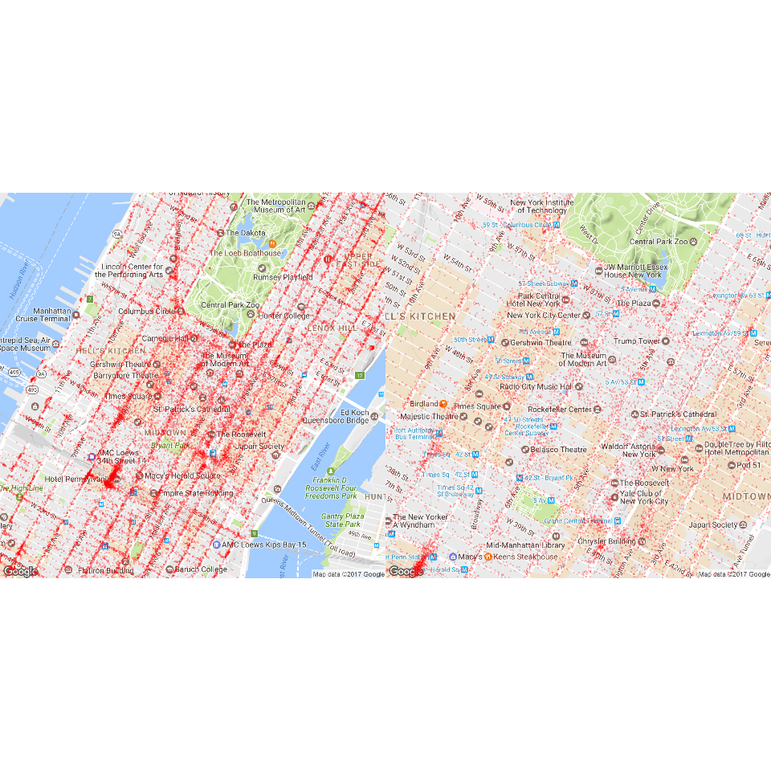
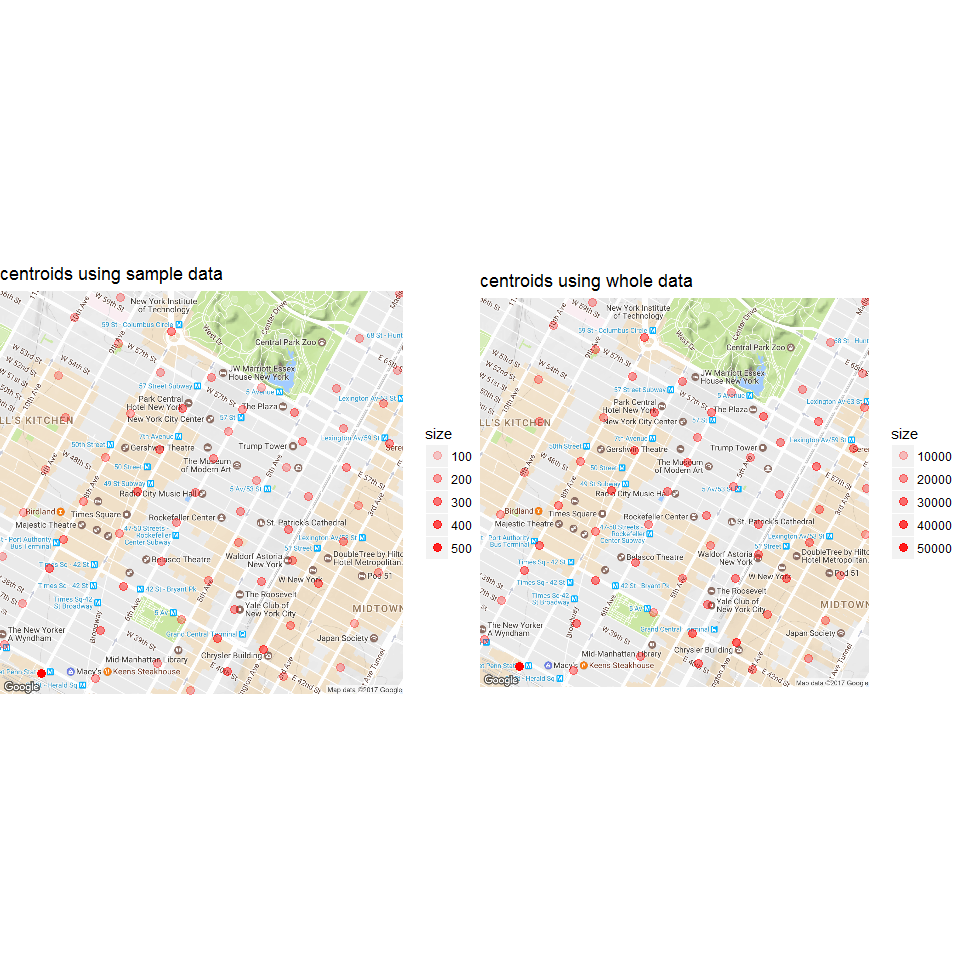
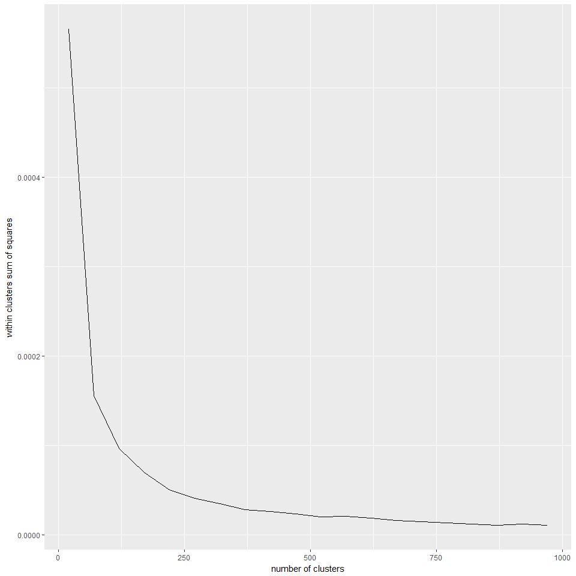

Clustering example
================
Seth Mottaghinejad
2017-02-28

Many times we don't necessarily have to resort to using the whole dataset to extract insights from the data. In other words, we really only have a big data problem when using the whole dataset versus a much smaller sample of the data can make a big difference in insight. Even when we do have a big data problem, sampling can be an effective way to gain some preliminary insights into the problem or to speed up the algorithm.

Learning objectives
-------------------

In this chapter, we learn how to - develop an intuition for when we truly have a big data problem - build clusters using the `rxKmeans` algorithm in `RevoScaleR` - speed up the clustering algorithm by making an initial pass through the sampled data using the `kmeans` function

Using Manhattan only
--------------------

We now narrow our field of vision by focusing on trips that took place inside of Manhattan only, and meet "reasonable" criteria for a trip. Since we added new features to the data, we can also drop some old columns from the data so that the data can be processed faster.

``` r
input_xdf <- file.path(data_dir, 'yellow_tripdata_2016_clean.xdf')
mht_xdf <- RxXdfData(input_xdf)

rxDataStep(nyc_xdf, mht_xdf,
  rowSelection = (passenger_count > 0 &
                  trip_distance >= 0 & trip_distance < 30 &
                  trip_duration > 0 & trip_duration < 60*60*24 &
                  str_detect(pickup_borough, 'Manhattan') &
                  str_detect(dropoff_borough, 'Manhattan') &
                  !is.na(pickup_nb) &
                  !is.na(dropoff_nb) &
                  fare_amount > 0),
  transformPackages = "stringr",
  varsToDrop = c('extra', 'mta_tax', 'improvement_surcharge', 'total_amount', 
                 'pickup_borough', 'dropoff_borough', 'pickup_nhood', 'dropoff_nhood'),
  overwrite = TRUE)
```

    ## 
    Rows Processed: 500000
    Rows Processed: 1000000
    Rows Processed: 1500000
    Rows Processed: 2000000
    Rows Processed: 2500000
    Rows Processed: 3000000
    Rows Processed: 3500000
    Rows Processed: 4000000
    Rows Processed: 4500000
    Rows Processed: 5000000
    Rows Processed: 5500000
    Rows Processed: 6000000

And since we limited the scope of the data, it might be a good idea to create a sample of the new data (as a `data.frame`). Our last sample, `nyc_sample` was not a good sample, since we only took the top 1000 rows of the data. This time, we use `rxDataStep` to create a random sample of the data, containing only 1 percent of the rows from the larger dataset.

``` r
mht_sample <- rxDataStep(mht_xdf, rowSelection = (u < .01), transforms = list(u = runif(.rxNumRows)))
```

    ## 
    Rows Processed: 412183
    Rows Processed: 824198
    Rows Processed: 1234518
    Rows Processed: 1644958
    Rows Processed: 2059221
    Rows Processed: 2473197
    Rows Processed: 2887153
    Rows Processed: 3301832
    Rows Processed: 3720140
    Rows Processed: 4138788
    Rows Processed: 4554338
    Rows Processed: 4969813

``` r
dim(mht_sample)
```

    ## [1] 49667    26

Visualizing the data
--------------------

We can use the `ggmap` package to visually inspect the sample data. If we zoom in enough on a particular neighborhood, we can start seeing certain areas where passengers tend of get off often.

``` r
library(ggmap)
map_13 <- get_map(location = c(lon = -73.98, lat = 40.76), zoom = 13)
map_14 <- get_map(location = c(lon = -73.98, lat = 40.76), zoom = 14)
map_15 <- get_map(location = c(lon = -73.98, lat = 40.76), zoom = 15)

q1 <- ggmap(map_14) +
  geom_point(aes(x = dropoff_longitude, y = dropoff_latitude), data = mht_sample, 
             alpha = 0.15, na.rm = TRUE, col = "red", size = .5) +
  theme_nothing(legend = TRUE)

q2 <- ggmap(map_15) +
  geom_point(aes(x = dropoff_longitude, y = dropoff_latitude), data = mht_sample, 
             alpha = 0.15, na.rm = TRUE, col = "red", size = .5) +
  theme_nothing(legend = TRUE)

library(gridExtra)
grid.arrange(q1, q2, ncol = 2)
```



Creating clusters
-----------------

If the above plots seem too crowded, as an alternative, we could use **k-means clustering** to cluster the data based on longitude and latitude, which we would have to rescale so they have the same influence on the clusters (a simple way to rescale them is to divide longitude by -74 and latitude by 40). Once we have the clusters, we can plot the cluster **centroids** on the map instead of the individual data points that comprise each cluster.

``` r
library(dplyr)
xydata <- transmute(mht_sample, 
                    long_std = dropoff_longitude / -74, 
                    lat_std = dropoff_latitude / 40)

start_time <- Sys.time()
rxkm_sample <- kmeans(xydata, centers = 300, iter.max = 2000, nstart = 50)
Sys.time() - start_time
```

    ## Time difference of 50.92276 secs

``` r
# we need to put the centroids back into the original scale for coordinates
centroids_sample <- rxkm_sample$centers %>%
  as.data.frame %>%
  transmute(long = long_std*(-74), lat = lat_std*40, size = rxkm_sample$size)

head(centroids_sample)
```

    ##        long      lat size
    ## 1 -73.97842 40.72843  161
    ## 2 -73.98183 40.74651  163
    ## 3 -73.94655 40.77621  181
    ## 4 -73.96456 40.76843  133
    ## 5 -73.98528 40.75515  255
    ## 6 -73.96990 40.79878  180

In the above code chunk we used the `kmeans` function to cluster the sample dataset `mht_sample`. In `RevoScaleR`, there is a counterpart to the `kmeans` function called `rxKmeans`, but in addition to working with a `data.frame`, `rxKmeans` also works with XDF files. We can therefore use `rxKmeans` to create clusters from the whole data instead of the sample represented by `mht_sample`.

``` r
start_time <- Sys.time()
rxkm <- rxKmeans( ~ long_std + lat_std, data = mht_xdf, outFile = mht_xdf, 
                 outColName = "dropoff_cluster", centers = rxkm_sample$centers, 
                 transforms = list(long_std = dropoff_longitude / -74, 
                                   lat_std = dropoff_latitude / 40), 
                 blocksPerRead = 1, overwrite = TRUE, maxIterations = 100, 
                 reportProgress = -1)
Sys.time() - start_time
```

    ## Time difference of 31.1733 mins

``` r
clsdf <- cbind(
transmute(as.data.frame(rxkm$centers), long = long_std*(-74), lat = lat_std*40),
size = rxkm$size, withinss = rxkm$withinss)

head(clsdf)
```

    ##        long      lat  size       withinss
    ## 1 -73.97809 40.72851 14006 0.000018173662
    ## 2 -73.98326 40.74569 15283 0.000005647622
    ## 3 -73.94610 40.77644 16897 0.000013809185
    ## 4 -73.96452 40.76836 13210 0.000005649484
    ## 5 -73.98555 40.75532 24837 0.000014139977
    ## 6 -73.97032 40.79797 15972 0.000016071739

With a little bit of work, we can extract the cluster centroids from the resulting object and plot them on a similar map. As we can see, the results are not very different, however differences do exist and depending on the use case, such small differences can have a lot of practical significance. If for example we wanted to find out which spots taxis are more likely to drop off passengers and make it illegal for street vendors to operate at those spots (in order to avoid creating too much traffic), we can do a much better job of narrowing down the spots using the clusters created from the whole data.

``` r
centroids_whole <- cbind(transmute(as.data.frame(rxkm$centers), 
                                   long = long_std*(-74), lat = lat_std*40), 
                         size = rxkm$size, 
                         withinss = rxkm$withinss)

q1 <- ggmap(map_15) +
  geom_point(data = centroids_sample, aes(x = long, y = lat, alpha = size), 
             na.rm = TRUE, size = 3, col = 'red') +
  theme_nothing(legend = TRUE) +
  labs(title = "centroids using sample data")

q2 <- ggmap(map_15) +
  geom_point(data = centroids_whole, aes(x = long, y = lat, alpha = size), 
             na.rm = TRUE, size = 3, col = 'red') +
  theme_nothing(legend = TRUE) +
  labs(title = "centroids using whole data")

library(gridExtra)
grid.arrange(q1, q2, ncol = 2)
```



### Exercises

In the last section, we used the `kmeans` function to build clusters on the sample data, and used the centroids it provided us with to initialize the `rxKmeans` function, which builds the clusters on the whole data, thereby considerably reducing its runtmie. One thing that we took for granted is the number of clusters to build. Our decision to build 300 clusters was somewhat arbitrary, based on the gut feeling that we expect about 300 "drop-off hubs" in Manhattan, i.e. points where taxis often drop passengers off. In this exercise, we provide a little more backing for our choice of the number of clusters.

Let's go back to the sample data and the `kmeans` function, as shown here. We made two changes to the function call:

-   we let the number of clusters vary based on what we pick for `nclus`
-   by letting `nstart = 1` we initialize the clusters only once, making it run much faster at the expense of less "stable" clusters (which we don't care about in this case)

``` r
nclus <- 50
kmeans_nclus <- kmeans(xydata, centers = nclus, iter.max = 2000, nstart = 1)
sum(kmeans_nclus$withinss)
```

    ## [1] 0.0002148665

The number we extracted is the sum of the within-cluster sum of squares for each cluster. The **within-cluster sum of squares** (WSSs for short) is a measure of how much variability there is within each cluster. A lower WSSs indicates a more homogeneous cluster. However, we don't care about this metric per cluster. We simply seek the all the clusters' WSSs. When the number of clusters we build is small, individual clusters are less homogeneous, making the total WSSs larger. When we build a large number of clusters, the opposite is true. Therefore, total WSSs generally drops as `nclus` increases, but there is a point beyond which increasing `nclus` results in smaller and smaller drops in total WSSs. In other words, a point beyond which building a higher number of clusters is not worth the cost of increased complexity (as having more clusters makes it hard to tell them apart).

1.  Write a function called `find_wss` that has as input the number of clusters we want to build, represented by `nclus` in the above code, and returns the total WSSs. Additionally, your function should also print the input `nclus` as well as how long it takes to run.

2.  Demonstrate the concept of decreasing total WSSs as we assign a larger and larger number to `nclus` by letting `nculs` loop through the increasing sequence of numbers given by `nclus_seq`, and running `find_wss` in each case. You can do so by plotting the results.

``` r
nclus_seq <- seq(20, 1000, by = 50)
```

### Solutions

1.  The function shown here has `nclus` as its only argument, but we also use `...` to pass any arguments `kmeans` take to `find_wss` as well. This could be helpful if we wanted to change `nstart` or the data itself.

``` r
find_wss <- function(nclus, ...) {
st <- Sys.time()
res <- sum(kmeans(centers = nclus, ...)$withinss)
print(sprintf("nclus = %d, runtime = %3.2f seconds", nclus, Sys.time() - st))
res
}

find_wss(nclus = 10, x = xydata, iter.max = 500, nstart = 1)
```

    ## [1] "nclus = 10, runtime = 0.37 seconds"

    ## [1] 0.001280436

1.  We use `sapply` to run the above function in a loop. This makes the notation more clean and easy to modify. We then use `ggplot2` to plot the results. Another interesting to notice is that `nclus` goes up, the function takes longer and longer to run. This has implications on building the clusters on the whole data: the number of clusters we want to build can significantly add to the runtime.

``` r
wss <- sapply(nclus_seq, find_wss, x = xydata, iter.max = 500, nstart = 1)
```

    ## [1] "nclus = 20, runtime = 0.34 seconds"
    ## [1] "nclus = 70, runtime = 0.74 seconds"
    ## [1] "nclus = 120, runtime = 0.94 seconds"
    ## [1] "nclus = 170, runtime = 0.66 seconds"
    ## [1] "nclus = 220, runtime = 0.51 seconds"
    ## [1] "nclus = 270, runtime = 0.72 seconds"
    ## [1] "nclus = 320, runtime = 0.60 seconds"
    ## [1] "nclus = 370, runtime = 2.25 seconds"
    ## [1] "nclus = 420, runtime = 2.67 seconds"
    ## [1] "nclus = 470, runtime = 0.82 seconds"
    ## [1] "nclus = 520, runtime = 1.23 seconds"
    ## [1] "nclus = 570, runtime = 1.32 seconds"
    ## [1] "nclus = 620, runtime = 1.37 seconds"
    ## [1] "nclus = 670, runtime = 1.39 seconds"
    ## [1] "nclus = 720, runtime = 3.65 seconds"
    ## [1] "nclus = 770, runtime = 3.38 seconds"
    ## [1] "nclus = 820, runtime = 1.37 seconds"
    ## [1] "nclus = 870, runtime = 1.18 seconds"
    ## [1] "nclus = 920, runtime = 1.09 seconds"
    ## [1] "nclus = 970, runtime = 1.44 seconds"

``` r
library(ggplot2)
ggplot(aes(x = x, y = y), data = data.frame(x = nclus_seq, y = wss)) +
  geom_line() +
  xlab("number of clusters") +
  ylab("within clusters sum of squares")
```



As the plot shows, around 250 clusters, total WSSs starts to decrease very slowly.
