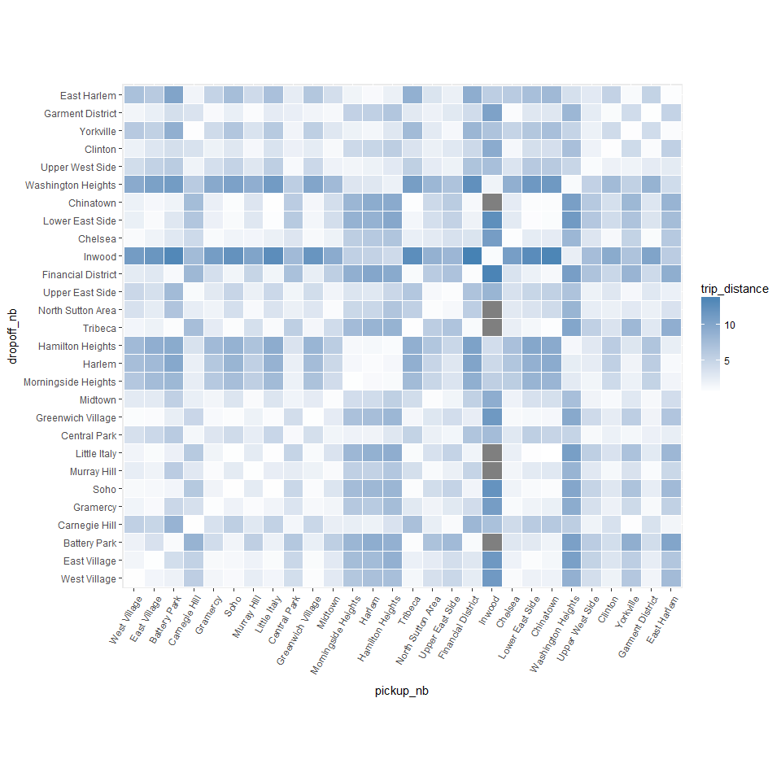
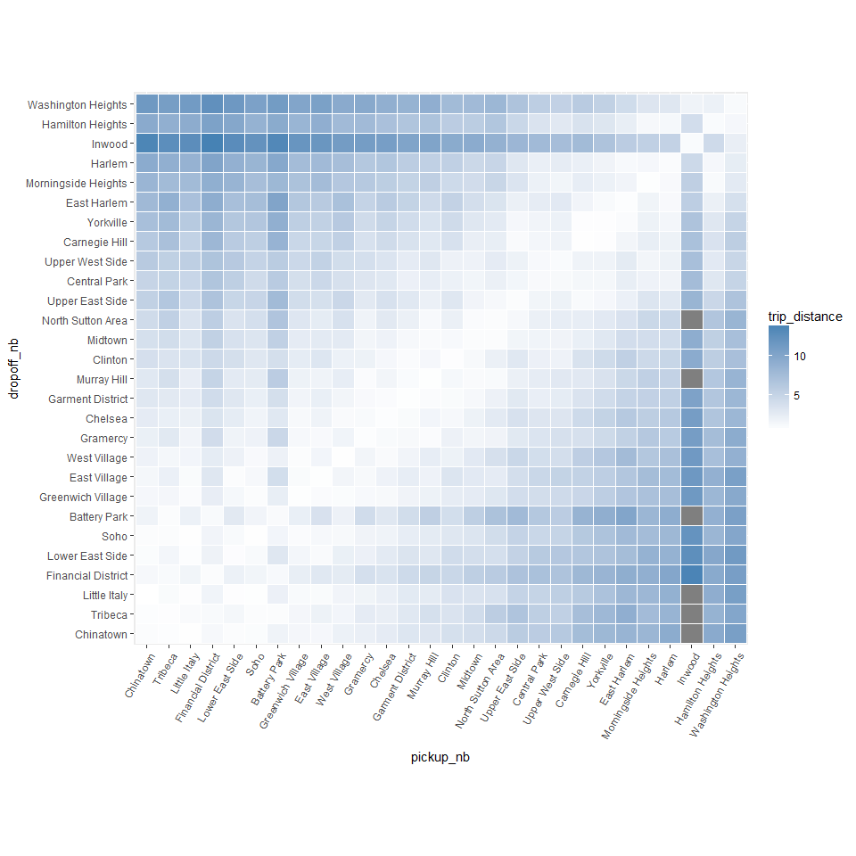
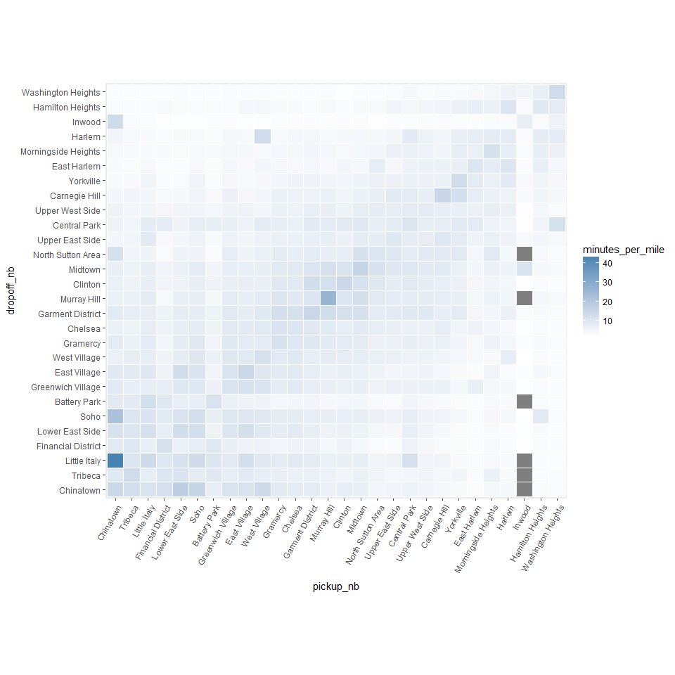
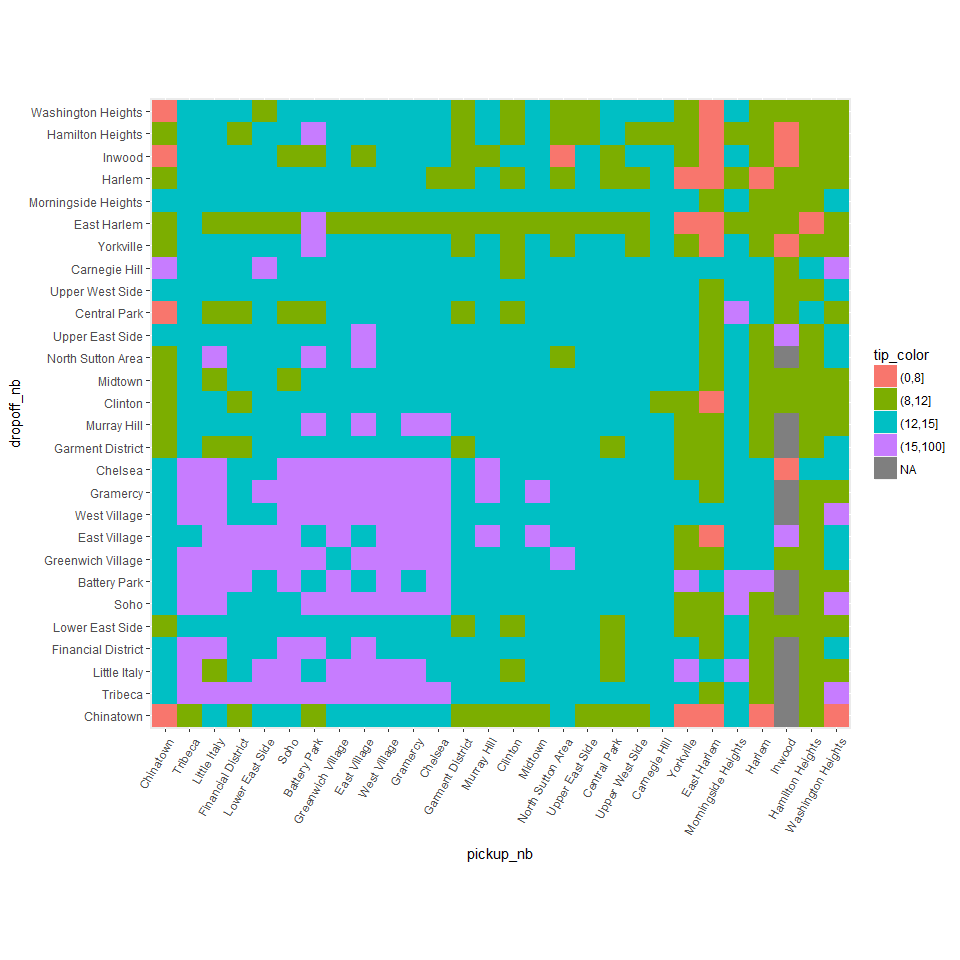
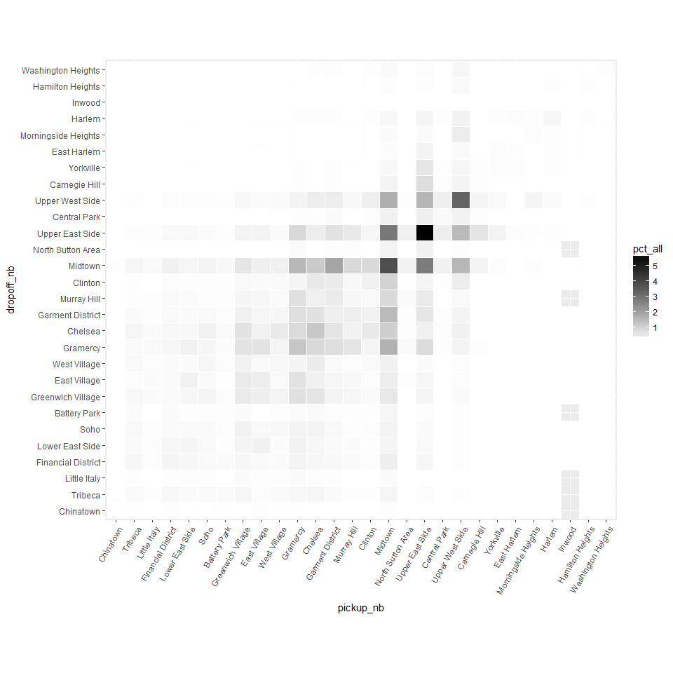
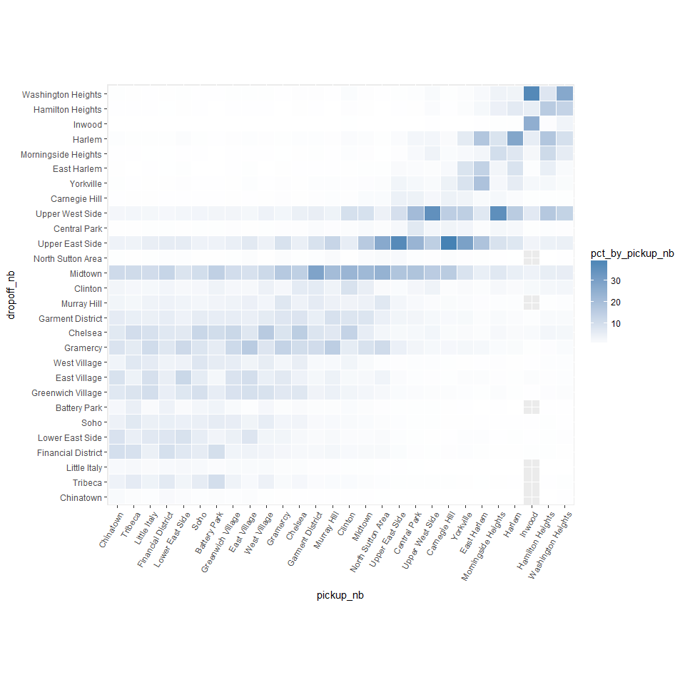
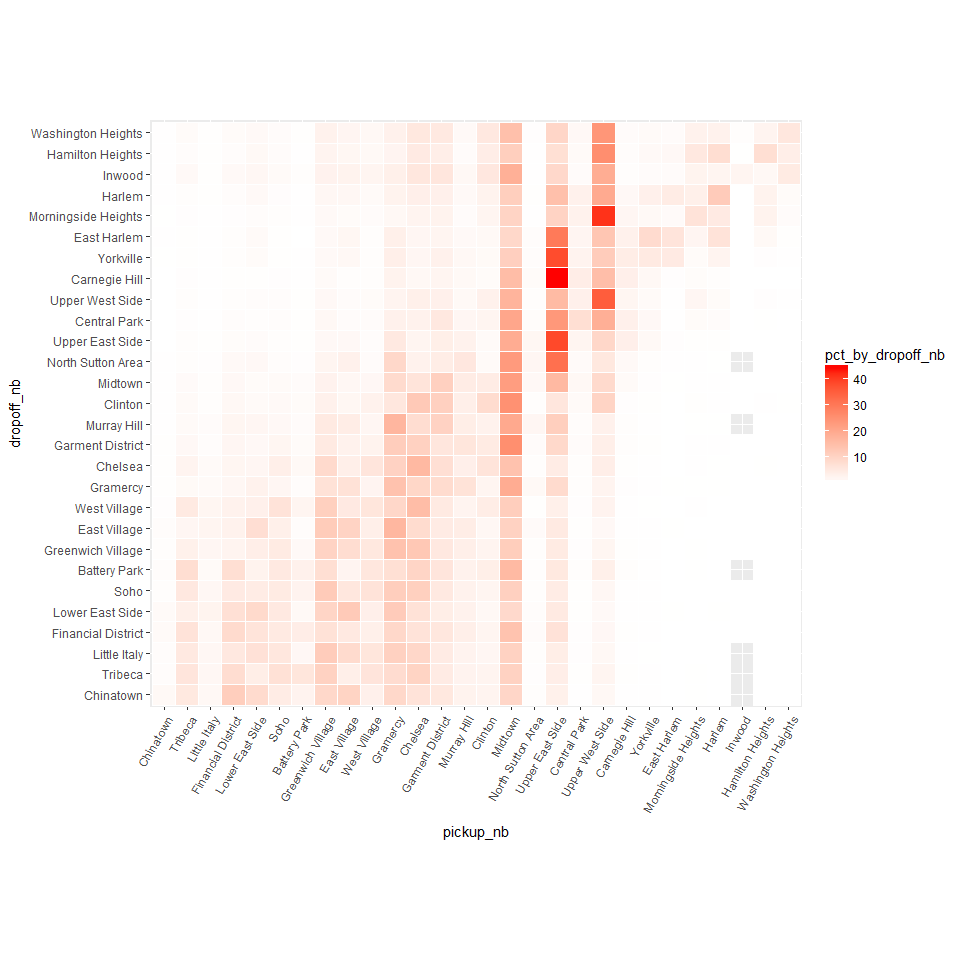
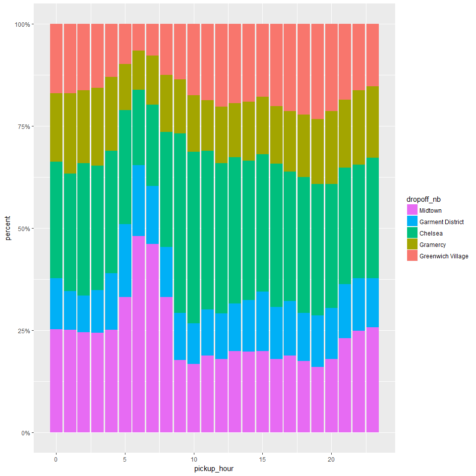
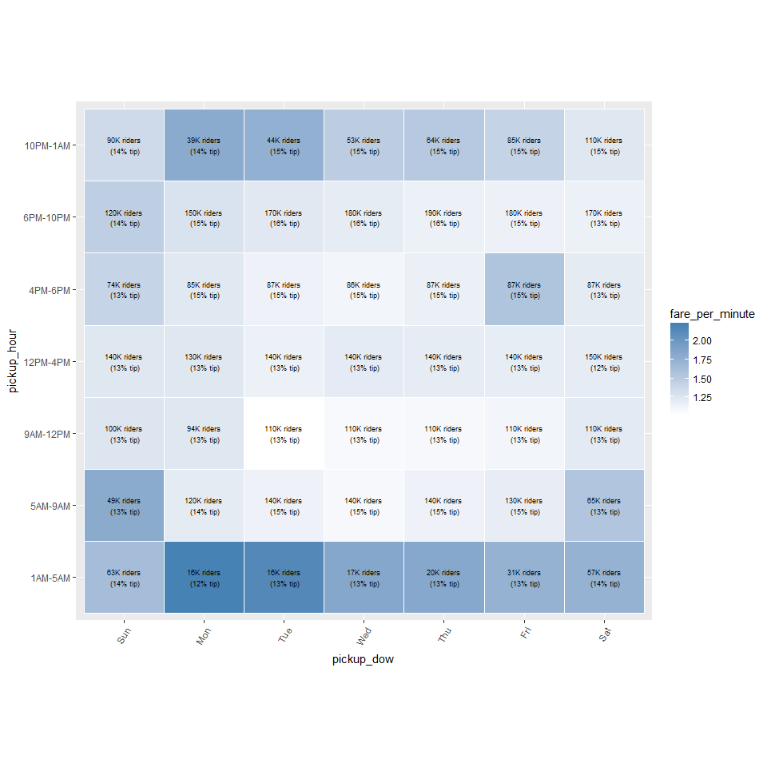

Neighborhood patterns
================
Seth Mottaghinejad
2017-02-17

As our next task, we seek to find patterns between pickup and drop-off neighborhoods and other variables such as fare amount, trip distance, traffic and tipping. Since ultimately `RevoScaleR` is just another R package, it's important to know that to really put it to use, it must integrate and interact with other R packages to make our analysis possible. We've already seen examples of how to use packages such as `lubridate` or `rgeos` for data transformations with `RevoScaleR`, and how to use results returned by `rxSummary` or `rxCrossTabs` and pass them to other R functions. Sometimes, in the process of examining our results, we notice certain attributes about the data that need to be re-examined.

Learning objectives
-------------------

At the end of this chapter, we will know how to - let data summaries guide your decision about how the data should be formatted - know when to use `rxCrossTabs` and when to use `rxCube` - recognize which transformations should best be performed on the fly for the sake a this or that summary, and which one should be built into the data - use the `factor` function or the alternative `rxFactor` function for "releveling" a `factor` column

Using distance to map out neighborhoods
---------------------------------------

As our next task, we seek to find patterns between pickup and drop-off neighborhoods and other variables such as fare amount, trip distance, traffic and tipping. To estimate traffic by looking at the ratio of trip duration and trip distance, assuming that traffic is the most common reason for trips taking longer than they should.

For this analysis, we use the `rxCube` and `rxCrossTabs` are both very similar to `rxSummary` but they return fewer statistical summaries and therefore run faster. With `y ~ u:v` as the formula, `rxCrossTabs` returns counts and sums, and `rxCube` returns counts and averages for column `y` broken up by any combinations of columns `u` and `v`. Another important difference between the two functions is that `rxCrossTabs` returns an array but `rxCube` returns a `data.frame`. Depending on the application in question, we may prefer one to the other (and of course we can always convert one form to the other by "reshaping" it, but doing so would involve extra work).

Let's see what this means in action: We start by using `rxCrossTabs` to get sums and counts for `trip_distance`, broken up by `pickup_nb` and `dropoff_nb`. We can immediately divide the sums by the counts to get averages. The result is called a **distance matrix** and can be fed to the `seriate` function in the `seriation` library to order it so closer neighborhoods appear next to each other (right now neighborhoods are sorted alphabetically, which is what R does by default with factor levels unless otherwise specified).

``` r
rxct <- rxCrossTabs(trip_distance ~ pickup_nb:dropoff_nb, mht_xdf)
```

    ## 
    Rows Processed: 412183
    Rows Processed: 824198
    Rows Processed: 1234518
    Rows Processed: 1644958
    Rows Processed: 2059221
    Rows Processed: 2473197
    Rows Processed: 2887153
    Rows Processed: 3301832
    Rows Processed: 3720140
    Rows Processed: 4138788
    Rows Processed: 4554338
    Rows Processed: 4969813

``` r
res <- rxct$sums$trip_distance / rxct$counts$trip_distance

library(seriation)
res[which(is.nan(res))] <- mean(res, na.rm = TRUE)
nb_order <- seriate(res)
```

We will use `nb_order` in a little while, but before we do so, let's use `rxCube` to get counts and averages for `trip_distance`, a new data point representing minutes spent in the taxi per mile of the trip, and `tip_percent`. In the above example, we used `rxCrossTabs` because we wanted a matrix as the return object, so we could feed it to `seriate`. We now use `rxCube` to get a `data.frame` instead, since we intend to use it for plotting with `ggplot2`, which is more easier to code using a long `data.frame` as input compared to a wide `matirx`.

``` r
rxc1 <- rxCube(trip_distance ~ pickup_nb:dropoff_nb, mht_xdf)
```

    ## 
    Rows Processed: 412183
    Rows Processed: 824198
    Rows Processed: 1234518
    Rows Processed: 1644958
    Rows Processed: 2059221
    Rows Processed: 2473197
    Rows Processed: 2887153
    Rows Processed: 3301832
    Rows Processed: 3720140
    Rows Processed: 4138788
    Rows Processed: 4554338
    Rows Processed: 4969813

``` r
rxc2 <- rxCube(minutes_per_mile ~ pickup_nb:dropoff_nb, mht_xdf, 
               transforms = list(minutes_per_mile = (trip_duration/60)/trip_distance))
```

    ## 
    Rows Processed: 412183
    Rows Processed: 824198
    Rows Processed: 1234518
    Rows Processed: 1644958
    Rows Processed: 2059221
    Rows Processed: 2473197
    Rows Processed: 2887153
    Rows Processed: 3301832
    Rows Processed: 3720140
    Rows Processed: 4138788
    Rows Processed: 4554338
    Rows Processed: 4969813

``` r
rxc3 <- rxCube(tip_percent ~ pickup_nb:dropoff_nb, mht_xdf)
```

    ## 
    Rows Processed: 412183
    Rows Processed: 824198
    Rows Processed: 1234518
    Rows Processed: 1644958
    Rows Processed: 2059221
    Rows Processed: 2473197
    Rows Processed: 2887153
    Rows Processed: 3301832
    Rows Processed: 3720140
    Rows Processed: 4138788
    Rows Processed: 4554338
    Rows Processed: 4969813

``` r
library(dplyr)
res <- bind_cols(list(rxc1, rxc2, rxc3))
res <- res[ , c('pickup_nb', 'dropoff_nb', 'trip_distance', 'minutes_per_mile', 'tip_percent')]
head(res)
```

    ## # A tibble: 6 × 5
    ##       pickup_nb   dropoff_nb trip_distance minutes_per_mile tip_percent
    ##          <fctr>       <fctr>         <dbl>            <dbl>       <dbl>
    ## 1  West Village West Village         0.679            11.39        15.1
    ## 2  East Village West Village         1.544             8.85        15.3
    ## 3  Battery Park West Village         1.959             6.37        16.0
    ## 4 Carnegie Hill West Village         5.573             5.31        14.8
    ## 5      Gramercy West Village         1.582             8.30        15.9
    ## 6          Soho West Village         1.130             9.28        15.9

We can start plotting the above results to see some interesting trends.

``` r
library(ggplot2)
ggplot(res, aes(pickup_nb, dropoff_nb)) +
  geom_tile(aes(fill = trip_distance), colour = "white") +
  theme(axis.text.x = element_text(angle = 60, hjust = 1)) +
  scale_fill_gradient(low = "white", high = "steelblue") +
  coord_fixed(ratio = .9)
```



The problem with the above plot is the order of the neighborhoods (which is alphabetical), which makes the plot somewhat arbitrary and useless. But as we saw above, using the `seriate` function we found a more natural ordering for the neighborhoods, so we can use it to reorder the above plot in a more suitable way. To reorder the plot, all we need to do is reorder the factor levels in the order given by `nb_order`.

``` r
newlevs <- levels(res$pickup_nb)[unlist(nb_order)]
res$pickup_nb <- factor(res$pickup_nb, levels = unique(newlevs))
res$dropoff_nb <- factor(res$dropoff_nb, levels = unique(newlevs))

ggplot(res, aes(pickup_nb, dropoff_nb)) +
  geom_tile(aes(fill = trip_distance), colour = "white") +
  theme(axis.text.x = element_text(angle = 60, hjust = 1)) +
  scale_fill_gradient(low = "white", high = "steelblue") +
  coord_fixed(ratio = .9)
```



Neighborhood trends
-------------------

Since trip distances remain fix, but trip duration mostly is a function of how much traffic there is, we can plot a look at the same plot as the above, but for the `minutes_per_mile` column, which will give us an idea of which neighborhoods have the most traffic between them.

``` r
ggplot(res, aes(pickup_nb, dropoff_nb)) +
  geom_tile(aes(fill = minutes_per_mile), colour = "white") +
  theme(axis.text.x = element_text(angle = 60, hjust = 1)) +
  scale_fill_gradient(low = "white", high = "steelblue") +
  coord_fixed(ratio = .9)
```



Another interesting question to consider is the relationship between the fare amount and how much passengers tip in relation to which neighborhoods they travel between. We create another plot similar to the ones above, showing fare amount on a gray background color scale, and displaying how much passengers tipped on average for the trip. To make it easier to visually see patterns in tipping behavior, we color-code the average tip based on some predetermined cut-offs.

``` r
res %>%
  mutate(tip_color = cut(tip_percent, c(0, 8, 12, 15, 100))) %>%
  ggplot(aes(pickup_nb, dropoff_nb)) +
  geom_tile(aes(fill = tip_color)) +
  theme(axis.text.x = element_text(angle = 60, hjust = 1)) +
  coord_fixed(ratio = .9)
```



Some interesting results stand out:

-   Trips leaving Battery Park or the Financial District going to midtown or uptown neighborhoods seem to cost a little more than seems warranted, and same trips leaving Greenwich Village going to Chinatown.
-   Trips into and out of Chinatown tip consistently low (below 10%), especially if traveling to or coming from midtown and uptown neighborhoods.
-   The most generous tippers (around 12%) are the ones traveling between downtown neighborhoods (except for Chinatown). The next most generous tippers (around 11%) are the ones traveling between midtown neighborhoods and downtown neighborhoods in either direction. The worst tippers are the one traveling between uptown neighborhoods.

Refactoring neighborhoods
-------------------------

As the plots shows, a lot of traffic happens between neighborhoods that are close to each other. This is not very surprising since trips between neighborhoods that are far apart can be made using periphery routes that bypass most of the traffic through the town center. We can also see generally high traffic in the midtown neighborhoods, and downtown especially between Chinatown and Little Italy.

We changed the order of the factor levels for `pickup_nb` and `dropoff_nb` to draw the above plots. However, this change best belongs in the data itself, otherwise every time we plot something involving `pickup_nb` or `dropoff_nb` we will need to change the order of the factor levels. So let's take the change and apply it to the whole data. We have two options for making the change:

1.  We can use `rxDataStep` with the `transforms` argument, and use the `base` R function `factor` to reorder the factor levels.
2.  We can use the `rxFactor` function and its `factorInfo` to manipulate the factors levels. The advantage of `rxFactors` is that it is faster, because it works at the meta-data level. The disadvantage is that it may not work in other compute contexts such as Hadoop or Spark. Both ways of doing this are shown here.

``` r
# first way of reordering the factor levels
rxDataStep(inData = mht_xdf, outFile = mht_xdf, 
    transforms = list(
        pickup_nb = factor(pickup_nb, levels = newlevels), 
        dropoff_nb = factor(dropoff_nb, levels = newlevels)), 
    transformObjects = list(newlevels = unique(newlevs)), overwrite = TRUE)
```

    ## 
    Rows Processed: 412183
    Rows Processed: 824198
    Rows Processed: 1234518
    Rows Processed: 1644958
    Rows Processed: 2059221
    Rows Processed: 2473197
    Rows Processed: 2887153
    Rows Processed: 3301832
    Rows Processed: 3720140
    Rows Processed: 4138788
    Rows Processed: 4554338
    Rows Processed: 4969813

``` r
# second way of reordering the factor levels
rxFactors(mht_xdf, outFile = mht_xdf, 
    factorInfo = list(
        pickup_nb = list(newLevels = unique(newlevs)), 
        dropoff_nb = list(newLevels = unique(newlevs))), 
    overwrite = TRUE)
```

Total and marginal distribution trips between neighborhoods
-----------------------------------------------------------

Let's focus our attention now the following important questions: - Between which neighborhoods do the most common trips occur? - Assuming that a traveler leaves from a given neighborhood, which neighborhoods are they most likely to go to? - Assuming that someone was just dropped off at a given neighborhood, which neighborhoods are they most likely to have come from?

To answer the above questions, we need to find the distribution (or proportion) of trips between any two neighborhoods, first as a percentage of total trips, then as a percentage of trips *leaving from* a particular neighborhood, and finally as a percentage of trips *going to* a particular neighborhood.

``` r
rxc <- rxCube( ~ pickup_nb:dropoff_nb, mht_xdf)
```

    ## 
    Rows Processed: 412183
    Rows Processed: 824198
    Rows Processed: 1234518
    Rows Processed: 1644958
    Rows Processed: 2059221
    Rows Processed: 2473197
    Rows Processed: 2887153
    Rows Processed: 3301832
    Rows Processed: 3720140
    Rows Processed: 4138788
    Rows Processed: 4554338
    Rows Processed: 4969813

``` r
rxc <- as.data.frame(rxc)

rxc %>%
  filter(Counts > 0) %>%
  mutate(pct_all = Counts/sum(Counts) * 100) %>%
  group_by(pickup_nb) %>%
  mutate(pct_by_pickup_nb = Counts/sum(Counts) * 100) %>%
  group_by(dropoff_nb) %>%
  mutate(pct_by_dropoff_nb = Counts/sum(Counts) * 100) %>%
  group_by() %>%
  arrange(desc(Counts)) -> rxcs

head(rxcs)
```

    ## # A tibble: 6 × 6
    ##          pickup_nb      dropoff_nb Counts pct_all pct_by_pickup_nb
    ##             <fctr>          <fctr>  <dbl>   <dbl>            <dbl>
    ## 1  Upper East Side Upper East Side 286086    5.76             37.0
    ## 2          Midtown         Midtown 191555    3.85             21.8
    ## 3  Upper West Side Upper West Side 166064    3.34             35.1
    ## 4          Midtown Upper East Side 142348    2.86             16.2
    ## 5  Upper East Side         Midtown 138639    2.79             17.9
    ## 6 Garment District         Midtown  92478    1.86             28.9
    ##   pct_by_dropoff_nb
    ##               <dbl>
    ## 1              38.3
    ## 2              22.4
    ## 3              35.1
    ## 4              19.1
    ## 5              16.2
    ## 6              10.8

Based on the first row, we can see that trips from the Upper East Side to the Upper East Side make up about 5% of all trips in Manhattan. Of all the trips that pick up in the Upper East Side, about 36% drop off in the Upper East Side. Of all the trips that drop off in the Upper East Side, 37% and tripped that also picked up in the Upper East Side.

We can take the above numbers and display them in plots that make it easier to digest it all at once. We begin with a plot showing how taxi trips between any pair of neighborhoods are distributed.

``` r
ggplot(rxcs, aes(pickup_nb, dropoff_nb)) +
  geom_tile(aes(fill = pct_all), colour = "white") +
  theme(axis.text.x = element_text(angle = 60, hjust = 1)) +
  scale_fill_gradient(low = "white", high = "black") +
  coord_fixed(ratio = .9)
```



The plot shows that trips to and from the Upper East Side make up the majority of trips, a somewhat unexpected result. Furthermore, the lion's share of trips are to and from the Upper East Side and the Upper West Side and the midtown neighborhoods (with most of this category having Midtown either as an origin or a destination). Another surprising fact about the above plot is its near symmetry, which suggests that perhaps most passengers use taxis for a "round trip", meaning that they take a taxi to their destination, and another taxi for the return trip. This point warrants further inquiry (perhaps by involving the time of day into the analysis) but for now we leave it at that.

Next we look at how trips leaving a particular neighborhood (a point on the x-axis in the plot below), "spill out" into other neighborhoods (shown by the vertical color gradient along the y-axis at each point on the x-axis).

``` r
ggplot(rxcs, aes(pickup_nb, dropoff_nb)) +
  geom_tile(aes(fill = pct_by_pickup_nb), colour = "white") +
  theme(axis.text.x = element_text(angle = 60, hjust = 1)) +
  scale_fill_gradient(low = "white", high = "steelblue") +
  coord_fixed(ratio = .9)
```



We can see how most downtown trips are to other downtown neighborhoods or to midtown neighborhoods (especially Midtown). Midtown and the Upper East Side are common destinations from any neighborhood, and the Upper West Side is a common destination for most uptown neighborhoods.

For a trip ending at a particular neighborhood (represented by a point on the y-axis) we now look at the distribution of where the trip originated from (the horizontal color-gradient along the x-axis for each point on the y-axis).

``` r
ggplot(rxcs, aes(pickup_nb, dropoff_nb)) +
  geom_tile(aes(fill = pct_by_dropoff_nb), colour = "white") +
  theme(axis.text.x = element_text(angle = 60, hjust = 1)) +
  scale_fill_gradient(low = "white", high = "red") +
  coord_fixed(ratio = .9)
```



As we can see, a lot of trips claim Midtown regardless of where they ended. The Upper East Side and Upper West Side are also common origins for trips that drop off in one of the uptown neighborhoods.

### Exercises

Let's return to one of the questions we asked in the last section: Assuming that a traveler leaves from a given neighborhood, which neighborhoods are they most likely to go to? To answer this question, in we obtained the proportion of trips that fan out into all the different neighborhoods, given that they all start from the same neighborhood. The results are stored in the `rxcs` data. If we sort the data and keep only the relevant columns, it's easier to make sense of it:

``` r
rxcs %>%
  select(pickup_nb, dropoff_nb, pct = pct_by_pickup_nb) %>%
  arrange(pickup_nb, desc(pct))
```

    ## # A tibble: 778 × 3
    ##               pickup_nb          dropoff_nb     pct
    ##                  <fctr>              <fctr>   <dbl>
    ## 1             Chinatown             Midtown 11.2232
    ## 2             Chinatown  Financial District  9.6968
    ## 3             Chinatown        East Village  8.9744
    ## 4             Chinatown     Lower East Side  8.7359
    ## 5             Chinatown            Gramercy  8.4838
    ## 6             Chinatown   Greenwich Village  7.1346
    ## 7             Chinatown             Chelsea  6.7462
    ## 8             Chinatown    Garment District  5.9489
    ## 9             Chinatown                Soho  4.2044
    ## 10            Chinatown             Tribeca  3.8705
    ## 11            Chinatown     Upper East Side  3.8365
    ## 12            Chinatown        West Village  3.4003
    ## 13            Chinatown         Murray Hill  3.1891
    ## 14            Chinatown             Clinton  2.9779
    ## 15            Chinatown     Upper West Side  2.6235
    ## 16            Chinatown        Battery Park  2.2964
    ## 17            Chinatown        Little Italy  1.7717
    ## 18            Chinatown           Chinatown  1.6218
    ## 19            Chinatown              Harlem  0.6405
    ## 20            Chinatown   North Sutton Area  0.4089
    ## 21            Chinatown           Yorkville  0.3884
    ## 22            Chinatown  Washington Heights  0.3816
    ## 23            Chinatown        Central Park  0.3066
    ## 24            Chinatown         East Harlem  0.3066
    ## 25            Chinatown Morningside Heights  0.2658
    ## 26            Chinatown    Hamilton Heights  0.2521
    ## 27            Chinatown       Carnegie Hill  0.2453
    ## 28            Chinatown              Inwood  0.0681
    ## 29              Tribeca             Midtown 10.8855
    ## 30              Tribeca             Chelsea 10.2669
    ## 31              Tribeca  Financial District  9.2189
    ## 32              Tribeca   Greenwich Village  8.2770
    ## 33              Tribeca        West Village  7.1169
    ## 34              Tribeca                Soho  6.7376
    ## 35              Tribeca            Gramercy  6.1319
    ## 36              Tribeca             Tribeca  5.9288
    ## 37              Tribeca    Garment District  4.9146
    ## 38              Tribeca        Battery Park  4.8248
    ## 39              Tribeca     Lower East Side  4.7151
    ## 40              Tribeca        East Village  4.0171
    ## 41              Tribeca     Upper East Side  3.7359
    ## 42              Tribeca     Upper West Side  2.8419
    ## 43              Tribeca         Murray Hill  2.5303
    ## 44              Tribeca             Clinton  2.3855
    ## 45              Tribeca        Little Italy  2.0319
    ## 46              Tribeca           Chinatown  0.9745
    ## 47              Tribeca              Harlem  0.3700
    ## 48              Tribeca  Washington Heights  0.3548
    ## 49              Tribeca       Carnegie Hill  0.3455
    ## 50              Tribeca        Central Park  0.3163
    ## 51              Tribeca   North Sutton Area  0.3069
    ## 52              Tribeca           Yorkville  0.2147
    ## 53              Tribeca Morningside Heights  0.1891
    ## 54              Tribeca    Hamilton Heights  0.1844
    ## 55              Tribeca         East Harlem  0.1097
    ## 56              Tribeca              Inwood  0.0735
    ## 57         Little Italy            Gramercy 10.7684
    ## 58         Little Italy             Midtown 10.5810
    ## 59         Little Italy   Greenwich Village 10.0905
    ## 60         Little Italy        East Village  9.4357
    ## 61         Little Italy             Chelsea  9.1372
    ## 62         Little Italy     Lower East Side  6.8835
    ## 63         Little Italy        West Village  5.9812
    ## 64         Little Italy     Upper East Side  5.0857
    ## 65         Little Italy  Financial District  4.6230
    ## 66         Little Italy    Garment District  4.6068
    ## 67         Little Italy                Soho  4.5767
    ## 68         Little Italy             Tribeca  3.7877
    ## 69         Little Italy         Murray Hill  3.6581
    ## 70         Little Italy     Upper West Side  2.4133
    ## 71         Little Italy             Clinton  2.2398
    ## 72         Little Italy        Little Italy  1.4484
    ## 73         Little Italy        Battery Park  1.4369
    ## 74         Little Italy           Chinatown  0.5970
    ## 75         Little Italy   North Sutton Area  0.4304
    ## 76         Little Italy              Harlem  0.4188
    ## 77         Little Italy        Central Park  0.3679
    ## 78         Little Italy           Yorkville  0.3309
    ## 79         Little Italy       Carnegie Hill  0.3077
    ## 80         Little Italy  Washington Heights  0.2291
    ## 81         Little Italy    Hamilton Heights  0.1828
    ## 82         Little Italy         East Harlem  0.1758
    ## 83         Little Italy Morningside Heights  0.1689
    ## 84         Little Italy              Inwood  0.0370
    ## 85   Financial District             Midtown 12.9377
    ## 86   Financial District  Financial District  9.6053
    ## 87   Financial District     Lower East Side  7.6390
    ## 88   Financial District            Gramercy  7.4175
    ## 89   Financial District             Chelsea  7.0009
    ## 90   Financial District             Tribeca  6.4130
    ## 91   Financial District     Upper East Side  5.6964
    ## 92   Financial District    Garment District  5.3764
    ## 93   Financial District        East Village  5.0810
    ## 94   Financial District   Greenwich Village  5.0195
    ## 95   Financial District                Soho  4.9210
    ## 96   Financial District         Murray Hill  3.8910
    ## 97   Financial District        Battery Park  3.8181
    ## 98   Financial District        West Village  3.5473
    ## 99   Financial District             Clinton  2.9168
    ## 100  Financial District     Upper West Side  2.3706
    ## 101  Financial District        Little Italy  1.7533
    ## 102  Financial District           Chinatown  1.7249
    ## 103  Financial District   North Sutton Area  0.5983
    ## 104  Financial District        Central Park  0.4260
    ## 105  Financial District              Harlem  0.4194
    ## 106  Financial District           Yorkville  0.3389
    ## 107  Financial District  Washington Heights  0.3190
    ## 108  Financial District       Carnegie Hill  0.2301
    ## 109  Financial District         East Harlem  0.1647
    ## 110  Financial District    Hamilton Heights  0.1590
    ## 111  Financial District Morningside Heights  0.1534
    ## 112  Financial District              Inwood  0.0615
    ## 113     Lower East Side        East Village 12.0456
    ## 114     Lower East Side            Gramercy 11.4686
    ## 115     Lower East Side     Lower East Side  8.9266
    ## 116     Lower East Side             Midtown  8.2175
    ## 117     Lower East Side   Greenwich Village  7.4543
    ## 118     Lower East Side  Financial District  7.0002
    ## 119     Lower East Side             Chelsea  6.6599
    ## 120     Lower East Side     Upper East Side  5.8086
    ## 121     Lower East Side                Soho  4.4573
    ## 122     Lower East Side    Garment District  3.9757
    ## 123     Lower East Side        West Village  3.8464
    ## 124     Lower East Side         Murray Hill  3.3868
    ## 125     Lower East Side             Tribeca  3.1767
    ## 126     Lower East Side     Upper West Side  2.6465
    ## 127     Lower East Side        Little Italy  2.1759
    ## 128     Lower East Side             Clinton  2.0796
    ## 129     Lower East Side        Battery Park  1.4017
    ## 130     Lower East Side           Chinatown  1.2393
    ## 131     Lower East Side              Harlem  0.8412
    ## 132     Lower East Side   North Sutton Area  0.6421
    ## 133     Lower East Side           Yorkville  0.5532
    ## 134     Lower East Side  Washington Heights  0.3945
    ## 135     Lower East Side         East Harlem  0.3761
    ## 136     Lower East Side        Central Park  0.3495
    ## 137     Lower East Side    Hamilton Heights  0.3110
    ## 138     Lower East Side Morningside Heights  0.2449
    ## 139     Lower East Side       Carnegie Hill  0.2413
    ## 140     Lower East Side              Inwood  0.0789
    ## 141                Soho             Chelsea 12.2640
    ## 142                Soho             Midtown 10.2081
    ## 143                Soho   Greenwich Village  9.3701
    ## 144                Soho            Gramercy  7.9658
    ## 145                Soho        West Village  7.4610
    ## 146                Soho        East Village  5.8834
    ## 147                Soho  Financial District  5.7452
    ## 148                Soho             Tribeca  5.6694
    ## 149                Soho    Garment District  5.6419
    ## 150                Soho     Lower East Side  5.4838
    ## 151                Soho                Soho  4.8437
    ## 152                Soho     Upper East Side  3.9602
    ## 153                Soho     Upper West Side  2.8996
    ## 154                Soho         Murray Hill  2.7310
    ## 155                Soho        Battery Park  2.6581
    ## 156                Soho             Clinton  2.3418
    ## 157                Soho        Little Italy  1.8153
    ## 158                Soho           Chinatown  0.6828
    ## 159                Soho        Central Park  0.4233
    ## 160                Soho              Harlem  0.3665
    ## 161                Soho   North Sutton Area  0.3201
    ## 162                Soho       Carnegie Hill  0.2794
    ## 163                Soho  Washington Heights  0.2746
    ## 164                Soho Morningside Heights  0.1903
    ## 165                Soho    Hamilton Heights  0.1809
    ## 166                Soho           Yorkville  0.1733
    ## 167                Soho         East Harlem  0.1146
    ## 168                Soho              Inwood  0.0521
    ## 169        Battery Park             Midtown 14.4618
    ## 170        Battery Park             Chelsea 10.3888
    ## 171        Battery Park             Tribeca 10.0422
    ## 172        Battery Park  Financial District  9.8769
    ## 173        Battery Park                Soho  5.8078
    ## 174        Battery Park        West Village  5.7063
    ## 175        Battery Park            Gramercy  5.6505
    ## 176        Battery Park   Greenwich Village  5.5031
    ## 177        Battery Park    Garment District  5.4752
    ## 178        Battery Park     Upper East Side  3.9536
    ## 179        Battery Park             Clinton  3.6628
    ## 180        Battery Park        Battery Park  3.4536
    ## 181        Battery Park     Lower East Side  3.2843
    ## 182        Battery Park         Murray Hill  3.2047
    ## 183        Battery Park     Upper West Side  2.9736
    ## 184        Battery Park        East Village  2.4757
    ## 185        Battery Park        Little Italy  1.2189
    ## 186        Battery Park           Chinatown  0.8803
    ## 187        Battery Park        Central Park  0.4461
    ## 188        Battery Park   North Sutton Area  0.3366
    ## 189        Battery Park       Carnegie Hill  0.2808
    ## 190        Battery Park           Yorkville  0.2151
    ## 191        Battery Park  Washington Heights  0.2091
    ## 192        Battery Park              Harlem  0.1972
    ## 193        Battery Park Morningside Heights  0.1155
    ## 194        Battery Park    Hamilton Heights  0.0777
    ## 195        Battery Park         East Harlem  0.0578
    ## 196        Battery Park              Inwood  0.0438
    ## 197   Greenwich Village             Chelsea 12.0352
    ## 198   Greenwich Village            Gramercy 11.3771
    ## 199   Greenwich Village             Midtown 10.3101
    ## 200   Greenwich Village   Greenwich Village  8.7128
    ## 201   Greenwich Village        East Village  8.4758
    ## 202   Greenwich Village    Garment District  5.5204
    ## 203   Greenwich Village        West Village  5.4905
    ## 204   Greenwich Village                Soho  5.3474
    ## 205   Greenwich Village     Upper East Side  4.8856
    ## 206   Greenwich Village     Lower East Side  4.5223
    ## 207   Greenwich Village         Murray Hill  3.7214
    ## 208   Greenwich Village             Tribeca  3.6546
    ## 209   Greenwich Village  Financial District  3.3856
    ## 210   Greenwich Village     Upper West Side  2.9718
    ## 211   Greenwich Village             Clinton  2.3915
    ## 212   Greenwich Village        Little Italy  1.6665
    ## 213   Greenwich Village        Battery Park  1.6538
    ## 214   Greenwich Village           Chinatown  0.5942
    ## 215   Greenwich Village              Harlem  0.5159
    ## 216   Greenwich Village        Central Park  0.4798
    ## 217   Greenwich Village   North Sutton Area  0.4265
    ## 218   Greenwich Village  Washington Heights  0.4093
    ## 219   Greenwich Village       Carnegie Hill  0.3609
    ## 220   Greenwich Village           Yorkville  0.3498
    ## 221   Greenwich Village Morningside Heights  0.2444
    ## 222   Greenwich Village    Hamilton Heights  0.2342
    ## 223   Greenwich Village         East Harlem  0.2042
    ## 224   Greenwich Village              Inwood  0.0586
    ## 225        East Village            Gramercy 15.8490
    ## 226        East Village        East Village 10.0555
    ## 227        East Village   Greenwich Village  9.4687
    ## 228        East Village             Midtown  9.2132
    ## 229        East Village     Lower East Side  7.7711
    ## 230        East Village             Chelsea  7.4143
    ## 231        East Village     Upper East Side  6.6705
    ## 232        East Village    Garment District  4.8260
    ## 233        East Village         Murray Hill  4.4345
    ## 234        East Village  Financial District  3.5700
    ## 235        East Village        West Village  3.4823
    ## 236        East Village                Soho  3.4761
    ## 237        East Village     Upper West Side  2.4967
    ## 238        East Village             Clinton  1.9981
    ## 239        East Village             Tribeca  1.8576
    ## 240        East Village        Little Italy  1.6453
    ## 241        East Village           Chinatown  0.9202
    ## 242        East Village   North Sutton Area  0.8406
    ## 243        East Village        Battery Park  0.7546
    ## 244        East Village              Harlem  0.6892
    ## 245        East Village           Yorkville  0.6152
    ## 246        East Village  Washington Heights  0.4177
    ## 247        East Village         East Harlem  0.4126
    ## 248        East Village        Central Park  0.3306
    ## 249        East Village    Hamilton Heights  0.2584
    ## 250        East Village Morningside Heights  0.2299
    ## 251        East Village       Carnegie Hill  0.2237
    ## 252        East Village              Inwood  0.0785
    ## 253        West Village             Chelsea 16.2195
    ## 254        West Village             Midtown 11.6101
    ## 255        West Village   Greenwich Village  8.8619
    ## 256        West Village            Gramercy  7.8342
    ## 257        West Village    Garment District  6.1953
    ## 258        West Village        West Village  5.5905
    ## 259        West Village                Soho  5.5213
    ## 260        West Village        East Village  4.9810
    ## 261        West Village             Clinton  4.1678
    ## 262        West Village     Upper East Side  4.1507
    ## 263        West Village             Tribeca  4.1359
    ## 264        West Village     Upper West Side  3.8234
    ## 265        West Village  Financial District  3.3017
    ## 266        West Village     Lower East Side  3.1836
    ## 267        West Village         Murray Hill  2.9084
    ## 268        West Village        Battery Park  2.3782
    ## 269        West Village        Little Italy  1.5867
    ## 270        West Village              Harlem  0.5893
    ## 271        West Village        Central Park  0.4649
    ## 272        West Village  Washington Heights  0.4299
    ## 273        West Village           Chinatown  0.4276
    ## 274        West Village   North Sutton Area  0.3048
    ## 275        West Village       Carnegie Hill  0.3032
    ## 276        West Village Morningside Heights  0.2838
    ## 277        West Village           Yorkville  0.2705
    ## 278        West Village    Hamilton Heights  0.2581
    ## 279        West Village         East Harlem  0.1298
    ## 280        West Village              Inwood  0.0878
    ## 281            Gramercy             Midtown 16.6598
    ## 282            Gramercy            Gramercy 13.4893
    ## 283            Gramercy     Upper East Side  8.8458
    ## 284            Gramercy             Chelsea  8.3565
    ## 285            Gramercy    Garment District  7.5147
    ## 286            Gramercy         Murray Hill  7.3086
    ## 287            Gramercy   Greenwich Village  6.9355
    ## 288            Gramercy        East Village  6.7226
    ## 289            Gramercy     Lower East Side  3.1354
    ## 290            Gramercy                Soho  2.9000
    ## 291            Gramercy     Upper West Side  2.8719
    ## 292            Gramercy        West Village  2.6576
    ## 293            Gramercy  Financial District  2.6009
    ## 294            Gramercy             Clinton  2.3721
    ## 295            Gramercy             Tribeca  1.6186
    ## 296            Gramercy   North Sutton Area  0.9678
    ## 297            Gramercy        Battery Park  0.9219
    ## 298            Gramercy        Little Italy  0.8692
    ## 299            Gramercy           Yorkville  0.5598
    ## 300            Gramercy        Central Park  0.5258
    ## 301            Gramercy       Carnegie Hill  0.4970
    ## 302            Gramercy              Harlem  0.4384
    ## 303            Gramercy           Chinatown  0.3408
    ## 304            Gramercy         East Harlem  0.3042
    ## 305            Gramercy  Washington Heights  0.2455
    ## 306            Gramercy Morningside Heights  0.1677
    ## 307            Gramercy    Hamilton Heights  0.1323
    ## 308            Gramercy              Inwood  0.0401
    ## 309             Chelsea             Chelsea 15.1715
    ## 310             Chelsea             Midtown 14.5055
    ## 311             Chelsea            Gramercy 10.4532
    ## 312             Chelsea    Garment District  8.0760
    ## 313             Chelsea   Greenwich Village  7.3115
    ## 314             Chelsea             Clinton  6.0934
    ## 315             Chelsea        West Village  5.0598
    ## 316             Chelsea     Upper East Side  4.7733
    ## 317             Chelsea     Upper West Side  4.6367
    ## 318             Chelsea         Murray Hill  3.9459
    ## 319             Chelsea        East Village  3.8787
    ## 320             Chelsea                Soho  3.2380
    ## 321             Chelsea             Tribeca  2.3445
    ## 322             Chelsea  Financial District  2.1412
    ## 323             Chelsea     Lower East Side  2.0934
    ## 324             Chelsea        Battery Park  1.4328
    ## 325             Chelsea        Little Italy  0.8772
    ## 326             Chelsea              Harlem  0.6497
    ## 327             Chelsea        Central Park  0.5776
    ## 328             Chelsea  Washington Heights  0.4818
    ## 329             Chelsea   North Sutton Area  0.3815
    ## 330             Chelsea           Yorkville  0.3581
    ## 331             Chelsea       Carnegie Hill  0.3572
    ## 332             Chelsea Morningside Heights  0.3034
    ##  [ reached getOption("max.print") -- omitted 446 rows ]

We can see that of all trips out of Chinatown, Midtown is the most common destination (about 11%), followed by the Financial District (about 10%), the Lower East Side (9%), and so on.

1.  Using the pipe operator `%>%` add a few more lines to the above code to do the following:

-   create a new column called `cumpct` representing the cumulative sum of the `pct` column, for each pick-up neighborhood
-   for each pick-up neighborhood, keep only the destinations that are each at least 5% of the share of trips, and that together account for at least half of the trips.
-   dump the results in a `data.frame` called `rxcs_tops`

For example, for Chinatown we should only see the top 6 neighborhoods, because each is a destination at least 5% of the time and together they make up about 54% of the share of destinations leaving from Chinatown.

1.  Let's choose West Village as a pick-up neighborhood. From the `mht_xdf` dataset with all the trips, select the subset of trips from this neighborhood and its most common destinations as shown by `rxcs_tops`.

We use `rxDataStep` along with the `rowSelection` argument to do this, and since we're not specifying the `outFile` argument, our result goes into a `data.frame` which we will call `pickup_df`. We can hard-code this easily, but we want to make the code more dynamic, so that we only choose a neighborhood at the top and let the rest follow. Here's some code to get us started. We can modify it to make it work. As it turns out, if we need to pass any R objects to `rowSelection`, we can do so using the `transformObjects` argument.

``` r
nb_name <- "West Village" # a neighborhood of our choosing
nb_drop <- ## pull the most common destinations for this neighborhood from `rxcs_tops`

pickup_df <- rxDataStep(mht_xdf, # we leave out outFile and store results in pickup_df
  rowSelection = ## select the relevant subset of the data
  varsToKeep = c("dropoff_nb", "pickup_datetime"),
  transformObjects = ## a list, used to pass `nb_name` and `nb_drop` to rowSelection
  )
```

1.  Let's now look at a stacked bar plot showing the number of drop-offs that happened from West Village into each of its top destination neighborhoods hour by hour. Modify this code so that instead of a stacked bar plot showing the counts (frequencies) of trips in the y-axis, it shows the proportions (relative frequencies) of each destination for that hour, and adds up to 100% for each hour.

``` r
library(lubridate)
pickup_df %>%
  mutate(pickup_hour = hour(ymd_hms(pickup_datetime, tz = "UTC"))) %>%
  ggplot(aes(x = pickup_hour, fill = dropoff_nb)) +
  geom_bar(position = "stack", stat = "count") +
  scale_fill_discrete(guide = guide_legend(reverse = TRUE))
```

### Solutions

1.  The easiest way to get the cumulative sum is using the built-in `cumsum` function, but we need to group the data by `pickup_nb` before applying it. Finally, we use `filter` to get on the top destination neighborhoods. The condition `pct > 5` will give us only those neighborhoods that are a destination at least 5% of the time, and the condition `(cumpct <= 50 | (cumpct > 50 & lag(cumpct) <= 50))` will stop us once the destinations together account for more than 50 percent of trips.

``` r
rxcs %>%
  select(pickup_nb, dropoff_nb, pct = pct_by_pickup_nb) %>%
  arrange(pickup_nb, desc(pct)) %>%
  group_by(pickup_nb) %>%
  mutate(cumpct = cumsum(pct)) %>%
  filter(pct > 5 & (cumpct <= 50 | (cumpct > 50 & lag(cumpct) <= 50))) %>%
  as.data.frame -> rxcs_tops
```

1.  We can use `subset` to extract the top drop-off neighborhoods for a given pick-up neighborhood. We use `drop = TRUE` the results into a vector. In the `rxDataStep` call, we can pass the two objects `nb_name` and `nb_drop` to the `rowSelection` argument by using `transformObjects` which is simply a *named list*. One quirk that we must be aware of here is that the objects (`nb_name` and `nb_drop`) must be renamed and the new names (`nb` and `top_drop_for_nb` respectively) go into `rowSelection`.

``` r
nb_name <- "West Village"
nb_drop <- subset(rxcs_tops, pickup_nb == nb_name, select = "dropoff_nb", drop = TRUE)

pickup_df <- rxDataStep(mht_xdf,
  rowSelection = pickup_nb == nb & dropoff_nb %in% top_drop_for_nb,
  varsToKeep = c("dropoff_nb", "pickup_datetime"),
  transformObjects = list(nb = nb_name, top_drop_for_nb = nb_drop))
```

    ## 
    Rows Processed: 412183
    Rows Processed: 824198
    Rows Processed: 1234518
    Rows Processed: 1644958
    Rows Processed: 2059221
    Rows Processed: 2473197
    Rows Processed: 2887153
    Rows Processed: 3301832
    Rows Processed: 3720140
    Rows Processed: 4138788
    Rows Processed: 4554338
    Rows Processed: 4969813

1.  We simply need to change `position = "stack"` to `position = "fill"`. However, since the y-axis is mislabeled, we use `scale_y_continuous(labels = percent_format())` and `ylab("percent")` to properly format and label the y-axis.

``` r
library(scales)
library(lubridate)
pickup_df %>%
  mutate(pickup_hour = hour(ymd_hms(pickup_datetime, tz = "UTC"))) %>%
  ggplot(aes(x = pickup_hour, fill = dropoff_nb)) +
  geom_bar(position = "fill", stat = "count") +
  scale_fill_discrete(guide = guide_legend(reverse = TRUE)) +
  scale_y_continuous(labels = percent_format()) +
  ylab("percent")
```



Day of week and time of day
---------------------------

We've so far only focus on spatial patterns, i.e. between the various neighborhoods. Let's now see what sorts of insights can be derived from temporal columns we extracted from the data, namely the day of the week and the hour the traveler was picked up.

``` r
res1 <- rxCube(tip_percent ~ pickup_dow:pickup_hour, mht_xdf)
```

    ## 
    Rows Processed: 412183
    Rows Processed: 824198
    Rows Processed: 1234518
    Rows Processed: 1644958
    Rows Processed: 2059221
    Rows Processed: 2473197
    Rows Processed: 2887153
    Rows Processed: 3301832
    Rows Processed: 3720140
    Rows Processed: 4138788
    Rows Processed: 4554338
    Rows Processed: 4969813

``` r
res2 <- rxCube(fare_amount/(trip_duration/60) ~ pickup_dow:pickup_hour, mht_xdf)
```

    ## 
    Rows Processed: 412183
    Rows Processed: 824198
    Rows Processed: 1234518
    Rows Processed: 1644958
    Rows Processed: 2059221
    Rows Processed: 2473197
    Rows Processed: 2887153
    Rows Processed: 3301832
    Rows Processed: 3720140
    Rows Processed: 4138788
    Rows Processed: 4554338
    Rows Processed: 4969813

``` r
names(res2)[3] <- 'fare_per_minute'
res <- bind_cols(list(res1, res2))
res <- res[ , c('pickup_dow', 'pickup_hour', 'fare_per_minute', 'tip_percent', 'Counts')]

ggplot(res, aes(pickup_dow, pickup_hour)) +
  geom_tile(aes(fill = fare_per_minute), colour = "white") +
  theme(axis.text.x = element_text(angle = 60, hjust = 1)) +
  scale_fill_gradient(low = "white", high = "steelblue") +
  geom_text(aes(label = sprintf('%dK riders\n (%d%% tip)', 
                                signif(Counts/1000, 2), round(tip_percent, 0))), 
            size = 2.5) +
  coord_fixed(ratio = .9)
```



We can see from the above plot that a cab ride costs the more on a weekend than a weekday if it's taken between 5 AM and 10 PM, and vice versa from 10 PM to 5 AM. The plot also suggests that passengers tip slightly more on weekdays and especially right after office hours. The question of tipping should be more closely looked at, especially since the percentage people tip is affected by whether people use cash or card, which so far we've ignored.
