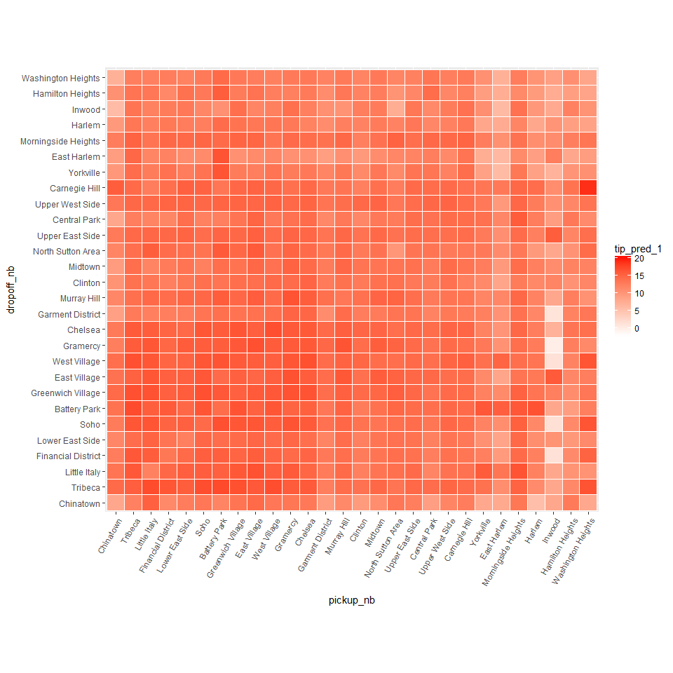
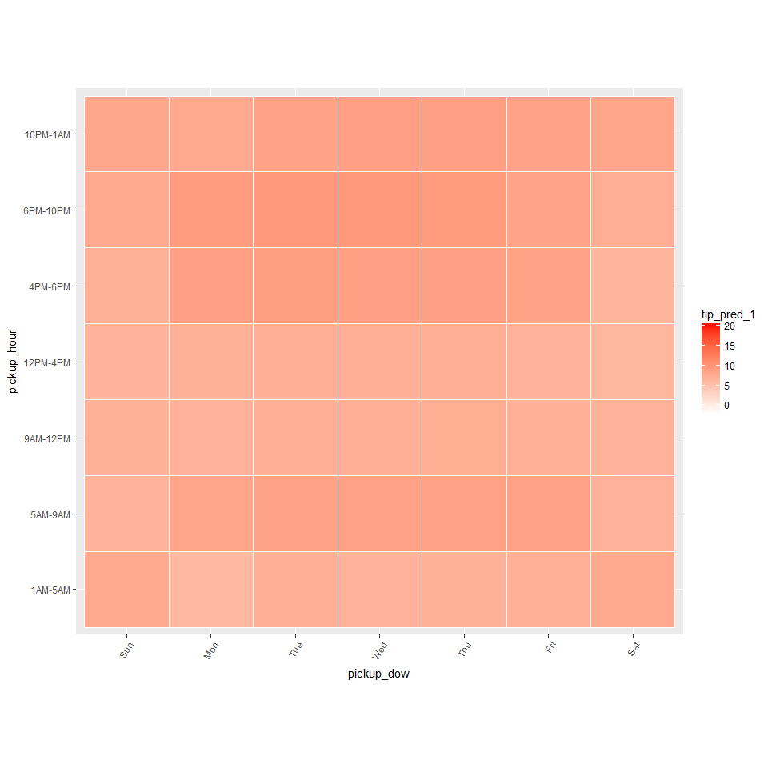
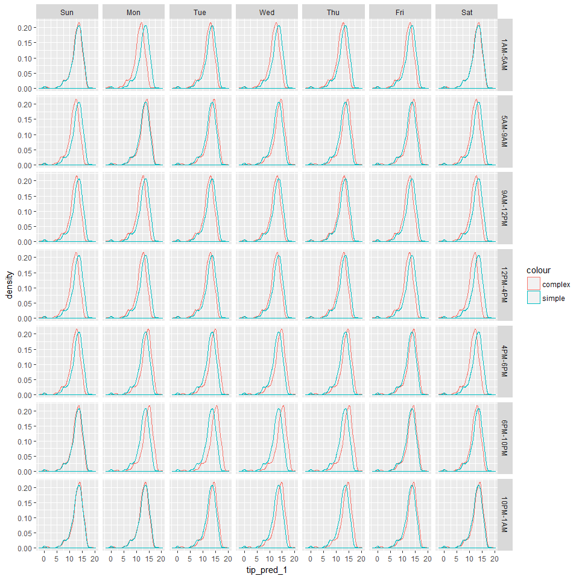
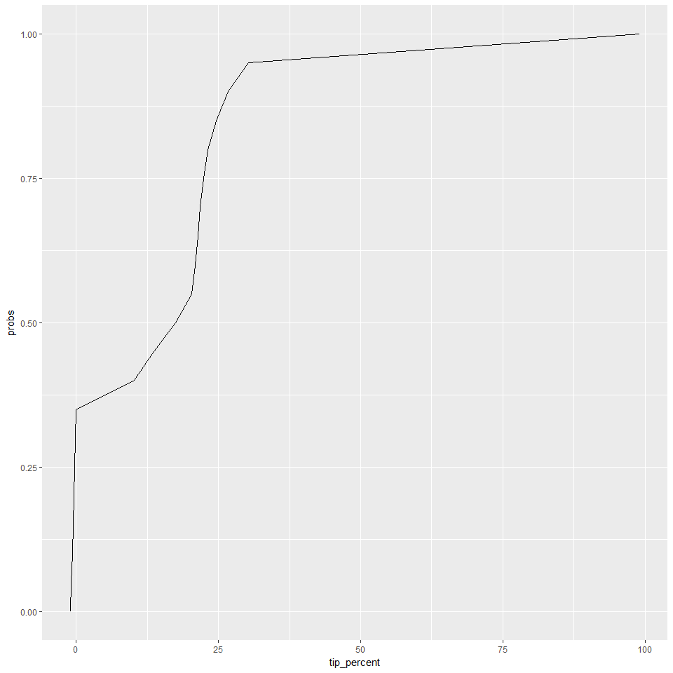
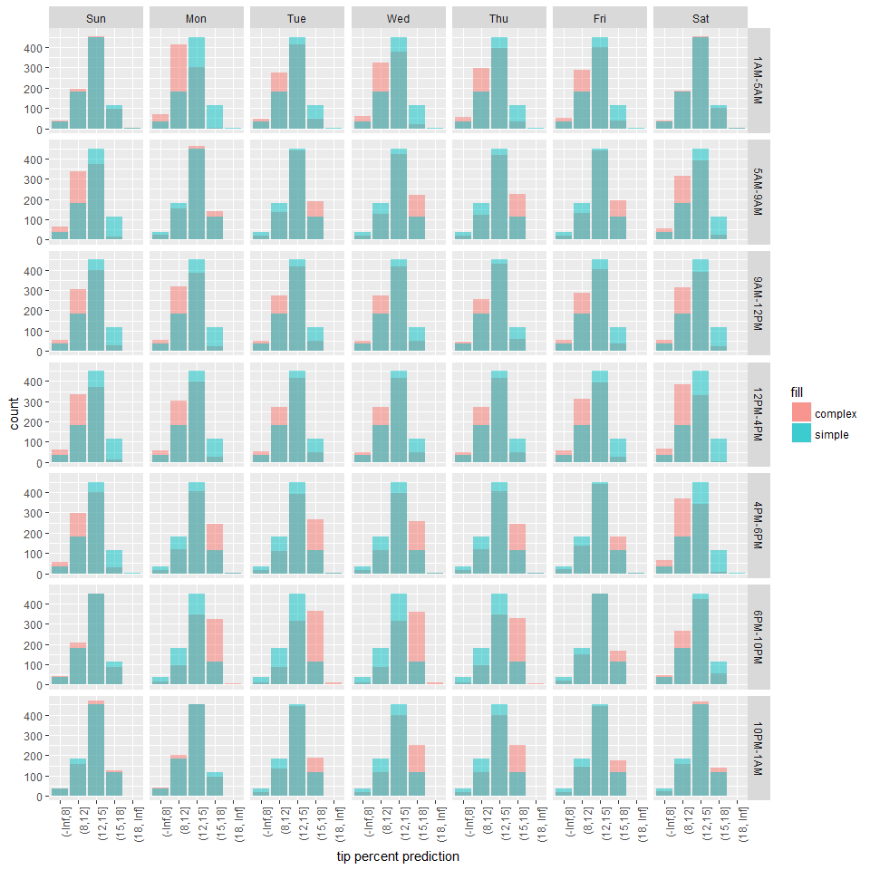
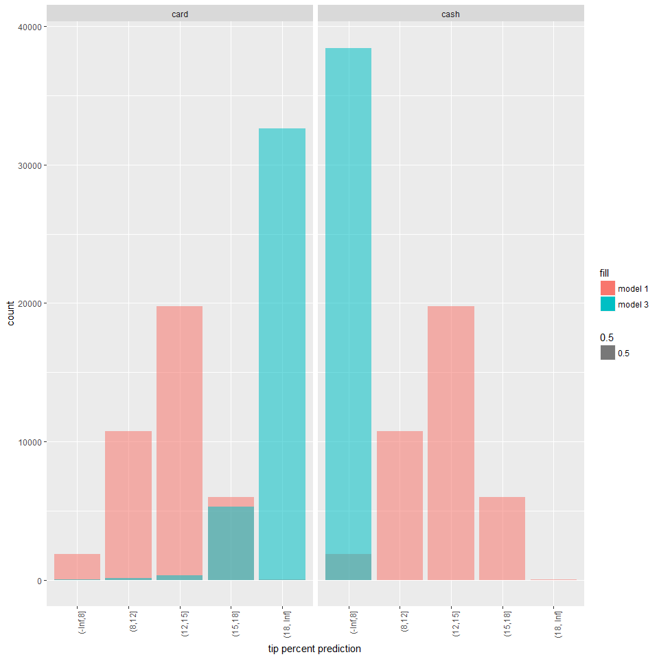
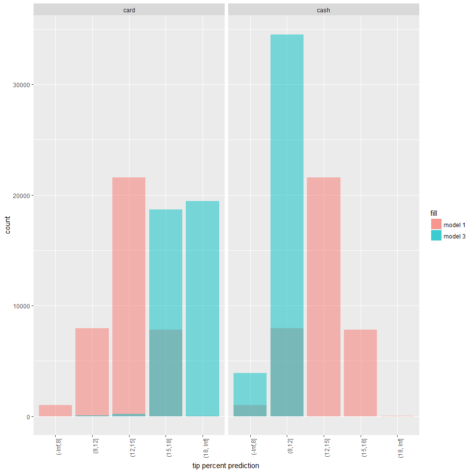
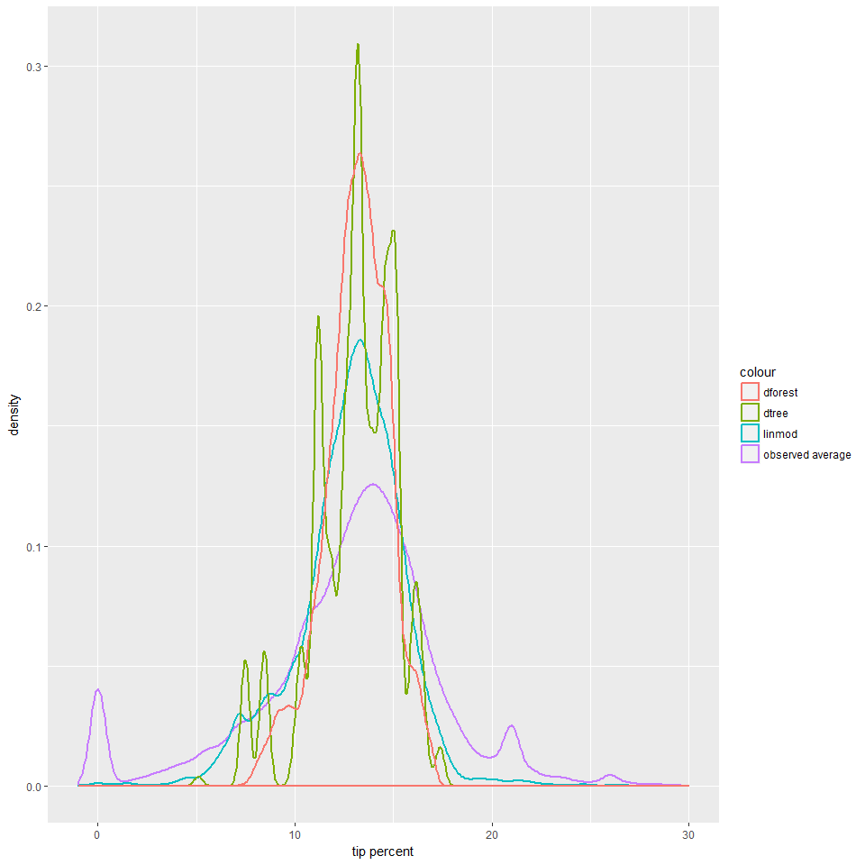
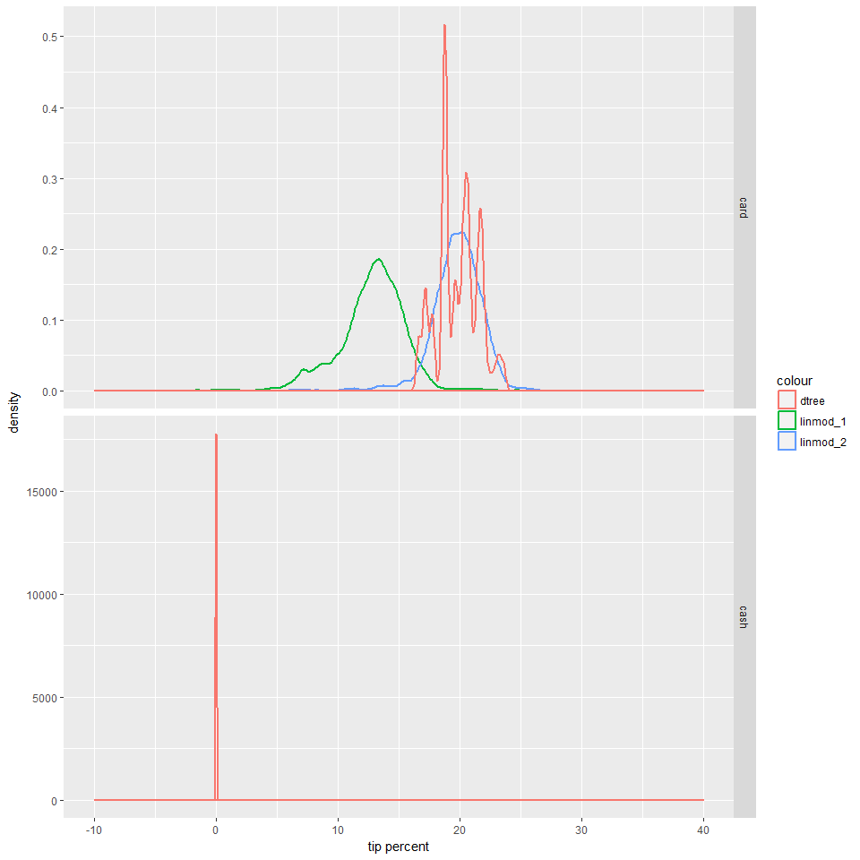
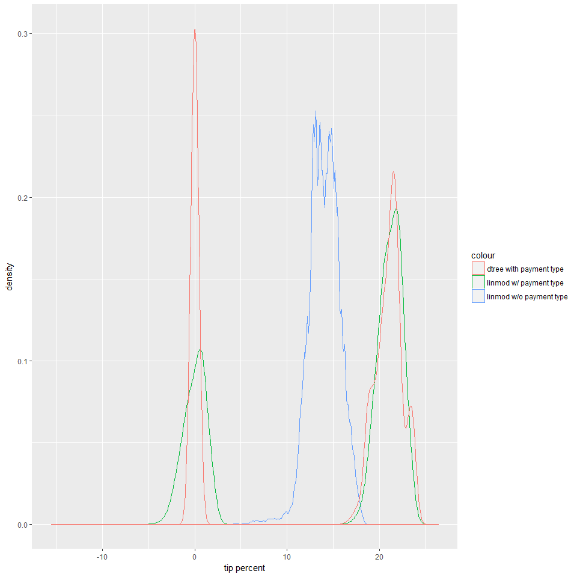

Building models
================
Seth Mottaghinejad
2017-02-28

Trying to modeling a given behavior can be a very involved task, as the data itself and business requirements have a say into our choice for a model. Some models have higher predictive power but are less easy to interpret, and others are the other way around. Moreover, the process of building a model can also involves several stages such as choosing among many models then iterating so we can tune the model we've decided upon.

Our next exercise will consist of using several analytics functions offered by `RevoScaleR` to build models for predicting the amount customers tip for a trip. We will use the pick-up and drop-off neighborhoods and the time and day of the trip as the variables most likely to influence tip.

Learning objectives
-------------------

At the end of this chapter, we will have a better understanding of how - to build models with `RevoScaleR` - to understand trade-offs between various models - use visualizations to guide the process of choosing among certain models - to **score** (run predictions on) a dataset with a model we just built

This chapter is not necessarily a thorough guide on running and choosing models. Instead it offers examples with code implementation as a starting point toward that end goal.

A linear model predicting tip percent
-------------------------------------

Let's begin by building a linear model involving two interactive terms: one between `pickup_nb` and `dropoff_nb` and another one between `pickup_dow` and `pickup_hour`. The idea here is that we think trip percent is not just influenced by which neighborhood the passengers was pickup up from, or which neighborhood they were dropped off to, but which neighborhood they were picked up from AND dropped off to. Similarly, we intuit that the day of the week and the hour of the day together influence tipping. For example, just because people tip high on Sundays between 9 and 12, doesn't mean that they tend to tip high any day of the week between 9 and 12 PM, or any time of the day on a Sunday. This intuition is encoded in the model formula argument that we pass to the `rxLinMod` function: `tip_percent ~ pickup_nb:dropoff_nb + pickup_dow:pickup_hour` where we use `:` to separate interactive terms and `+` to separate additive terms.

``` r
form_1 <- as.formula(tip_percent ~ pickup_nb:dropoff_nb + pickup_dow:pickup_hour)
rxlm_1 <- rxLinMod(form_1, data = mht_xdf, dropFirst = TRUE, covCoef = TRUE)
```

    ## 
    Rows Processed: 412183
    Rows Processed: 824198
    Rows Processed: 1234518
    Rows Processed: 1644958
    Rows Processed: 2059221
    Rows Processed: 2473197
    Rows Processed: 2887153
    Rows Processed: 3301832
    Rows Processed: 3720140
    Rows Processed: 4138788
    Rows Processed: 4554338
    Rows Processed: 4969813

Examining the model coefficients individually is a daunting task because of how many there are. Moreover, when working with big datasets, a lot of coefficients come out as statistically significant by virtue of large sample size, without necessarily being practically significant. Instead for now we just look at how our predictions are looking. We start by extracting each variable's factor levels into a `list` which we can pass to `expand.grid` to create a dataset with all the possible combinations of the factor levels. We then use `rxPredict` to predict `tip_percent` using the above model.

``` r
rxs <- rxSummary( ~ pickup_nb + dropoff_nb + pickup_hour + pickup_dow, mht_xdf)
```

    ## 
    Rows Processed: 412183
    Rows Processed: 824198
    Rows Processed: 1234518
    Rows Processed: 1644958
    Rows Processed: 2059221
    Rows Processed: 2473197
    Rows Processed: 2887153
    Rows Processed: 3301832
    Rows Processed: 3720140
    Rows Processed: 4138788
    Rows Processed: 4554338
    Rows Processed: 4969813

``` r
ll <- lapply(rxs$categorical, function(x) x[ , 1])
names(ll) <- c('pickup_nb', 'dropoff_nb', 'pickup_hour', 'pickup_dow')
pred_df_1 <- expand.grid(ll)
pred_df_1 <- rxPredict(rxlm_1, data = pred_df_1, computeStdErrors = TRUE, writeModelVars = TRUE)
```

    ## 
    Rows Processed: 38416

``` r
names(pred_df_1)[1:2] <- paste(c('tip_pred', 'tip_stderr'), 1, sep = "_")
head(pred_df_1, 10)
```

    ##    tip_pred_1 tip_stderr_1          pickup_nb dropoff_nb pickup_dow
    ## 1    7.585604    0.7724980          Chinatown  Chinatown        Sun
    ## 2   11.652358    0.4108979            Tribeca  Chinatown        Sun
    ## 3   14.799271    0.7357894       Little Italy  Chinatown        Sun
    ## 4   10.838549    0.2804085 Financial District  Chinatown        Sun
    ## 5   12.078835    0.3243162    Lower East Side  Chinatown        Sun
    ## 6   12.681298    0.4418141               Soho  Chinatown        Sun
    ## 7   11.396901    0.5630987       Battery Park  Chinatown        Sun
    ## 8   13.041078    0.3134503  Greenwich Village  Chinatown        Sun
    ## 9   13.974115    0.2971224       East Village  Chinatown        Sun
    ## 10  12.652115    0.5050404       West Village  Chinatown        Sun
    ##    pickup_hour
    ## 1      1AM-5AM
    ## 2      1AM-5AM
    ## 3      1AM-5AM
    ## 4      1AM-5AM
    ## 5      1AM-5AM
    ## 6      1AM-5AM
    ## 7      1AM-5AM
    ## 8      1AM-5AM
    ## 9      1AM-5AM
    ## 10     1AM-5AM

Going over predictions
----------------------

We can now visualize the model's predictions by plotting the average predictions for all combinations of the interactive terms.

``` r
library(ggplot2)
ggplot(pred_df_1, aes(x = pickup_nb, y = dropoff_nb)) +
  geom_tile(aes(fill = tip_pred_1), colour = "white") +
  theme(axis.text.x = element_text(angle = 60, hjust = 1)) +
  scale_fill_gradient(low = "white", high = "red") +
  coord_fixed(ratio = .9)
```



``` r
ggplot(pred_df_1, aes(x = pickup_dow, y = pickup_hour)) +
  geom_tile(aes(fill = tip_pred_1), colour = "white") +
  theme(axis.text.x = element_text(angle = 60, hjust = 1)) +
  scale_fill_gradient(low = "white", high = "red") +
  coord_fixed(ratio = .9)
```



Choosing between models
-----------------------

A question we might ask ourselves is how important is the interaction between `pickup_dow` and `pickup_hour` to the predictions? How much worse would the predictions be if we only kept the interaction between `pickup_nb` and `dropoff_nb` and dropped the second interactive term? To answer this, we can build a simpler model with `rxLinMod` in which we only include `pickup_nb:dropoff_nb`. We then predict with the simpler model and use `cbind` to append the new predictions next to the data with the old predictions we made with the more complex model.

``` r
form_2 <- as.formula(tip_percent ~ pickup_nb:dropoff_nb)
rxlm_2 <- rxLinMod(form_2, data = mht_xdf, dropFirst = TRUE, covCoef = TRUE)
```

    ## 
    Rows Processed: 412183
    Rows Processed: 824198
    Rows Processed: 1234518
    Rows Processed: 1644958
    Rows Processed: 2059221
    Rows Processed: 2473197
    Rows Processed: 2887153
    Rows Processed: 3301832
    Rows Processed: 3720140
    Rows Processed: 4138788
    Rows Processed: 4554338
    Rows Processed: 4969813

``` r
pred_df_2 <- rxPredict(rxlm_2, data = pred_df_1, computeStdErrors = TRUE, writeModelVars = TRUE)
```

    ## 
    Rows Processed: 38416

``` r
names(pred_df_2)[1:2] <- paste(c('tip_pred', 'tip_stderr'), 2, sep = "_")

library(dplyr)
pred_df <- pred_df_2 %>%
  select(starts_with('tip_')) %>%
  cbind(pred_df_1) %>%
  arrange(pickup_nb, dropoff_nb, pickup_dow, pickup_hour) %>%
  select(pickup_dow, pickup_hour, pickup_nb, dropoff_nb, starts_with('tip_pred_'))

head(pred_df)
```

    ##   pickup_dow pickup_hour pickup_nb dropoff_nb tip_pred_2 tip_pred_1
    ## 1        Sun     1AM-5AM Chinatown  Chinatown   7.581197   7.585604
    ## 2        Sun     5AM-9AM Chinatown  Chinatown   7.581197   6.479020
    ## 3        Sun    9AM-12PM Chinatown  Chinatown   7.581197   6.719867
    ## 4        Sun    12PM-4PM Chinatown  Chinatown   7.581197   6.474056
    ## 5        Sun     4PM-6PM Chinatown  Chinatown   7.581197   6.738151
    ## 6        Sun    6PM-10PM Chinatown  Chinatown   7.581197   7.488318

We can see from the results above that the predictions with the simpler model are identical across all the days of the week and all the hours for the same pick-up and drop-off combination. Whereas the predictions by the more complex model are unique for every combination of all four variables. In other words, adding `pickup_dow:pickup_hour` to the model adds extra variation to the predictions, and what we'd like to know is if this variation contains important signals or if it more or less behaves like noise. To get to the answer, we compare the distribution of the two predictions when we break them up by `pickup_dow` and `pickup_hour`.

``` r
ggplot(data = pred_df) +
  geom_density(aes(x = tip_pred_1, col = "complex")) +
  geom_density(aes(x = tip_pred_2, col = "simple")) +
  facet_grid(pickup_hour ~ pickup_dow)
```



The simpler model shows the same distribution all throughout, because these two variables have no effect on its predictions, but the more complex model shows a slightly different distribution for each combination of `pickup_dow` and `pickup_hour`, usually in the form of a slight shift in the distribution. That shift represents the effect of `pickup_dow` and `pickup_hour` at each given combination of the two variables. Because the shift is directional (not haphazard), it's safe to say that it captures some kind of important signal (although its practical significance is still up for debate). We can simplify the above plot if we apply some business logic to it.

Let's us `cut` to bin the tip predictions. To choose what the cut-offs should be, we can use the `rxQuantile` function to guide us.

``` r
dfq <- data.frame(probs = seq(0, 1, by = .05))
dfq$tip_percent <- rxQuantile("tip_percent", data = mht_xdf, probs = dfq$probs)
```

    ## 
    Rows Processed: 412183
    Rows Processed: 824198
    Rows Processed: 1234518
    Rows Processed: 1644958
    Rows Processed: 2059221
    Rows Processed: 2473197
    Rows Processed: 2887153
    Rows Processed: 3301832
    Rows Processed: 3720140
    Rows Processed: 4138788
    Rows Processed: 4554338
    Rows Processed: 4969813

``` r
ggplot(aes(x = tip_percent, y = probs), data = dfq) +
  geom_line()
```



Based on the above results, we can bin `tip_percent` by whether they are less than 8%, between 8% and 12%, between 12% and 15%, between 15% and 18%, or 18% or higher. We can then plot a bar plot showing the same information as above, but slightly easier to interpret.

``` r
pred_df %>%
  mutate_each(funs(cut(., c(-Inf, 8, 12, 15, 18, Inf))), tip_pred_1, tip_pred_2) %>%
  ggplot() +
  geom_bar(aes(x = tip_pred_1, fill = "complex"), alpha = .5) +
  geom_bar(aes(x = tip_pred_2, fill = "simple"), alpha = .5) +
  facet_grid(pickup_hour ~ pickup_dow) +
  xlab('tip percent prediction') +
  theme(axis.text.x = element_text(angle = 90, hjust = 1))
```



Based on the above plot, we can see that compared to the simple model, the complex model tends to predict more high-tipping passengers and fewer average-tipping ones during certain day and time combinations (such as Monday through Thursday during the rush hours).

### Exercises

In this section, we will try to improve our predictions. To do so, we can think of selecting "better" algorithms, but "better" is usually subjective as we discussed since every algorithm has its pros and cons and choosing between two algorithm can be a balancing act. However, one thing that any model can benefit from is better features. Better features can mean features that have been pre-processed to suit a particular algorithm, or it can refer to using more inputs in the model.

1.  Let's continue with linear models. Let's build a linear model very similar to the one represented by `form_1`, except that we throw `payment_type` into the mix. Let's call the new formula `form_3`.

``` r
form_3 <- ## formula described above goes here
rxlm_3 <- ## build a linear model based on the above formula
```

We now create a dataset called `pred_df` which will contain all the combinations of the features contained in `form_3`.

``` r
rxs <- rxSummary( ~ payment_type + pickup_nb + dropoff_nb + pickup_hour + pickup_dow, mht_xdf)
ll <- lapply(rxs$categorical, function(x) x[ , 1])
names(ll) <- c('payment_type', 'pickup_nb', 'dropoff_nb', 'pickup_hour', 'pickup_dow')
pred_df <- expand.grid(ll)
```

1.  Use `rxPredict` to put the predictions from the first model we built, `rxlm_1` and the current model, `rxlm_3` into this dataset. In other words, score `pred_df` with `rxlm_1` and `rxlm_3`. Dump results in a `data.frame` called `pred_all`. Name the predictions `p1` and `p3` respectively. Using the same binning process as before, replace the numeric predictions with the categorical predictions (e.g. `p1` is replaced by `cut(p1, c(-Inf, 8, 12, 15, 18, Inf))`).

2.  Feed `pred_all` to the following code snippet to create a plot comparing the two predictions for different days and times of the day. What is your conclusion based on the plot?

``` r
ggplot(data = pred_all) +
  geom_bar(aes(x = p1, fill = "model 1", group = payment_type, alpha = .5)) +
  geom_bar(aes(x = p3, fill = "model 3", group = payment_type, alpha = .5)) +
  facet_grid(pickup_hour ~ pickup_dow) +
  xlab('tip percent prediction') +
  theme(axis.text.x = element_text(angle = 90, hjust = 1))
```

### Solutions

As it turns out, `payment_type` is a very important feature for what we're trying to predict. For whatever reason, `tip_amount` does not show up in the data when a customer pays in cash. In other words, as far as the data is concerned, cash-paying customers do not tip. Let's set aside the reason, although it is something that is worth investigating. Knowing this, what we expect to happen is that predictions made by `rxlm_3` will be heavily influenced by `payment_type`.

1.  We begin by building the model and storing it in the model object `rxlm_3`.

``` r
form_3 <- as.formula(tip_percent ~ payment_type + pickup_nb:dropoff_nb + pickup_dow:pickup_hour)
rxlm_3 <- rxLinMod(form_3, data = mht_xdf, dropFirst = TRUE, covCoef = TRUE)
```

    ## 
    Rows Processed: 412183
    Rows Processed: 824198
    Rows Processed: 1234518
    Rows Processed: 1644958
    Rows Processed: 2059221
    Rows Processed: 2473197
    Rows Processed: 2887153
    Rows Processed: 3301832
    Rows Processed: 3720140
    Rows Processed: 4138788
    Rows Processed: 4554338
    Rows Processed: 4969813

1.  There are different ways of combining the predictions. One approach is to first let's make the predictions and store them in separate datasets and use `cbind` to combine them (as long as the order of the rows doesn't change). We can then use the `mutate_at` function in `dplyr` to apply the binning transformation to the two predictions (we can use `mutate` too but `mutate_at` has a more concise notation).

``` r
rxs <- rxSummary( ~ payment_type + pickup_nb + dropoff_nb + pickup_hour + pickup_dow, mht_xdf)
```

    ## 
    Rows Processed: 412183
    Rows Processed: 824198
    Rows Processed: 1234518
    Rows Processed: 1644958
    Rows Processed: 2059221
    Rows Processed: 2473197
    Rows Processed: 2887153
    Rows Processed: 3301832
    Rows Processed: 3720140
    Rows Processed: 4138788
    Rows Processed: 4554338
    Rows Processed: 4969813

``` r
ll <- lapply(rxs$categorical, function(x) x[ , 1])
names(ll) <- c('payment_type', 'pickup_nb', 'dropoff_nb', 'pickup_hour', 'pickup_dow')
pred_df <- expand.grid(ll)

pred_df_1 <- rxPredict(rxlm_1, data = pred_df, computeStdErrors = TRUE, writeModelVars = TRUE)
```

    ## 
    Rows Processed: 76832

``` r
pred_df_3 <- rxPredict(rxlm_3, data = pred_df, computeStdErrors = TRUE, writeModelVars = TRUE)
```

    ## 
    Rows Processed: 76832

``` r
pred_df %>%
  cbind(select(rename(pred_df_1, p1 = tip_percent_Pred), p1)) %>%
  cbind(select(rename(pred_df_3, p3 = tip_percent_Pred), p3)) %>%
  mutate_at(vars(p1, p3), funs(cut(., c(-Inf, 8, 12, 15, 18, Inf)))) -> pred_all
```

1.  Once we have the data ready, we feed it to `ggplot` to create bar plots comparing predictions made by each models broken up by whether the customer paid with a card or using cash.

``` r
ggplot(data = pred_all) +
  geom_bar(aes(x = p1, fill = "model 1", alpha = .5)) +
  geom_bar(aes(x = p3, fill = "model 3", alpha = .5)) +
  facet_grid(~ payment_type) +
  xlab('tip percent prediction') +
  theme(axis.text.x = element_text(angle = 90, hjust = 1))
```



The model does in fact predict as we expected. It is also possible that are predictions are good, but need to be calibrated. We can recalibrate the predictions by adding a single line of code just before we bin the predictions. To recalibrate the predictions, we use the `rescale` function in the `scales` library. In this case, we are rescaling predictions so that both models predict a number between 0 and 20% tip.

``` r
library(scales)
pred_df %>%
  cbind(select(rename(pred_df_1, p1 = tip_percent_Pred), p1)) %>%
  cbind(select(rename(pred_df_3, p3 = tip_percent_Pred), p3)) %>%
  mutate_at(vars(p1, p3), funs(rescale(., to = c(0, 20)))) %>%
  mutate_at(vars(p1, p3), funs(cut(., c(-Inf, 8, 12, 15, 18, Inf)))) -> pred_all

ggplot(data = pred_all) +
  geom_bar(aes(x = p1, fill = "model 1"), alpha = .5) +
  geom_bar(aes(x = p3, fill = "model 3"), alpha = .5) +
  facet_grid(~ payment_type) +
  xlab('tip percent prediction') +
  theme(axis.text.x = element_text(angle = 90, hjust = 1))
```



Using other algorithms
----------------------

So far we've only looked at two models from the same `rxLinMod` algorithm. When comparing the two, we looked at the way their predictions capture the effects of the variables used to build each model. To do the comparison, we built a dataset with all combinations of the variables used to build the models with, and then scored that dataset with the two models using `rxPredict`. By doing so we can see how the predictions are distributed, but we still don't know if the predictions are good. The true test of a model's performance is in its ability to predict **out of sample**, which is why we split the data in two and set aside a portion of it for model testing.

To divide the data into training and testing portions, we first used `rxDataStep` to create a new `factor` column called `split` where each row is `"train"` or `"test"` such that a given proportion of the data (here 75 percent) is used to train a model and the rest is used to test the model's predictive power. We then used the `rxSplit` function to divide the data into the two portions. The `rx_split_xdf` function we create here combines the two steps into one and sets some arguments to defaults.

``` r
dir.create(file.path(data_dir, 'output'), showWarnings = FALSE)
rx_split_xdf <- function(xdf = mht_xdf, split_perc = 0.75,
                         output_path = file.path(data_dir, "output"), ...) {
  # first create a column to split by
  outFile <- tempfile(fileext = 'xdf')
  rxDataStep(inData = xdf, outFile = xdf, transforms = list(
    split = factor(ifelse(rbinom(.rxNumRows, size = 1, prob = splitperc), "train", "test"))),
    transformObjects = list(splitperc = split_perc), overwrite = TRUE, ...)

  # then split the data in two based on the column we just created
  splitDS <- rxSplit(inData = xdf,
  outFilesBase = file.path(output_path, "train"),
  splitByFactor = "split",
  overwrite = TRUE)
  return(splitDS)
}

# we can now split to data in two
mht_split <- rx_split_xdf(xdf = mht_xdf, 
    varsToKeep = c('payment_type', 'fare_amount', 'tip_amount', 'tip_percent', 
                                 'pickup_hour', 'pickup_dow', 'pickup_nb', 'dropoff_nb'))
```

    ## 
    Rows Processed: 412183
    Rows Processed: 824198
    Rows Processed: 1234518
    Rows Processed: 1644958
    Rows Processed: 2059221
    Rows Processed: 2473197
    Rows Processed: 2887153
    Rows Processed: 3301832
    Rows Processed: 3720140
    Rows Processed: 4138788
    Rows Processed: 4554338
    Rows Processed: 4969813 
    ## 
    Rows Processed: 102807 
    ## 
    Rows Processed: 309376 
    ## 
    Rows Processed: 412183
    Rows Processed: 102886 
    ## 
    Rows Processed: 309129 
    ## 
    Rows Processed: 824198
    Rows Processed: 101970 
    ## 
    Rows Processed: 308350 
    ## 
    Rows Processed: 1234518
    Rows Processed: 102280 
    ## 
    Rows Processed: 308160 
    ## 
    Rows Processed: 1644958
    Rows Processed: 103863 
    ## 
    Rows Processed: 310400 
    ## 
    Rows Processed: 2059221
    Rows Processed: 103329 
    ## 
    Rows Processed: 310647 
    ## 
    Rows Processed: 2473197
    Rows Processed: 103562 
    ## 
    Rows Processed: 310394 
    ## 
    Rows Processed: 2887153
    Rows Processed: 103437 
    ## 
    Rows Processed: 311242 
    ## 
    Rows Processed: 3301832
    Rows Processed: 104536 
    ## 
    Rows Processed: 313772 
    ## 
    Rows Processed: 3720140
    Rows Processed: 104628 
    ## 
    Rows Processed: 314020 
    ## 
    Rows Processed: 4138788
    Rows Processed: 103973 
    ## 
    Rows Processed: 311577 
    ## 
    Rows Processed: 4554338
    Rows Processed: 103600 
    ## 
    Rows Processed: 311875 
    ## 
    Rows Processed: 4969813

``` r
names(mht_split) <- c("train", "test")
```

We now run three different algorithms on the data:

-   `rxLinMod`, the linear model from earlier with the terms `tip_percent ~ pickup_nb:dropoff_nb + pickup_dow:pickup_hour`
-   `rxDTree`, the decision tree algorithm with the terms `tip_percent ~ pickup_nb + dropoff_nb + pickup_dow + pickup_hour` (decision trees don't need interactive factors because interactions are built into the algorithm itself)
-   `rxDForest`, the random forest algorithm with the same terms as decision trees Since this is not a modeling course, we will not discuss how the algorithms are implemented. Instead we run the algorithms and use them to predict tip percent on the test data so we can see which one works better.

``` r
system.time(linmod <- rxLinMod(tip_percent ~ pickup_nb:dropoff_nb + pickup_dow:pickup_hour, data = mht_split$train, reportProgress = 0))
```

    ##    user  system elapsed 
    ##    0.03    0.00    0.64

``` r
system.time(dtree <- rxDTree(tip_percent ~ pickup_nb + dropoff_nb + pickup_dow + pickup_hour, data = mht_split$train, pruneCp = "auto", reportProgress = 0))
```

    ##    user  system elapsed 
    ##    0.05    0.02  139.86

``` r
system.time(dforest <- rxDForest(tip_percent ~ pickup_nb + dropoff_nb + pickup_dow + pickup_hour, data = mht_split$train, nTree = 30, importance = TRUE, useSparseCube = TRUE, reportProgress = 0))
```

    ##    user  system elapsed 
    ##    0.13    0.05  382.47

Since running the above algorithms can take a while, it may be worth saving the models that each return.

``` r
trained.models <- list(linmod = linmod, dtree = dtree, dforest = dforest)
save(trained.models, file = 'trained_models.Rdata')
```

Comparing predictions
---------------------

Before applying the algorithm to the test data, let's apply it to the small dataset with all the combinations of categorical variables and visualize the predictions. This might help us develop some intuition about each algorithm.

``` r
pred_df <- expand.grid(ll[2:5])
pred_df_1 <- rxPredict(trained.models$linmod, data = pred_df, predVarNames = "pred_linmod")
```

    ## 
    Rows Processed: 38416

``` r
pred_df_2 <- rxPredict(trained.models$dtree, data = pred_df, predVarNames = "pred_dtree")
```

    ## 
    Rows Processed: 38416

``` r
pred_df_3 <- rxPredict(trained.models$dforest, data = pred_df, predVarNames = "pred_dforest")
```

    ## 
    Rows Processed: 38416

``` r
pred_df <- do.call(cbind, list(pred_df, pred_df_1, pred_df_2, pred_df_3))

observed_df <- rxSummary(tip_percent ~ pickup_nb:dropoff_nb:pickup_dow:pickup_hour, mht_xdf)
```

    ## 
    Rows Processed: 412183
    Rows Processed: 824198
    Rows Processed: 1234518
    Rows Processed: 1644958
    Rows Processed: 2059221
    Rows Processed: 2473197
    Rows Processed: 2887153
    Rows Processed: 3301832
    Rows Processed: 3720140
    Rows Processed: 4138788
    Rows Processed: 4554338
    Rows Processed: 4969813

``` r
observed_df <- observed_df$categorical[[1]][ , c(2:6)]
pred_df <- inner_join(pred_df, observed_df, by = names(pred_df)[1:4])

ggplot(data = pred_df) +
  geom_density(aes(x = Means, col = "observed average"), size = 1) +
  geom_density(aes(x = pred_linmod, col = "linmod"), size = 1) +
  geom_density(aes(x = pred_dtree, col = "dtree"), size = 1) +
  geom_density(aes(x = pred_dforest, col = "dforest"), size = 1) +
  xlim(-1, 30) +
  xlab("tip percent")
```



Both the linear model and the random forest give us smooth predictions. We can see that the random forest predictions are the most concentrated. The predictions for the decision tree follow a jagged distribution, probably as a result of overfitting, but we don't know that until we check performance against the test set.

Comparing predictive performance
--------------------------------

We now apply the model to the test data so we can compare the predictive power of each model. If we are correct about the decision tree over-fitting, then we should see it preform poorly on the test data compared to the other two models. If we believe the random forest captures some inherent signals in the data that the linear model misses, we should see it perform better than the linear model on the test data.

The first metric we look at is the average of the squared residuals, which gives us an idea of how close the predictions are to the observed values. Since we're predicting tip percent, which usually falls in a narrow range of 0 to about 20 percent, we should expect on average the residuals for a good model to be no more than 2 or 3 percentage points.

``` r
rxPredict(trained.models$linmod, data = mht_split$test, outData = mht_split$test, predVarNames = "tip_percent_pred_linmod", overwrite = TRUE)
```

    ## 
    Rows Processed: 309376
    Rows Processed: 618505
    Rows Processed: 926855
    Rows Processed: 1235015
    Rows Processed: 1545415
    Rows Processed: 1856062
    Rows Processed: 2166456
    Rows Processed: 2477698
    Rows Processed: 2791470
    Rows Processed: 3105490
    Rows Processed: 3417067
    Rows Processed: 3728942

``` r
rxPredict(trained.models$dtree, data = mht_split$test, outData = mht_split$test, predVarNames = "tip_percent_pred_dtree", overwrite = TRUE)
```

    ## 
    Rows Processed: 309376
    Rows Processed: 618505
    Rows Processed: 926855
    Rows Processed: 1235015
    Rows Processed: 1545415
    Rows Processed: 1856062
    Rows Processed: 2166456
    Rows Processed: 2477698
    Rows Processed: 2791470
    Rows Processed: 3105490
    Rows Processed: 3417067
    Rows Processed: 3728942

``` r
rxPredict(trained.models$dforest, data = mht_split$test, outData = mht_split$test, predVarNames = "tip_percent_pred_dforest", overwrite = TRUE)
```

    ## 
    Rows Processed: 309376
    Rows Processed: 618505
    Rows Processed: 926855
    Rows Processed: 1235015
    Rows Processed: 1545415
    Rows Processed: 1856062
    Rows Processed: 2166456
    Rows Processed: 2477698
    Rows Processed: 2791470
    Rows Processed: 3105490
    Rows Processed: 3417067
    Rows Processed: 3728942

``` r
rxSummary(~ SSE_linmod + SSE_dtree + SSE_dforest, data = mht_split$test,
  transforms = list(
    SSE_linmod = (tip_percent - tip_percent_pred_linmod)^2,
    SSE_dtree = (tip_percent - tip_percent_pred_dtree)^2,
    SSE_dforest = (tip_percent - tip_percent_pred_dforest)^2))
```

    ## 
    Rows Processed: 309376
    Rows Processed: 618505
    Rows Processed: 926855
    Rows Processed: 1235015
    Rows Processed: 1545415
    Rows Processed: 1856062
    Rows Processed: 2166456
    Rows Processed: 2477698
    Rows Processed: 2791470
    Rows Processed: 3105490
    Rows Processed: 3417067
    Rows Processed: 3728942

    ## Call:
    ## rxSummary(formula = ~SSE_linmod + SSE_dtree + SSE_dforest, data = mht_split$test, 
    ##     transforms = list(SSE_linmod = (tip_percent - tip_percent_pred_linmod)^2, 
    ##         SSE_dtree = (tip_percent - tip_percent_pred_dtree)^2, 
    ##         SSE_dforest = (tip_percent - tip_percent_pred_dforest)^2))
    ## 
    ## Summary Statistics Results for: ~SSE_linmod + SSE_dtree +
    ##     SSE_dforest
    ## Data: mht_split$test (RxXdfData Data Source)
    ## File name: C:\Data\NYC_taxi\output\train.split.train.xdf
    ## Number of valid observations: 3728942 
    ##  
    ##  Name        Mean     StdDev   Min                                 
    ##  SSE_linmod  139.1868 175.6740 0.0000000000000000000000000001546167
    ##  SSE_dtree   139.1643 176.1312 0.0000038748261381108108575635484705
    ##  SSE_dforest 138.8462 174.8122 0.0000000000102172309775806611706339
    ##  Max      ValidObs MissingObs
    ##  8015.448 3726019  2923      
    ##  8020.056 3726019  2923      
    ##  7906.674 3726019  2923

Another metric worth looking at is a correlation matrix. This can help us determine to what extent the predictions from the different models are close to each other, and to what extent each is close to the actual or observed tip percent.

``` r
rxc <- rxCor( ~ tip_percent + tip_percent_pred_linmod + tip_percent_pred_dtree + tip_percent_pred_dforest, data = mht_split$test)
```

    ## 
    Rows Processed: 309376
    Rows Processed: 618505
    Rows Processed: 926855
    Rows Processed: 1235015
    Rows Processed: 1545415
    Rows Processed: 1856062
    Rows Processed: 2166456
    Rows Processed: 2477698
    Rows Processed: 2791470
    Rows Processed: 3105490
    Rows Processed: 3417067
    Rows Processed: 3728942

``` r
print(rxc)
```

    ##                          tip_percent tip_percent_pred_linmod
    ## tip_percent                1.0000000               0.1359495
    ## tip_percent_pred_linmod    0.1359495               1.0000000
    ## tip_percent_pred_dtree     0.1364810               0.8447106
    ## tip_percent_pred_dforest   0.1472673               0.9106463
    ##                          tip_percent_pred_dtree tip_percent_pred_dforest
    ## tip_percent                           0.1364810                0.1472673
    ## tip_percent_pred_linmod               0.8447106                0.9106463
    ## tip_percent_pred_dtree                1.0000000                0.9283602
    ## tip_percent_pred_dforest              0.9283602                1.0000000

### Exercises

The models we built in the last section were disappointing, and the last exercise showed us that it's because those models ignored `payment_type`, which is strongly correlated with `tip_percent` since customers who pay cash for their taxi fare do not have their tips registered by the data.

1.  Now that we used `RevoScaleR` to split the data into training and testing sets, let's go back and rebuild the three models from last section but include `payment_type` this time, in addition to all the features we used last time.

``` r
# we re-build the linear model without payment_type for comparison
linmod_1 <- rxLinMod(## formula goes here
                     data = mht_split$train, reportProgress = 0)
# we build a linear model with payment_type
linmod_2 <- rxLinMod(## formula goes here
                     data = mht_split$train, reportProgress = 0)
# we build a decision tree with payment_type
dtree <- rxDTree(## formula goes here
                 data = mht_split$train, pruneCp = "auto", reportProgress = 0)

trained.models <- list(linmod_1 = linmod_1, linmod_2 = linmod_2, dtree = dtree)
```

1.  Here is a code to build a prediction dataset called `pred_df`. Fill in the code for predicting `payment_type` using the three models from above and attach the predictions to `pred_df` as separate columns called `pred_linmod_1`, `pred_linmod_2` and `pred_dtree`.

``` r
pred_df <- expand.grid(ll)
## predict payment_type on pred_df by each of three models
# pred_df_1 stores predictions made by linmod_1 into a column called pred_linmod_1
# pred_df_2 stores predictions made by linmod_2 into a column called pred_linmod_2
# pred_df_3 stores predictions made by dtree into a column called pred_dtree
pred_df <- bind_cols(pred_df, pred_df_1, pred_df_2, pred_df_3)
head(pred_df)
```

1.  Run your dataset against the following code snippet to produce a plot similar to the plot we examined earlier. What is different about the plot this time?

``` r
ggplot(data = pred_df) +
  geom_density(aes(x = pred_linmod_1, col = "linmod_1"), size = 1) +
  geom_density(aes(x = pred_linmod_2, col = "linmod_2"), size = 1) +
  geom_density(aes(x = pred_dtree, col = "dtree"), size = 1) +
  xlim(-10, 40) +
  xlab("tip percent") +
  facet_grid(payment_type ~ ., scales = "free")
```

1.  Extract only the necessary columns from the test data and run predictions on it. In the last section, we put the predictions directly in the test data's XDF file, but because this is an IO intensive operation, we can run it faster by using a `data.frame` instead (as long as the test data is not big enough to make us run out of memory). Use `rxPredict` to run score `test_df` with the predictions from each of the three models.

``` r
test_df <- rxDataStep(mht_split$test, 
  varsToKeep = c('tip_percent', 'payment_type', 'pickup_nb', 'dropoff_nb', 'pickup_hour', 'pickup_dow'), 
  maxRowsByCols = 10^9)
test_df_1 <- ## predict for the first model, call the predictions `tip_pred_linmod`
test_df_2 <- ## predict for the second model, call the predictions `tip_pred_dtree`
test_df_3 <- ## predict for the third model, call the predictions `tip_pred_dforest`
```

We can now attach models' predictions to the `test_df` and run a `rxSummary` (or any R function we like, since `test_df` is a `data.frame`) to look at the performance of the models.

``` r
test_df <- do.call(cbind, list(test_df, test_df_1, test_df_2, test_df_3))

rxSummary(~ SSE_linmod + SSE_dtree + SSE_dforest, data = test_df,
  transforms = list(
    SSE_linmod = (tip_percent - tip_pred_linmod)^2,
    SSE_dtree = (tip_percent - tip_pred_dtree)^2,
    SSE_dforest = (tip_percent - tip_pred_dforest)^2))
```

1.  Run the above summary and report your findings.

### Solutions

1.  We begin by building the three models on the training data and saving the results in an `Rdata` file.

``` r
linmod_1 <- rxLinMod(tip_percent ~ pickup_nb:dropoff_nb + pickup_dow:pickup_hour, data = mht_split$train, reportProgress = 0)
linmod_2 <- rxLinMod(tip_percent ~ payment_type + pickup_nb:dropoff_nb + pickup_dow:pickup_hour, data = mht_split$train, reportProgress = 0)
dtree <- rxDTree(tip_percent ~ payment_type + pickup_nb + dropoff_nb + pickup_dow + pickup_hour, data = mht_split$train, pruneCp = "auto", reportProgress = 0)

trained.models <- list(linmod_1 = linmod_1, linmod_2 = linmod_2, dtree = dtree)
```

1.  We can now build a prediction dataset with all the combinations of the input variables. If any of the input variables was numeric, we would have to discretize it so the dataset does not blow up in size. In our case, we don't have numeric inputs. Finally, with `do.call` we can recursively join the predictions to the original data using the `cbind` function.

``` r
pred_df <- expand.grid(ll)
pred_df_1 <- rxPredict(trained.models$linmod_1, data = pred_df, predVarNames = "pred_linmod_1")
```

    ## 
    Rows Processed: 76832

``` r
pred_df_2 <- rxPredict(trained.models$linmod_2, data = pred_df, predVarNames = "pred_linmod_2")
```

    ## 
    Rows Processed: 76832

``` r
pred_df_3 <- rxPredict(trained.models$dtree, data = pred_df, predVarNames = "pred_dtree")
```

    ## 
    Rows Processed: 76832

``` r
pred_df <- bind_cols(pred_df, pred_df_1, pred_df_2, pred_df_3)
head(pred_df)
```

    ##   payment_type    pickup_nb dropoff_nb pickup_hour pickup_dow
    ## 1         card    Chinatown  Chinatown     1AM-5AM        Sun
    ## 2         cash    Chinatown  Chinatown     1AM-5AM        Sun
    ## 3         card      Tribeca  Chinatown     1AM-5AM        Sun
    ## 4         cash      Tribeca  Chinatown     1AM-5AM        Sun
    ## 5         card Little Italy  Chinatown     1AM-5AM        Sun
    ## 6         cash Little Italy  Chinatown     1AM-5AM        Sun
    ##   pred_linmod_1 pred_linmod_2   pred_dtree
    ## 1      9.928182    22.3983754 21.705727828
    ## 2      9.928182     1.0381083  0.000164329
    ## 3     12.236094    21.6252174 21.705727828
    ## 4     12.236094     0.2649504  0.000164329
    ## 5     16.828946    24.9087283 21.705727828
    ## 6     16.828946     3.5484613  0.000164329

1.  We now feed the above data to `ggplot` to look at the distribution of the predictions made by each model. It should come as no surprise that with the inclusion of `payment_type` the predictions have a **bimodal distribution** one for trips paid in cash and one for trips paid using a card. For trips paid in cash, the actual distribution is not as important, but for trips paid using a card we can see that the random forest model makes predictions that are less spread out than the other two models.

``` r
ggplot(data = pred_df) +
  geom_density(aes(x = pred_linmod_1, col = "linmod_1"), size = 1) +
  geom_density(aes(x = pred_linmod_2, col = "linmod_2"), size = 1) +
  geom_density(aes(x = pred_dtree, col = "dtree"), size = 1) +
  xlim(-10, 40) +
  xlab("tip percent") +
  facet_grid(payment_type ~ ., scales = "free")
```



1.  We now run the predictions on the test data to evaluate each model's performance. To do so, we use `rxPredict` without the `outData` argument and make an assignment on the left side so results would go into a `data.frame`.

``` r
test_df <- rxDataStep(mht_split$test, varsToKeep = c('tip_percent', 'payment_type', 'pickup_nb', 'dropoff_nb', 'pickup_hour', 'pickup_dow'), maxRowsByCols = 10^9)
```

    ## 
    Rows Processed: 309376
    Rows Processed: 618505
    Rows Processed: 926855
    Rows Processed: 1235015
    Rows Processed: 1545415
    Rows Processed: 1856062
    Rows Processed: 2166456
    Rows Processed: 2477698
    Rows Processed: 2791470
    Rows Processed: 3105490
    Rows Processed: 3417067
    Rows Processed: 3728942

``` r
test_df_1 <- rxPredict(trained.models$linmod_1, data = test_df, predVarNames = "tip_pred_linmod_1")
```

    ## 
    Rows Processed: 3728942

``` r
test_df_2 <- rxPredict(trained.models$linmod_2, data = test_df, predVarNames = "tip_pred_linmod_2")
```

    ## 
    Rows Processed: 3728942

``` r
test_df_3 <- rxPredict(trained.models$dtree, data = test_df, predVarNames = "tip_pred_dtree")
```

    ## 
    Rows Processed: 3728942

``` r
test_df <- do.call(cbind, list(test_df, test_df_1, test_df_2, test_df_3))
head(test_df)
```

    ##   tip_percent payment_type        pickup_nb       dropoff_nb pickup_hour
    ## 1          29         card      Murray Hill         Gramercy    6PM-10PM
    ## 2           0         cash  Upper West Side Garment District     5AM-9AM
    ## 3          35         card  Upper West Side    Carnegie Hill    6PM-10PM
    ## 4          22         card     West Village  Lower East Side    10PM-1AM
    ## 5           0         cash         Gramercy     West Village    12PM-4PM
    ## 6          34         card Garment District          Midtown     1AM-5AM
    ##   pickup_dow tip_pred_linmod_1 tip_pred_linmod_2 tip_pred_dtree
    ## 1        Tue          17.64869        23.4318701   23.198918420
    ## 2        Wed          13.67083        -1.3331889    0.000164329
    ## 3        Sun          13.91380        20.9889078   22.038624113
    ## 4        Fri          14.00318        19.6826817   18.710000264
    ## 5        Tue          14.99703        -0.5735811    0.000164329
    ## 6        Fri          11.63258        22.4662642   22.071999870

Since we have the test data in a `data.frame` we can also plot the distribution of the predictions on the test data to compare it with the last plot. As we can see, the random forest and linear model both probably waste some computation effort making predictions for trips paid in cash.

``` r
ggplot(data = test_df) +
  geom_density(aes(x = tip_pred_linmod_1, col = "linmod w/o payment type")) +
  geom_density(aes(x = tip_pred_linmod_2, col = "linmod w/ payment type")) +
  geom_density(aes(x = tip_pred_dtree, col = "dtree with payment type")) +
  xlab("tip percent") # + facet_grid(pickup_hour ~ pickup_dow)
```



1.  Recall from the last section that the predictions made by the three models had an average SSE of about 80. With the inclusion of `payment_type` we should see a considerable drop in this number.

``` r
rxSummary(~ SSE_linmod_1 + SSE_linmod_2 + SSE_dtree, data = test_df,
  transforms = list(
    SSE_linmod_1 = (tip_percent - tip_pred_linmod_1)^2,
    SSE_linmod_2 = (tip_percent - tip_pred_linmod_2)^2,
    SSE_dtree = (tip_percent - tip_pred_dtree)^2))
```

    ## 
    Rows Processed: 3728942

    ## Call:
    ## rxSummary(formula = ~SSE_linmod_1 + SSE_linmod_2 + SSE_dtree, 
    ##     data = test_df, transforms = list(SSE_linmod_1 = (tip_percent - 
    ##         tip_pred_linmod_1)^2, SSE_linmod_2 = (tip_percent - tip_pred_linmod_2)^2, 
    ##         SSE_dtree = (tip_percent - tip_pred_dtree)^2))
    ## 
    ## Summary Statistics Results for: ~SSE_linmod_1 + SSE_linmod_2 +
    ##     SSE_dtree
    ## Data: test_df
    ## Number of valid observations: 3728942 
    ##  
    ##  Name         Mean      StdDev   Min                                 
    ##  SSE_linmod_1 139.18676 175.6740 0.0000000000000000000000000001546167
    ##  SSE_linmod_2  40.07856 135.1130 0.0000000000000000000000000000000000
    ##  SSE_dtree     41.80960 138.4497 0.0000000270040222138820546729683081
    ##  Max      ValidObs MissingObs
    ##  8015.448 3726019   2923     
    ##  6215.947 3711362  17580     
    ##  6535.421 3726019   2923

``` r
rxc <- rxCor( ~ tip_percent + tip_pred_linmod_1 + tip_pred_linmod_2 + tip_pred_dtree, data = test_df)
```

    ## 
    Rows Processed: 3728942

``` r
print(rxc)
```

    ##                   tip_percent tip_pred_linmod_1 tip_pred_linmod_2
    ## tip_percent         1.0000000         0.1355376         0.8467185
    ## tip_pred_linmod_1   0.1355376         1.0000000         0.1622829
    ## tip_pred_linmod_2   0.8467185         0.1622829         1.0000000
    ## tip_pred_dtree      0.8463435         0.1555113         0.9945409
    ##                   tip_pred_dtree
    ## tip_percent            0.8463435
    ## tip_pred_linmod_1      0.1555113
    ## tip_pred_linmod_2      0.9945409
    ## tip_pred_dtree         1.0000000

The average SSE has now dropped to a little over 20, which confirms how the inclusion of the right features (`payment_type` in this case) can have a significant impact on our model's predictive power.

Final thoughts
--------------

An analytics or machine learning workflow is not a linear process. As we saw in some of the examples we provided, discovering certain things about our data or getting disappointing results from our models can force us to go back to square one and think about how we can improve our data. This can mean getting more data, getting better data, or very probably both. Getting more data doesn't always help, since we saw that even not-so-large samples can do a good job of representing the overall population. However, getting more data can be especially helpful if we need to model very unusual behaviors (sometimes called rare events) using a lot of features. Getting better data can refer to two things: 1. Using new features in the hope that they will reduce noise in our models. A *new* feature here can be a new source of data, or a feature that was derived directly from the existing feature set. As we saw in the last exercise, this approach can considerably reduce noise. However, obtaining or engineering new features is not always easy, as it may require a lot of domain knowledge about the business and data sources. 2. Doing a better job of cleaning and transforming our existing feature set before we use them to build a model. In this case, what we mean by *cleaning and transforming* depends somewhat on the model we want to build. Therefore, using this approach requires a certain amount of machine learning expertise.

With its parallel data processing and analytics capabilities, `RevoScaleR` can help a data scientist to reduce the time spent on iterating and improving models, and once ready, models can be deployed to a production environment with relative ease. This allows the data scientist to keep their focus on the analytics and modeling and spend less time being side-tracked into the hurdles faced in distributed computing environments.
